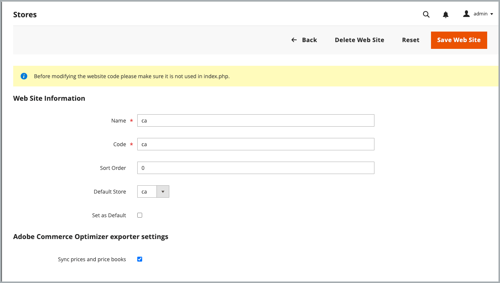
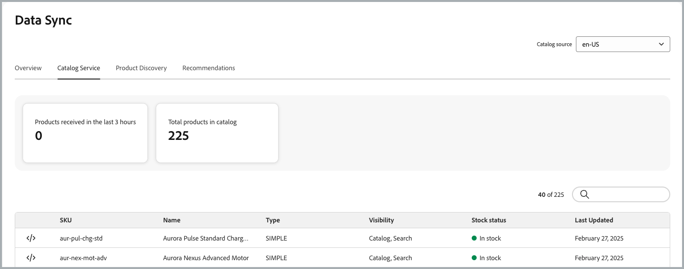

# Aan de slag

Installeer en configureer de Commerce Optimizer-connector om uw Adobe Commerce-catalogusgegevens te synchroniseren met [!DNL Adobe Commerce Optimizer] en controleer vervolgens de status voor gegevenssynchronisatie om te controleren of uw winkel up-to-date is.

## Vereisten voor het gebruik van de integratie

* Adobe Commerce 2.4.7+

   * PHP 8.2, 8.3 of 8.4
   * Composer 2.x

* [!DNL Adobe Commerce Optimizer] -licentie met een geleverde sandbox-instantie.

* Toegang tot [ repo.magento.com ](https://repo.magento.com) om het metapakket van de Verbinding van Commerce te downloaden gebruikend Composer.

* Admin toegang tot een [ zandbakinstantie van Adobe Commerce Optimizer ](https://experienceleague.adobe.com/en/docs/commerce-learn/tutorials/adobe-commerce-optimizer/create-first-instance).

De Adobe Commerce-gebruiker die de integratie configureert, moet beschikken over:

* Beheerderstoegang tot de Adobe Commerce Admin.

* [ de lijntoegang van het Bevel tot de de toepassingsserver van Adobe Commerce ](https://experienceleague.adobe.com/en/docs/commerce-on-cloud/user-guide/project/user-access).

* De toegang van de ontwikkelaar tot de [ IMS Organisatie ](https://experienceleague.adobe.com/en/docs/core-services/interface/administration/organizations?) waar het [!DNL Adobe Commerce Optimizer] project provisioned is.

>[!BEGINSHADEBOX]

## Vereisten

Als u een van de volgende extensies hebt geïnstalleerd, verwijdert u deze voordat u de Commerce Optimizer-connector installeert:

* Adobe Commerce Live zoeken (`magento/live-search`)
* Adobe Commerce-productaanbevelingen (`magento/product-recommendations`)
* Adobe Commerce Catalog Service (`magento/catalog-service`, `magento/catalog-service-installer`)
* Data Management Dashboard (`magento-catalog-sync-admin`)

Gegevens die aan deze extensies zijn gekoppeld, zijn nog steeds beschikbaar in de Commerce-database. Het wordt echter niet naar [!DNL Adobe Commerce Optimizer] geëxporteerd wanneer de connector is ingeschakeld. Om het onderzoek en het merchandising mogelijkheden uit te voeren die door deze uitbreidingen na het toelaten van de Schakelaar worden verstrekt, vorm hen van [[!DNL Adobe Commerce Optimizer]  Admin UI ](https://experienceleague.adobe.com/en/docs/commerce/optimizer/overview#quick-tour).

>[!ENDSHADEBOX]

## Configuratiestappen

Voer de volgende stappen uit om de connector in te schakelen en gegevens van Commerce naar uw Adobe Commerce Optimizer-instantie te synchroniseren.

1. **[installeer het pakket van de Schakelaar van Commerce Optimizer](#install-the-commerce-connector-package)** gebruikend Composer om uw instantie van Commerce aan [!DNL Adobe Commerce Optimizer] te verbinden.

1. **[Overzicht en pas de configuratie van de gegevensuitvoer](#customize-commerce-data-export-configuration)** van Admin aan.

1. **[krijgt API geloofsbrieven die worden vereist om de verbinding tussen Commerce en Commerce Optimizer](#get-required-values-for-configuring-the-commerce-optimizer-connection)** te vestigen.

1. **[laat de  [!DNL Adobe Commerce Optimizer]  integratie](#enable-the-adobe-commerce-optimizer-integration)** toe.

1. **[verifieer dat de gegevenssynchronisatie](#verify-that-the-data-sync-is-working)** werkt.


## Het Commerce Optimizer-connectorpakket installeren

De Adobe Commerce Optimizer Connector wordt geleverd als een Composer-pakket dat beschikbaar is voor alle Commerce-handelaren met een actieve licentie voor [!DNL Adobe Commerce Optimizer] .

### Installatiestappen

1. Voeg de module `adobe-commerce/commerce-data-export-aco-adapter` toe met behulp van Composer:

   ```shell
   composer require adobe-commerce/commerce-data-export-aco-adapter
   ```

1. Implementeer de wijzigingen in uw Adobe Commerce-testomgeving.

Nadat de implementatie is voltooid, is de optie Commerce Optimizer beschikbaar in het menu Commerce Admin. Klik op **[!UICONTROL Commerce Optimizer]** om uw Commerce Optimizer-instantie rechtstreeks vanuit Commerce Admin te openen.

>[!NOTE]
>
>Raadpleeg de volgende handleidingen voor gedetailleerde installatie-instructies voor extensies:
>
>[ installeer uitbreiding op Adobe Commerce op de Infrastructuur van de Wolk ](https://experienceleague.adobe.com/en/docs/commerce-on-cloud/user-guide/configure-store/extensions)
>
>[ installeer uitbreiding op Adobe Commerce op-gebouw ](https://experienceleague.adobe.com/en/docs/commerce-operations/installation-guide/tutorials/extensions)

### Vereiste verbindingsgegevens ophalen

Van Adobe Developer Console, creeer een ontwikkelaarproject dat voor de [!DNL Adobe Commerce Optimizer] dienst van de Ingestie wordt toegelaten en produceer Server-aan-Server geloofsbrieven OAuth. Voor gedetailleerde instructies, zie [ de Geloofsbrieven IMS ](https://developer.adobe.com/commerce/services/optimizer/data-ingestion/authentication/#obtain-ims-credentials) in de *Handleiding van de Ontwikkelaar Merchandising* verkrijgen.

>[!TIP]
>
>Als u reeds een ontwikkelaarsproject hebt dat met de Ingestie API van Gegevens in de zelfde organisatie IMS zoals uw instantie van Commerce Optimizer wordt gevormd, kunt u de bestaande server-aan-server geloofsbrieven opnieuw gebruiken OAuth.

Sla de volgende waarden op vanaf de pagina met referenties:

* **identiteitskaart van de Organisatie** (`org_id`)
* **identiteitskaart van de Cliënt** (`client_id`)
* **geheim van de Cliënt** (`client_secret`)

### Instantiedetails [!DNL Adobe Commerce Optimizer] ophalen

Sla de instantie-id (ook wel de huurder-id genoemd) op vanuit uw [!DNL Adobe Commerce Optimizer] -instantie. U vindt deze in de URL waarmee u toegang hebt tot de instantie. In `https://experience.adobe.com/#/@<project-id>/in:TToyu73daQRn66KAYaq8YZ/commerce-optimizer-studio/home` is de instantie-id bijvoorbeeld `TToyu73daQRn66KAYaq8YZ` .

## De Commerce-configuratie voor gegevensexport aanpassen

Standaard is het synchroniseren van catalogusgegevens ingeschakeld voor alle Commerce-bereiken (websites en winkelweergaven). U kunt de exportinstellingen aanpassen om alleen gegevens voor specifieke toepassingen te synchroniseren op basis van uw bedrijfsbehoeften. Als u bijvoorbeeld meerdere opslagweergaven hebt, maar alleen gegevens voor een van deze weergaven wilt exporteren, kunt u de exportfunctie uitschakelen voor de andere opslagweergaven.

>[!IMPORTANT]
>
>Als u de exportinstellingen wijzigt, wordt de index volledig opnieuw geïndexeerd. Dit kan veel tijd in beslag nemen, afhankelijk van de grootte van de catalogus. Plan deze veranderingen tijdens laag-verkeersperiodes om prestatieseffect te minimaliseren.

### Uitvoer van gegevens naar bereik

In de volgende tabel wordt beschreven welke gegevens op elk bereikniveau worden geëxporteerd:

| Bereik | Gegevens geëxporteerd | Notities |
| ------- | --------------- | ------- |
| Website | Prijzen en prijsboeken | Elke reeks prijzen wordt uitgevoerd als a [ prijsboek ](../optimizer/setup/pricebooks.md) gebruikend de noemende overeenkomst `website::customergroupcode`. Alle klantengroepen voor de website worden inbegrepen. |
| Winkelweergave | Producten en productkenmerken | In elke winkelweergave wordt een aparte catalogusbron gemaakt in [!DNL Adobe Commerce Optimizer] . |

### Gedrag in- en uitschakelen

| Actie | Resultaat |
| -------- | -------- |
| Een winkelweergave uitschakelen | De catalogusbron blijft in [!DNL Adobe Commerce Optimizer] staan, maar alle gegevens worden verwijderd. |
| Een winkelweergave uitschakelen en opnieuw inschakelen | Dezelfde catalogusbron wordt opnieuw gevuld met volledige gegevensresynchronisatie. |

### De exportconfiguratie bijwerken

Nadat u het aansluitingspakket hebt geïnstalleerd, worden in het raster Opslaan in Admin nu de exportconfiguratie-instellingen voor Commerce Optimizer weergegeven.

{width="600" zoomable="yes"}

**om de montages voor een website of opslagmening te veranderen:**

1. Navigeer in Commerce Admin naar **[!UICONTROL Stores]** > [!UICONTROL Settings] > **[!UICONTROL All Stores]** .

1. Selecteer de website- of opslagweergave die u wilt configureren.

1. In de **[!DNL Adobe Commerce Optimizer]montages van de Exporteur**, gebruik checkbox om de gegevenssynchronisatie toe te laten of onbruikbaar te maken zoals nodig.

   {width="500" zoomable="yes"}

1. Sla uw wijzigingen op.

## De integratie met [!DNL Adobe Commerce Optimizer] inschakelen

>[!IMPORTANT]
>
>De verwerking van de gegevenssynchronisatie begint zodra u het configuratiebevel in werking stelt. Standaard is het synchroniseren van catalogusgegevens ingeschakeld voor alle Commerce-bereiken (websites en winkelweergaven). Afhankelijk van de grootte van de catalogus kan het synchronisatieproces van de gegevens enkele minuten tot enkele uren duren.

Met behulp van de API-referenties en de instantiedetails die u in de vorige stappen hebt verzameld, kunt u nu de integratie tussen uw Commerce- en [!DNL Adobe Commerce Optimizer]-instanties configureren.

1. Selecteer in Commerce Admin **[!UICONTROL Adobe Commerce Optimizer]** om de configuratiepagina met instructies weer te geven.

   ![[!DNL Adobe Commerce Optimizer] configuratiepagina ](/help/aco-connector/assets/aco-connector-admin-installation.png){width="500" zoomable="yes"}

1. Van de bevellijn, [ gebruik SSH ](https://experienceleague.adobe.com/en/docs/commerce-on-cloud/user-guide/develop/secure-connections) om met het opvoeren van Commerce milieu te verbinden.

1. Voer het volgende Commerce CLI bevel in werking om de integratie te vormen, die de placeholder waarden met de waarden voor uw project van Commerce Optimizer vervangt:

```terminal
bin/magento aco:config:init --org_id=your-org --tenant_id=your-tenant --client_id=your-client-id --client_secret=your-secret
```

1. Controleer de verbinding door terug te keren naar Commerce Admin en de optie [!UICONTROL Adobe Commerce Optimizer] te selecteren.

   Wanneer u op de optie klikt, wordt de interface van [!DNL Adobe Commerce Optimizer] op een nieuw tabblad geopend.

## Controleren of de gegevenssync werkt

Nadat u de integratie hebt ingeschakeld, wordt de gegevenssynchronisatie automatisch gestart. Afhankelijk van de catalogusgrootte kan de eerste synchronisatie enkele minuten tot enkele uren duren.

1. **de synchronisatiestatus van de Controle in Commerce Admin:**

   Ga naar **[!UICONTROL System]** > [!UICONTROL Data Transfer] > **[!UICONTROL Data Feed Sync Status]** .

   {width="500" zoomable="yes"}

   Wanneer de synchronisatie wordt uitgevoerd, worden records verzonden in de feed-gegevens. Selecteer een feed om details weer te geven of synchronisatieproblemen op te lossen.

1. **bevestig gegevens die in Commerce Optimizer worden aangekomen:**

   Selecteer [!DNL Adobe Commerce Optimizer] in het menu **[!UICONTROL Data Sync]** .

   {width="500" zoomable="yes"}

   Controleer of de verwachte producten, prijzen en kenmerken worden weergegeven.

>[!TIP]
>
>Als u om het even welke kwesties met de gegevenssynchronisatie hebt, zie de [ sectie van het Oplossen van problemen ](/help/data-export/troubleshooting-logging.md) in de *Export van Gegevens SaaS* documentatie.

## Volgende stappen

1. **[vorm  [!DNL Adobe Commerce Optimizer]  catalogusmeningen en beleid](#configure-adobe-commerce-optimizer-stores)**

   Maak catalogusweergaven en -beleid in de [!DNL Adobe Commerce Optimizer] Guide. Prijsboeken worden automatisch aangemaakt door Adobe Commerce-klantengroepen.

1. **[opstelling een Opslag van Commerce op Edge Delivery Services](#set-up-a-commerce-storefront-on-edge-delivery-services)**

   Volg de [ documentatie van de Opstelling van de Storefront ](https://experienceleague.adobe.com/developer/commerce/storefront/setup/) om uw storefront aan de [!DNL Adobe Commerce Optimizer] instantie te verbinden en beginnen gepersonaliseerde handelservaringen te leveren.


