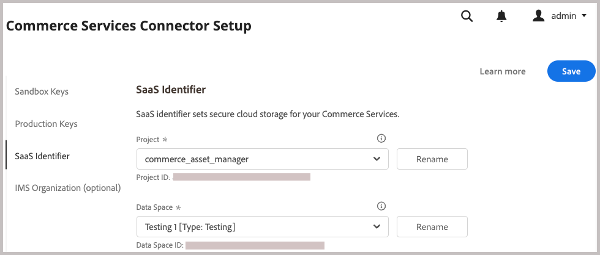

# Adobe Commerce-pakketten installeren

Deze integratie voor Commerce maakt synchronisatie van middelen tussen Adobe Commerce en Adobe Experience Manager Assets (AEM Assets) mogelijk. De extensie biedt een set gereedschappen en services voor het beheren van productafbeeldingen, video en andere media-elementen op beide platforms.

Voeg deze extensie toe aan de Commerce-omgeving door de `aem-assets-integration` PHP-extensie te installeren. U moet Adobe I/O Events for Commerce ook inschakelen en de vereiste gegevens voor communicatie en workflows tussen Adobe Commerce en Adobe Experience Manager Assets genereren.

**de vereisten van de Toegang**

U hebt de volgende rollen en toestemmingen nodig om de integratie van Commerce met AEM Assets toe te laten.

- [ de beheerder van het wolkenproject van Commerce ](https://experienceleague.adobe.com/en/docs/commerce-cloud-service/user-guide/project/user-access) - installeer vereiste uitbreidingen en vorm de de toepassingsserver van Commerce van Admin of de bevellijn.

   - Toegang tot [ repo.magento.com ](https://repo.magento.com/admin/dashboard) om de uitbreiding te installeren.

     Voor zeer belangrijke generatie en het verkrijgen van de noodzakelijke rechten, zie [ uw authentificatiesleutels ](https://experienceleague.adobe.com/en/docs/commerce-operations/installation-guide/prerequisites/authentication-keys) krijgen. Voor wolkeninstallaties, zie [ Commerce op de Gids van de Infrastructuur van de Wolk ](https://experienceleague.adobe.com/en/docs/commerce-cloud-service/user-guide/develop/authentication-keys)

- [ Commerce Admin ](https://experienceleague.adobe.com/en/docs/commerce-admin/start/guide-overview) - de opslagconfiguratie van de Update en beheert Commerce gebruikersrekeningen.

>[!TIP]
>
> Adobe Commerce kan worden gevormd om [ authentificatie van Adobe te gebruiken IMS ](https://experienceleague.adobe.com/en/docs/commerce-admin/start/admin/ims/adobe-ims-config).

## Workflow voor installatie en configuratie

Installeer het Adobe Commerce-pakket en maak de Commerce-omgeving gereed door de volgende taken uit te voeren:

1. [ installeer de Integratie van AEM Assets voor de uitbreiding van Commerce (`aem-assets-integration`) ](#install-the-aem-assets-integration-extension).

1. [ vorm de Schakelaar van de Diensten van Commerce ](#configure-the-commerce-services-connector) om uw instantie van Adobe Commerce en met de diensten te verbinden die gegevens toelaten om tussen Adobe Commerce en AEM Assets worden overgebracht.

1. [Adobe I/O Events voor Commerce configureren](#configure-adobe-io-events-for-commerce)

1. [Verificatiegegevens ophalen voor API-toegang](#get-authentication-credentials-for-api-access)

## De extensie AEM Assets Integration installeren

Installeer de nieuwste versie van de extensie AEM Assets Integration (`aem-assets-integration`) op een Adobe Commerce-instantie met versie Adobe Commerce 2.4.5+. De uitbreiding wordt geleverd als composer metapack van de {[ bewaarplaats 0} repo.magento.com.](https://repo.magento.com/admin/dashboard)

>[!BEGINTABS]

>[!TAB  de infrastructuur van de Wolk ]

Gebruik deze methode om de extensie [!DNL AEM Assets Integration] te installeren op een Commerce Cloud-instantie.

1. Schakel op uw lokale werkstation de projectmap voor uw Adobe Commerce over het infrastructuurproject voor de cloud in.

   >[!NOTE]
   >
   >Voor informatie over het beheren van het projectmilieu&#39;s van Commerce plaatselijk, zie [ het Leiden takken met CLI ](https://experienceleague.adobe.com/en/docs/commerce-cloud-service/user-guide/develop/cli-branches) in _Adobe Commerce op de Gids van de Gebruiker van de Infrastructuur van de Wolk_.

1. Bekijk de omgevingsvertakking voor update met de Adobe Commerce Cloud CLI.

   ```shell
   magento-cloud environment:checkout <environment-id>
   ```

1. Voeg de extensie AEM Assets Integration voor Commerce toe.

   ```shell
   composer require "magento/aem-assets-integration" "<version-tbd>" --no-update
   ```

1. Pakketafhankelijkheden bijwerken.

   ```shell
   composer update "magento/aem-assets-integration"
   ```

1. Wijzigingen in de code voor de bestanden `composer.json` en `composer.lock` doorvoeren en uitvoeren.

1. Voeg de codewijzigingen voor de `composer.json` - en `composer.lock` -bestanden toe, wijs deze toe en duw ze naar de cloudomgeving.

   ```shell
   git add -A
   git commit -m "Install AEM Assets Integration extension for Adobe Commerce"
   git push origin <branch-name>
   ```

   Het duwen van de updates stelt het [ proces van de de wolkenplaatsing van Commerce ](https://experienceleague.adobe.com/en/docs/commerce-cloud-service/user-guide/develop/deploy/process) in werking om de veranderingen toe te passen. Controleer de plaatsingsstatus van [ opstellen logboek ](https://experienceleague.adobe.com/en/docs/commerce-cloud-service/user-guide/develop/test/log-locations#deploy-log).

>[!TAB  op-gebouw ]

Gebruik deze methode om de extensie [!DNL AEM Assets Integration] te installeren voor een instantie op locatie.

1. Gebruik Composer om de extensie AEM Assets Integration for Commerce toe te voegen aan uw project:

   ```shell
   composer require "magento/aem-assets-integration" --no-update
   ```

1. Afhankelijkheden bijwerken en de extensie installeren:

   ```shell
   composer update  "magento/aem-assets-integration"
   ```

1. Upgrade Adobe Commerce:

   ```shell
   bin/magento setup:upgrade
   ```

1. Cache wissen:

   ```shell
   bin/magento cache:clean
   ```

>[!TIP]
>
> Wanneer het opstellen aan productie, overweeg geen gecompileerde code om tijd te besparen. Maak altijd een back-up van uw systeem voordat u wijzigingen aanbrengt.

>[!ENDTABS]

## De Commerce Services Connector configureren

>[!NOTE]
>
> De opstelling van de Verbinding van de Diensten van Commerce is een eenmalig proces dat wordt vereist om [ de diensten van Adobe Commerce SaaS ](https://experienceleague.adobe.com/en/docs/commerce/user-guides/integration-services/saas#availableservices) te gebruiken. Als u de connector voor een andere service al hebt geconfigureerd, kunt u de bestaande configuratie weergeven via Commerce Admin door **[!UICONTROL Systems]** > [!UICONTROL Services] > **[!UICONTROL Commerce Services Connector]** te selecteren.

Als u gegevens wilt verzenden tussen uw Adobe Commerce-instantie en de services die AEM Assets Integration inschakelen, configureert u de Commerce Services-connector via de beheerfunctie ( **[!UICONTROL System]** > [!UICONTROL Services] > **[!UICONTROL Commerce Services Connector]** ).

{width="600" zoomable="yes"}

Geef de volgende waarden op in de configuratie

- API-sleutels voor productie en sandbox voor verificatie
- Naam gegevensruimte (SaaS-id) voor beveiligde cloudopslag
- IMS-organisatie-id waar uw Commerce- en AEM Assets-omgevingen zijn ingericht

Voor gedetailleerde instructies, bekijk de [ de configuratievideo van de Verbinding van de Diensten van Commerce ](https://experienceleague.adobe.com/en/docs/commerce-learn/tutorials/admin/adobe-commerce-services/configure-adobe-commerce-services-connector#configuration-faqs), van zie de [ 3} documentatie van de Schakelaar van de Diensten van Commerce {.](../../landing/saas.md#organizationid)

Wanneer u sparen de configuratie, produceert het systeem SaaS project en gegevensbestand IDs voor uw milieu. Deze waarden zijn vereist om de synchronisatie van bedrijfsmiddelen tussen Adobe Commerce en AEM Assets in te schakelen.

## Adobe I/O Events voor Commerce configureren

De integratie van AEM Assets gebruikt de dienst van Adobe I/O Events om de gegevens van de douanegebeurtenis tussen de instantie van Commerce en Experience Cloud te verzenden. De gebeurtenisgegevens worden gebruikt om workflows voor AEM Assets-integratie te coördineren.

Controleer voordat u Adobe I/O Events configureert de configuratie van de RabbitMQ- en Cron-taak voor uw Commerce-project:

- Zorg ervoor dat RabbitMQ is ingeschakeld en luister naar gebeurtenissen.
   - [ Opstelling RabbitMQ voor Adobe Commerce op gebouw ](https://experienceleague.adobe.com/en/docs/commerce-cloud-service/user-guide/configure/service/rabbitmq)
   - [ RabbitMQ Opstelling voor Adobe Commerce op wolkeninfrastructuur ](https://experienceleague.adobe.com/en/docs/commerce-cloud-service/user-guide/configure/service/rabbitmq)
   - Verifieer dat [ gewassentaken ](https://developer.adobe.com/commerce/extensibility/events/configure-commerce/#check-cron-and-message-queue-configuration) worden toegelaten. Cron-taken zijn vereist voor communicatie en workflows voor AEM Assets-integratie.

>[!NOTE]
>
> Voor projecten op versie 2.4.5 van Commerce, moet u [ de modules van Adobe I/O ](https://developer.adobe.com/commerce/extensibility/events/installation/#install-adobe-io-modules-on-commerce) installeren. In Commerce versie 2.4.6+, worden deze modules automatisch geladen. Voor de AEM Assets-integratie voor Commerce hoeft u alleen de modules te installeren. App Builder-instelling is niet vereist.


### Commerce Event-framework inschakelen

Schakel het gebeurtenisframework in via Commerce Admin.

>[!NOTE]
>
>App Builder-instellingen zijn alleen vereist als u een aangepaste matching-strategie wilt gebruiken om elementen tussen Commerce en AEM Assets te synchroniseren.

1. Van Admin, ga **[!UICONTROL Stores]** > [!UICONTROL Settings] > **[!UICONTROL Configuration]** > **[!UICONTROL Adobe Services]** > **Adobe I/O Events**.

1. Vouw **[!UICONTROL Commerce events]** uit.

1. Stel **[!UICONTROL Enabled]** in op `Yes` .

   {width="600" zoomable="yes"} toe

1. Voer de bedrijfsnaam van de handelaar in **[!UICONTROL Merchant ID]** en de omgevingsnaam in de **[!UICONTROL Environment ID]** gebieden in. Gebruik bij het instellen van deze waarden alleen alfanumerieke tekens en onderstrepingstekens.

>[!BEGINSHADEBOX]

**vorm Douane VCL voor het blokkeren van verzoeken**

Als u een aangepast VCL-fragment gebruikt om onbekende binnenkomende aanvragen te blokkeren, moet u mogelijk de HTTP-header `X-Ims-Org-Idheader` opnemen om binnenkomende verbindingen van de AEM Assets Integration for Commerce-service toe te staan.

>[!TIP]
>
> U kunt de Fastly CDN module gebruiken om Edge ACL met een lijst van IP adressen tot stand te brengen die u wilt blokkeren.

De volgende aangepaste VCL-fragmentcode (JSON-indeling) toont een voorbeeld met een `X-Ims-Org-Id` aanvraagkoptekst.

```json
{
  "name": "blockbyuseragent",
  "dynamic": "0",
  "type": "recv",
  "priority": "5",
  "content": "if ( req.http.X-ims-org ~ \"<YOUR-IMS-ORG>\" ) {error 405 \"Not allowed\";}"
}
```

Voordat u een op dit voorbeeld gebaseerd fragment maakt, controleert u de waarden om te bepalen of u wijzigingen wilt aanbrengen:

- `name`: naam voor het VCL-fragment. In dit voorbeeld wordt de naam `blockbyuseragent` gebruikt.

- `dynamic` : stelt de fragmentversie in. In dit voorbeeld wordt `0` gebruikt. Zie de [ Snelle fragmenten VCL ](https://www.fastly.com/documentation/reference/api/vcl-services/snippet/) voor gedetailleerde informatie van het gegevensmodel.

- `type` - Geeft het type VCL-fragment op, dat de locatie van het fragment in de gegenereerde VCL-code bepaalt. In dit voorbeeld wordt `recv` gebruikt. Zie de [ Snelle VCL fragmentverwijzing ](https://www.fastly.com/documentation/reference/api/#api-section-snippet) voor de lijst van fragmenttypes.

- `priority`: hiermee wordt bepaald wanneer het VCL-fragment wordt uitgevoerd. In dit voorbeeld wordt prioriteit `5` gebruikt om direct te worden uitgevoerd en te controleren of een beheerdersverzoek afkomstig is van een toegestaan IP-adres.

- `content`: Het fragment van VCL-code dat moet worden uitgevoerd, dat het client-IP-adres controleert. Als IP in ACL van Edge is, wordt het geblokkeerd van toegang met een `405 Not allowed` fout voor de volledige website. Alle andere client-IP-adressen hebben toegang.

Voor gedetailleerde informatie over het gebruiken van fragmenten VCL om inkomende verzoeken te blokkeren, zie [ Douane VCL voor het blokkeren van verzoeken ](https://experienceleague.adobe.com/en/docs/commerce-cloud-service/user-guide/cdn/custom-vcl-snippets/fastly-vcl-blocking) in _Commerce op de Gids van de Infrastructuur van de Wolk_.

>[!ENDSHADEBOX]

## Verificatiegegevens ophalen voor API-toegang

Voor AEM Assets Integration for Commerce zijn OAuth-verificatiereferenties vereist om API-toegang tot de Commerce-instantie te verlenen. Deze gegevens zijn vereist voor het verifiëren van API-aanvragen bij het beheer van middelen met de AEM Assets-integratie.

U genereert de referenties door de integratie aan de Commerce-instantie toe te voegen en deze te activeren.

### Integratie toevoegen aan de Commerce-omgeving

1. Van Admin, ga naar **Systeem** > Uitbreidingen > **Integraties**, dan klik **Nieuwe Integratie** toevoegen.

1. Voer informatie in over de integratie.

   In de **Algemene** sectie, specificeer slechts de integratie **Naam** en **E-mail**. Gebruik de e-mail voor een Adobe IMS-account met toegang tot de organisatie waar Commerce en Experience Manager Assets zijn geïmplementeerd.

   {width="600" zoomable="yes"}

1. Verifieer uw identiteit door **te klikken bevestigt Identiteit**.

   Het systeem verifieert uw identiteit door verificatie aan Experience Cloud met uw Adobe-id.

1. API-bronnen configureren.

   1. Klik in het linkerdeelvenster op **[!UICONTROL API]** .

   1. Selecteer de externe mediabron **[!UICONTROL Catalog > Inventory > Products > External Media]** .

      {width="600" zoomable="yes"}

1. Klik op **[!UICONTROL Save]**.

### OAuth-referenties genereren

Voor de pagina van Integraties, produceer de OAuth authentificatiegeloofsbrieven door **te klikken activeer** voor de integratie van Assets. U hebt deze gegevens nodig om het Commerce-project te registreren bij de Assets Rule Engine-service en om API-aanvragen in te dienen voor het beheer van middelen tussen Adobe Commerce en AEM Assets.

1. Genereer de referenties op de pagina Integraties door op **[!UICONTROL Activate]** te klikken.

   {width="600" zoomable="yes"}

1. Als u de API wilt gebruiken, slaat u de referenties voor de consumentensleutel en het toegangstoken op om verificatie in uw API-client te configureren.

   {width="600" zoomable="yes"} voor authentiek te verklaren

1. Klik op **[!UICONTROL Done]**.

>[!NOTE]
>
>U kunt ook verificatiegegevens genereren met de Adobe Commerce API&#39;s. Voor details over dit proces en meer informatie over op OAuth-Gebaseerde authentificatie voor Adobe Commerce, zie [ op OAuth-Gebaseerde authentificatie ](https://developer.adobe.com/commerce/webapi/get-started/authentication/gs-authentication-oauth/) in de documentatie van Adobe Developer.

## Volgende stap

- [Integratie configureren vanuit Commerce Admin](setup-synchronization.md)
