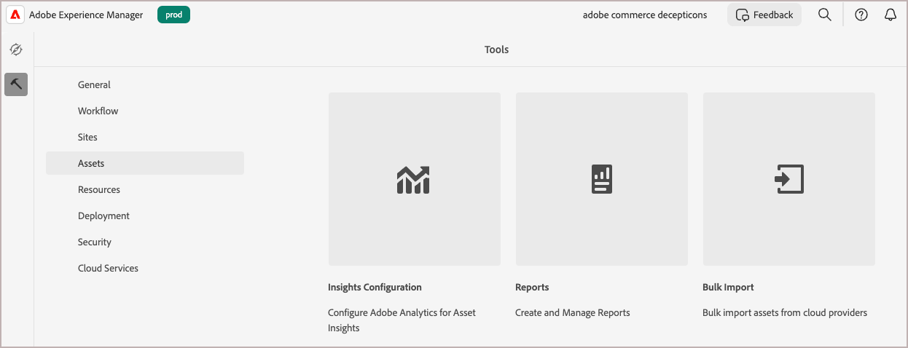

# Mediabestanden migreren naar de AEM Assets DAM

Zowel Adobe Commerce als Adobe Experience Manager (AEM) verstrekken ingebouwde eigenschappen om media dossiermigratie van Commerce aan het AEM Assets **digitale systeem van het activabeheer (DAM) te stroomlijnen**. U kunt ook mediabestanden migreren uit andere bronnen.

## Vereisten

| Categorie | Vereiste |
|----------|-------------|
| **vereisten van het Systeem** | <ul><li>AEM as a Cloud Service-omgeving voorzien van AEM Assets</li><li>Voldoende opslagcapaciteit</li><li>Netwerkbandbreedte voor grote bestandsoverdrachten</li></ul> |
| **Vereiste toegang en toestemmingen** | <ul><li>Toegang tot AEM Assets as a Cloud Service voor beheerders</li><li>Toegang tot het bronsysteem waar mediabestanden worden opgeslagen (Adobe Commerce of extern systeem)</li><li>Geschikte machtigingen voor toegang tot cloudopslagservices</li></ul> |
| **de Rekening van de Opslag van de Wolk** | <ul><li>AWS S3- of Azure Blob Storage-account</li><li>Configuratie van privécontainer/emmertje</li><li>Verificatiegegevens</li></ul> |
| **Inhoud Source** | <ul><li>Georganiseerde mediabestanden gereed voor migratie</li><li>Beeld en videodossiers in <a href="https://experienceleague.adobe.com/nl/docs/experience-manager-cloud-service/content/assets/file-format-support#image-formats"> formaten die door AEM Assets </a> worden gesteund.</li><li>Schone, gedupliceerde elementen</li></li> |
| **Voorbereiding van meta-gegevens** | <ul><li><a href="https://experienceleague.adobe.com/nl/docs/commerce-admin/content-design/aem-asset-management/getting-started/aem-assets-configure-aem"> AEM Assets meta-gegevensprofiel dat voor de activa van Commerce wordt gevormd </a></li><li>Toegewezen metagegevenswaarden voor elk element</li><li>CSV-bestandseditor (bijvoorbeeld Microsoft Excel)</li></ul> |

## Best practices voor migratie

1. Elementen krullen vóór de migratie door ongebruikte en gedupliceerde inhoud te verwijderen.

1. Elementen logisch ordenen op grootte, opmaak of hoofdlettergebruik.

1. Overweeg grote migraties in kleinere batches te splitsen.

1. Plan de bronintensieve invoer tijdens off-piekuren.

1. Metagegevenstoewijzing valideren voordat de bestanden volledig worden geïmporteerd.

## Migratieworkflow

Volg de migratieworkflow om mediabestanden uit Adobe Commerce of een ander extern systeem te exporteren en deze te importeren in AEM Assets DAM.

### Stap 1: Inhoud exporteren uit de bestaande gegevensbron

[!BADGE &#x200B; slechts PaaS &#x200B;]{type=Informative tooltip="Alleen van toepassing op Adobe Commerce op Cloud-projecten (door Adobe beheerde PaaS-infrastructuur)."}

Voor de handelaren van Adobe Commerce, kan de **Verre module van de Opslag** de invoer en de uitvoer van media dossier vergemakkelijken. Met deze module kunnen bedrijven mediabestanden opslaan en beheren met externe opslagservices zoals AWS S3. Aan opstellings verre opslag voor uw instantie van Commerce, zie [&#x200B; Verre Opslag &#x200B;](https://experienceleague.adobe.com/nl/docs/commerce-operations/configuration-guide/storage/remote-storage/remote-storage-aws-s3) in de **Gids van de Configuratie van Commerce** vormen.

Als u media dossiers hebt die buiten Adobe Commerce worden opgeslagen, upload hen rechtstreeks aan één van de [&#x200B; gegevensbronnen &#x200B;](https://experienceleague.adobe.com/nl/docs/experience-manager-cloud-service/content/assets/assets-view/bulk-import-assets-view#prerequisites) door AEM as a Cloud Service worden gesteund.

### Stap 2: Een CSV-bestand maken voor de toewijzing van metagegevens

Nadat u de mediabestanden hebt geëxporteerd, maakt u een CSV-bestand om deze elementen met de benodigde metagegevens voor automatisering toe te wijzen. CSV zou gebieden voor **product**, **positie**, en **rolafbeelding** moeten omvatten, die groepering met het [&#x200B; de meta-gegevensprofiel van AEM Assets &#x200B;](configure-aem.md#configure-a-metadata-profile) verzekeren.

Voor elk media dossier u van plan bent te migreren, verstrek waarden voor de meta-gegevensgebieden inbegrepen in het [&#x200B; de meta-gegevensprofiel van AEM Assets voor de activa van Commerce &#x200B;](configure-aem.md) zoals die in de volgende lijst worden beschreven.

| Metagegevens | Beschrijving | Waarde |
|-------|-------------|--------|
| assetPath | Het volledige pad waar het middel wordt opgeslagen in de AEM Assets-opslagplaats.<br><br> gebruik de weg om subomslagen tot stand te brengen om de activa van Commerce te organiseren, bijvoorbeeld `content/dam/commerce/<brand>/<type>`. | `/content/dam/commerce/<sub-folder>/..<filename>` |
| commerce :positions | De positie/volgorde van het element in productgalerieën | Meerdere numerieke waarden, gescheiden door pipe (&quot;Number: multi&quot;) |
| commerce :isCommerce | Markering die aangeeft of het actief in de handel wordt gebruikt | `Yes` |
| commerce :skus | Product-SKU&#39;s die aan dit element zijn gekoppeld | Meerdere tekenreekswaarden, gescheiden door pipe (String: multi) |
| commerce :roles | De rollen of typen afbeeldingen voor het element (bijvoorbeeld `thumbnail` , `main image` , `swatch` ) | Meerdere waarden, gescheiden door puntkomma&#39;s (bijvoorbeeld &quot;miniatuur; afbeelding; staal_afbeelding; small_image&quot;) |

+++CSV-code

Gebruik deze CSV-voorbeeldcode om het bestand te maken in een code-editor of spreadsheettoepassing zoals Microsoft Excel.

```csv
assetPath,commerce:positions{{Number: multi}},commerce:isCommerce{{String}},commerce:skus{{String: multi}},commerce:roles{{String: multi}}
/content/dam/commerce/sample1.jpg,1,Yes,sku1,thumbnail; image; swatch_image; small_image
/content/dam/commerce/sample2.jpg,1|1|1,Yes,sku1|sku2|sku3,thumbnail; image; swatch_image; small_image|image|image; small_change
```

+++

### Stap 3: Bulkimport van Assets naar AEM Assets

Nadat u het metagegevenstoewijzingsbestand hebt gemaakt, importeert u uw elementen met het gereedschap AEM Assets Bulk importeren.

Hieronder vindt u een overzicht op hoog niveau voor het gebruik van het gereedschap.

1. [&#x200B; Login aan uw het auteursmilieu van AEM Assets as a Cloud Service &#x200B;](https://experienceleague.adobe.com/nl/docs/experience-manager-cloud-service/content/onboarding/journey/aem-users#login-aem).

1. Selecteer in de weergave Experience Manager Tools **[!UICONTROL Assets]** > **[!UICONTROL Bulk Import]** .

   {width="600" zoomable="yes"}

1. Selecteer in het venster Configuraties voor bulkimport de optie **[!UICONTROL Create]** om het configuratieformulier te openen.

   {width="600" zoomable="yes"}

1. Opstelling en sparen de configuratie.

   U hebt het volgende nodig:

   * Verificatiereferenties voor uw gegevensbron
   * De doelmap in AEM Assets waarin geïmporteerde bestanden worden opgeslagen
   * Optioneel. Informatie over de MIME-typen, bestandsgrootte en andere parameters om de importconfiguratie aan te passen
   * Het pad naar het CSV-bestand met metagegevenstoewijzing dat u hebt geüpload naar de opslaginstantie in de cloud.

   Voor gedetailleerde stappen, zie [&#x200B; het Bulk hulpmiddel van de Invoer &#x200B;](https://experienceleague.adobe.com/nl/docs/experience-manager-cloud-service/content/assets/manage/add-assets#configure-bulk-ingestor-tool) in de *Gids van de Gebruiker van AEM Assets as a Cloud Service* vormen.

1. Nadat u de configuratie hebt opgeslagen, gebruikt u de gereedschappen voor bulkimport om de importbewerking te testen en uit te voeren.

>[!MORELIKETHIS]
>
> [&#x200B; Bulk het hulpmiddel van de Invoer videodemo &#x200B;](https://experienceleague.adobe.com/nl/docs/experience-manager-cloud-service/content/assets/manage/add-assets#asset-bulk-ingestor)
> [Tips, beste praktijken, en beperkingen &#x200B;](https://experienceleague.adobe.com/nl/docs/experience-manager-cloud-service/content/assets/manage/add-assets#tips-limitations)
> [Elementen uploaden of invoegen met behulp van API&#39;s &#x200B;](https://experienceleague.adobe.com/nl/docs/experience-manager-cloud-service/content/assets/admin/developer-reference-material-apis#asset-upload)
