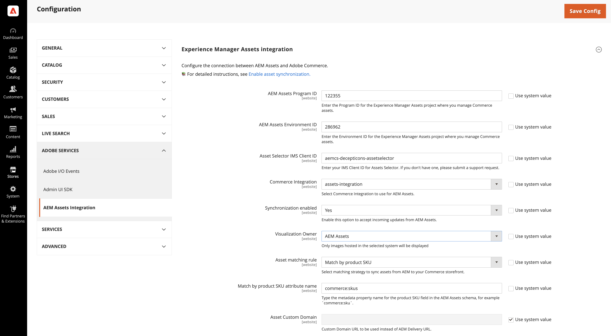

# De integratie configureren

Configureer de integratie door Commerce aan te sluiten op de AEM Assets-instantie en de bijbehorende strategie voor de synchronisatie van bedrijfsmiddelen te selecteren.

Nadat u het AEM Assets-project hebt geïdentificeerd, selecteert u de regel voor het synchroniseren van elementen tussen Adobe Commerce en AEM Assets.

* **[!UICONTROL Match by product SKU]** - Standaard regel die SKU in de activameta-gegevens met het [ product SKU van Commerce ](https://experienceleague.adobe.com/en/docs/commerce-operations/implementation-playbook/glossary#sku) aanpast om ervoor te zorgen dat de activa met de correcte producten worden geassocieerd.

* **[!UICONTROL Custom match]** - Het stemmen regel voor complexere scenario&#39;s of specifieke bedrijfsvereisten die aangepaste passende logica vereisen. Voor het implementeren van aangepaste overeenkomsten moet in Adobe Developer App Builder aangepaste code worden ontwikkeld om te bepalen hoe elementen op producten worden afgestemd. Binnenkort komen er meer details...

Voor de aanvankelijke opstelling, gebruik de standaard *Gelijke door productSKU* regel.

## Vereisten

* [AEM Assets-pakket installeren](configure-aem.md)

* [!BADGE  PaaS slechts ]{type=Informative tooltip="Alleen van toepassing op Adobe Commerce op Cloud-projecten (door Adobe beheerde PaaS-infrastructuur)."} [ installeert de pakketten van Adobe Commerce ](configure-commerce.md) om de uitbreiding toe te voegen en de vereiste geloofsbrieven en de verbindingen te produceren om de uitbreiding te gebruiken.

* Volg de stappen die in [ worden beschreven toelaten Dynamische Media Open API ](https://experienceleague.adobe.com/en/docs/experience-manager-cloud-service/content/assets/dynamicmedia/dynamic-media-open-apis/dynamic-media-open-apis-overview#enable-dynamic-media-open-apis) onderwerp. Neem de volgende informatie op voor het ondersteuningsteam:

   * **[!UICONTROL AEM Program ID]**
   * **[!UICONTROL Adobe Commerce URL]**
   * **[!UICONTROL AEM Environment ID]** ,
   * **[!UICONTROL IMS Org ID]** voor de AEM Assets-ontwerpomgeving die u wilt verbinden met Commerce.

## De verbinding configureren

1. Krijg [ AEM Assets Authoring Environment ](https://experienceleague.adobe.com/en/docs/experience-manager-cloud-service/content/sites/authoring/quick-start) project en milieu identiteitskaart

   1. Open de AEM Cloud Manager en selecteer **[!UICONTROL Assets]** .

   1. Kopieer en bewaar project en milieu IDs van URL: `https://author-p[Program ID]-e[EnvironmentID].adobeaemcloud.com/`

1. Open vanuit Commerce Admin de AEM Assets Integration-configuratie.

   1. Ga naar **[!UICONTROL Store]** > Configuratie > **[!UICONTROL ADOBE SERVICES]** > **[!UICONTROL AEM Assets Integration]** .

      {width="600" zoomable="yes"} toe

1. Voer de AEM Assets-omgeving **[!UICONTROL Program ID]** en **[!UICONTROL Environment ID]** in.

   Bewerk de configuratiewaarden door de selectie uit *[!UICONTROL Use system value]* te verwijderen.

1. Voer de **[!UICONTROL Asset Selector IMS Client ID]** in.

   Voor details over de Selecteur van Activa, zie [ manueel selecterend activa ](../synchronize/asset-selector-integration.md)

1. [!BADGE  slechts PaaS ]{type=Informative tooltip="Alleen van toepassing op Adobe Commerce op Cloud-projecten (door Adobe beheerde PaaS-infrastructuur)."} Selecteer [[!UICONTROL Commerce integration]](configure-commerce.md#add-the-integration-to-the-commerce-environment) voor het voor authentiek verklaren van verzoeken tussen Commerce en de activa passende dienst.

1. Stel **[!UICONTROL Commerce integration]** in op `assets-integration` om de Commerce-integratie te selecteren die u met AEM Assets wilt gebruiken.

1. Stel **[!UICONTROL Synchronization enabled]** in op `Yes` als u wilt dat Commerce binnenkomende updates van AEM Assets accepteert.

   Nadat u de integratie hebt ingeschakeld, zijn aanvullende configuratieopties beschikbaar om criteria voor het afstemmen van elementen op te geven.

1. Selecteer in het vervolgkeuzemenu **[!UICONTROL Asset matching rule]** een van de regels voor het afstemmen van elementen voor het synchroniseren van elementen.

   * Selecteer **[!UICONTROL Match by SKU]** voor [ standaard automatische aanpassing ](../synchronize/default-match.md),
   * Selecteer **[!UICONTROL Custom match]** voor [ douane automatische aanpassing ](../synchronize/custom-match.md) (vereist [ Adobe Developer App Builder ](https://experienceleague.adobe.com/en/docs/commerce-learn/tutorials/adobe-developer-app-builder/introduction-to-app-builder).)

1. Voeg de [ AEM Assets naam van het meta-gegevensgebied ](configure-aem.md#configure-metadata) toe die voor het product SKUs van Commerce op het **[!UICONTROL Match by product SKU attribute name]** gebied wordt bepaald, `commerce:skus` door gebrek.

1. Selecteer **[!UICONTROL Save Config]** om updates toe te passen en de synchronisatie van elementen te starten.

   De configuratieupdate activeert het eerste synchronisatieproces, zodat Commerce binnenkomende updates van AEM Assets kan accepteren. De tijd die nodig is voor synchronisatie is afhankelijk van het volume van elementen en specifieke configuraties. De integratie gebruikt geautomatiseerde processen om de tijd die nodig is voor synchronisatie te minimaliseren.

### Synchronisatie SLA

De integratie garandeert de volgende synchronisatieprestatieniveaus:

* `< 5 minutes for 99% of updates`

* `< 30 minutes for 99.9% of updates`

Op deze manier zorgt u ervoor dat op productpagina&#39;s altijd de meest actuele afbeeldingen worden weergegeven, zodat de inhoud van de winkel nauwkeurig blijft en visueel aantrekkelijk is.

### De eigenaar van de visualisatie configureren

Het **plaatsen van de Eigenaar van de Visualisatie** bepaalt welk systeem productbeelden in de integratie dient:

* Adobe Commerce - Hierbij worden afbeeldingen gebruikt die in Commerce worden gehost.
* AEM Assets - Hierbij worden afbeeldingen gebruikt die vanuit AEM zijn gesynchroniseerd.

Admin toont de beschikbare beelden voor die eigenaar, terwijl de rest beelden grayed uit en getoond met a **verborgen** etiket worden.

Zie het [ plaats beelddetails ](https://experienceleague.adobe.com/en/docs/commerce-admin/catalog/products/digital-assets/product-image#set-image-details){target=_blank} onderwerp voor details op beeldvertoningsgedrag.

>[!TIP]
>
> Tijdens een migratie van Commerce aan AEM Assets, plaats de **Eigenaar van de Visualisatie** aan Commerce om gebroken beeldverbindingen te vermijden. Nadat alle producten met AEM Assets zijn gesynchroniseerd, schakelt u over naar de AEM Assets-eigenaar om de overgang te voltooien. Dit verzekert ononderbroken beeldbeschikbaarheid door het proces.

1. Navigeer naar **[!UICONTROL Store]** > Configuratie > **[!UICONTROL ADOBE SERVICES]** > **[!UICONTROL AEM Assets Integration]** .

   {width="400" zoomable="yes"}

1. Selecteer de **bron van de Eigenaar van de Visualisatie** om de beelden te tonen.

1. Klik op **[!UICONTROL Save Config]** om updates toe te passen en de synchronisatie van elementen te starten.

### Optioneel. De URL van het aangepaste domein configureren

Als het project van AEM Assets as a Cloud Service met de Naam van het Domein van de a [ Douane ](https://experienceleague.adobe.com/en/docs/experience-manager-cloud-service/content/implementing/using-cloud-manager/custom-domain-names/add-custom-domain-name){target=_blank} is gevormd, moet u de domeinnaam aan de de archiefconfiguratie van Commerce toevoegen zodat de integratie van AEM Assets voor Commerce het kan gebruiken.

1. Navigeer naar **[!UICONTROL Store]** > Configuratie > **[!UICONTROL ADOBE SERVICES]** > **[!UICONTROL AEM Assets Integration]** .

   {width="700" zoomable="yes"} toe

1. Voeg **URL van het Domein van de Douane** aan het **[!UICONTROL Asset Custom Domain]** gebied toe.

1. Klik op **[!UICONTROL Save Config]** om updates toe te passen en de synchronisatie van elementen te starten.

## Volgende stap

[Commerce-middelen beheren](../manage-assets.md)
