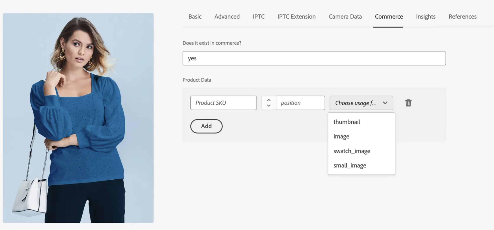

# Standaard automatische vergelijking

De integratie van AEM Assets voor Commerce verstrekt een standaard automatisch passend makend mechanisme (**[!UICONTROL Match by product SKU]**) dat op de **wordt gebaseerd AEM Assets** meta-gegevensconfiguratie. Deze regel laat naadloze synchronisatie tussen **Adobe Commerce** en **AEM Assets** toe, die ervoor zorgen dat de activa automatisch met de correcte handelende entiteiten worden verbonden.

## Het mechanisme voor automatische overeenkomsten configureren

1. Navigeer in Commerce Admin naar **[!UICONTROL Store]** > Configuratie > **[!UICONTROL ADOBE SERVICES]** > **[!UICONTROL AEM Assets Integration]** .

1. Geef **[!UICONTROL Match by SKU]** op als overeenkomende regel.

   {width="600" zoomable="yes"}

1. Voer in de AEM Assets de veldnaam voor metagegevens in die wordt gebruikt voor de identificatie van elementen.

   >[!NOTE]
   >
   > Als het standaard instapproces is gevolgd, moet deze waarde worden ingesteld op `commerce:skus` .

## De werking van het automatische mechanisme voor matching

Als de **[!UICONTROL Match by product SKU]** -regel voor overeenkomende bestanden is geconfigureerd in Commerce Admin, worden Commerce-elementbestanden automatisch gesynchroniseerd van AEM Assets naar uw Commerce-project op basis van de metagegevens van de elementen die voor elk bestand zijn geconfigureerd. U vormt de meta-gegevens van het AEM **Commerce** lusje in het **de auteur van AEM Assets** milieu:

{width="600" zoomable="yes"}

1. Werk in AEM Assets de metagegevens van de afbeelding bij en voeg de Adobe Commerce-koppeling `Commerce=yes` toe.

1. Configureer de metagegevens ([!UICONTROL SKU], [!UICONTROL position] en [!UICONTROL role] ) die het element koppelen aan de gekoppelde product-SKU.

   >[!NOTE]
   >
   > Als een element voor veelvoudige producten wordt gebruikt, vorm de meta-gegevens voor elke bijbehorende SKU.

Deze aanpak zorgt ervoor dat digitale elementen op de juiste wijze worden gekoppeld en weergegeven in Adobe Commerce. Het biedt handelaren en marketers ook de mogelijkheid om rollen en positionering van bedrijfsmiddelen rechtstreeks binnen AEM Assets te beheren, en biedt een consistent en gecentraliseerd mechanisme voor het selecteren van images en het bestellen van images over alle betrokkenheidskanalen.
