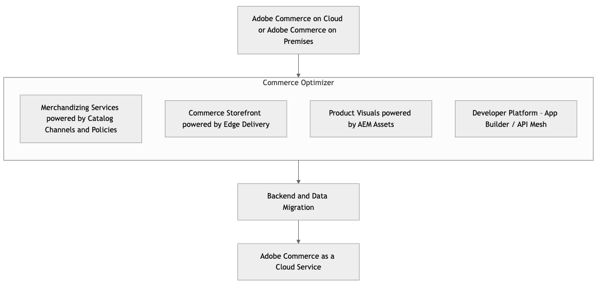

# Migreren naar [!DNL Adobe Commerce as a Cloud Service]

[!DNL Adobe Commerce as a Cloud Service] biedt een uitgebreide gids voor ontwikkelaars die van een bestaande Adobe Commerce PaaS-implementatie overstappen op het nieuwe Adobe Commerce as a Cloud Service-aanbod (SaaS). Adobe Commerce as a Cloud Service is een belangrijke stap op weg naar een volledig beheerd, versieloos SaaS-model, dat verbeterde prestaties, schaalbaarheid, vereenvoudigde bewerkingen en een strakkere integratie met het bredere [!DNL Adobe Experience Cloud] biedt.

>[!NOTE]
>
>Voor meer informatie over migratiehulpmiddel, zie het [&#x200B; Bulk Hulpmiddel van de Migratie van Gegevens &#x200B;](./bulk-data.md).

## De verschuiving begrijpen - PaaS en SaaS vergelijken

**Zeer belangrijke verschillen**

* [!BADGE &#x200B; PaaS slechts &#x200B;]{type=Informative url="https://experienceleague.adobe.com/en/docs/commerce/user-guides/product-solutions" tooltip="Is alleen van toepassing op Adobe Commerce op Cloud-projecten (door Adobe beheerde PaaS-infrastructuur) en op projecten in het veld."} **PaaS (Huidige)**: Merchant beheert toepassingscode, verbeteringen, het patchen, infrastructuurconfiguratie binnen het ontvangen milieu van Adobe. [&#x200B; Gedeeld verantwoordelijkheidsmodel &#x200B;](https://experienceleague.adobe.com/en/docs/commerce-operations/security-and-compliance/shared-responsibility) voor de diensten (MySQL, Elasticsearch, en anderen).
* [!BADGE &#x200B; SaaS slechts &#x200B;]{type=Positive url="https://experienceleague.adobe.com/en/docs/commerce/user-guides/product-solutions" tooltip="Alleen van toepassing op Adobe Commerce as a Cloud Service- en Adobe Commerce Optimizer-projecten (door Adobe beheerde SaaS-infrastructuur)."} **SaaS (Nieuw - [!DNL Adobe Commerce as a Cloud Service])**: Adobe beheert volledig de kerntoepassing, de infrastructuur, en de updates. Merchants richten zich op aanpassing via rekbaarheidspunten (APIs, App Builder, UI SDKs). De code van de kerntoepassing is vergrendeld.

**Architecturale implicaties**

* **Versionless platform**: De ononderbroken updates betekenen niet meer belangrijke versieverbeteringen voor de kern.
* **Microservices &amp; API-first**: Meer vertrouwen op APIs voor rekbaarheid en integratie.
* **Hoofdloos door gebrek (facultatief)**: Sterke steun voor ontkoppelde storefronts (bijvoorbeeld, Commerce Storefront aangedreven door Edge Delivery Services).
* **Edge Delivery Services**: Gevolgen voor front-end prestaties en plaatsing.

**Nieuwe tooling &amp; concepten**

* [&#x200B; Adobe Developer App Builder &#x200B;](https://developer.adobe.com/app-builder/) en [&#x200B; API Net voor Adobe Developer App Builder &#x200B;](https://developer.adobe.com/graphql-mesh-gateway)
* [Commerce Optimizer](../../optimizer/overview.md)
* [&#x200B; Edge Delivery Services &#x200B;](https://experienceleague.adobe.com/developer/commerce/storefront/)
* Zelfbediening levering met de [&#x200B; Manager van Commerce Cloud &#x200B;](../getting-started.md#create-an-instance)

## Migratiepaden

[!DNL Adobe Commerce as a Cloud Service] ondersteunt meerdere migratiepaden, afhankelijk van uw tijdlijn, voorgrond en aanpassingen.

Als alternatief voor een volledige migratie biedt [!DNL Adobe Commerce as a Cloud Service] ondersteuning voor een gefaseerde migratie, waarbij gebruik wordt gemaakt van Commerce Optimizer of een incrementele aanpak.

* **Incrementele migratie** - Deze benadering impliceert het migreren van uw gegevens, aanpassingen, en integratie in stadia. Deze benadering is ideaal voor grote handelaren met veel aanpassingen die hun complexe aanpassingen en gegevens geleidelijk in hun eigen tempo naar [!DNL Adobe Commerce as a Cloud Service] willen overbrengen.

{width="600" zoomable="yes"}

* **Commerce Optimizer** - Deze benadering staat u toe om zich herhalend te migreren, door Commerce Optimizer als overgangsfase te gebruiken om complexe aanpassingen en gegevens aan [!DNL Adobe Commerce as a Cloud Service] bij uw eigen tempo te bewegen. Commerce Optimizer biedt toegang tot Merchandising Services via Catalog Views and Policies, Commerce Storefront van Edge Delivery en [!DNL Product Visuals powered by AEM Assets] .

{width="600" zoomable="yes"}

* **Volledige migratie** - Deze benadering impliceert het migreren van alle gegevens, aanpassingen, en integratie in één keer. Deze benadering is ideaal voor kleinere handelaren met weinig aanpassingen die snel willen overschakelen op [!DNL Adobe Commerce as a Cloud Service] .

In de volgende tabel vindt u een overzicht van het migratieproces voor verschillende winkeliers en configuraties:

|                    | LUMA Storefront | PWA Storefront | Commerce Storefront met Edge Delivery | Koploos |
|--------------------|----------------------------------------|----------------------------------------|------------------------------------------------------|----------------------------------------|
| Gegevensmigratie | Vereist | Vereist | Vereist | Vereist |
| Storefront | Migreren naar Commerce Storefront met Edge Delivery | Migreren naar Commerce Storefront met Edge Delivery of onderhouden | Geen effect | Geen effect |
| API-net | Nieuw net maken | Nieuw net maken of bestaand net opnieuw configureren | Nieuw net maken of bestaand net opnieuw configureren | Nieuw net maken of bestaand net opnieuw configureren |
| Integraties | Hefboomintegratie-startkit | Hefboomintegratie-startkit | Hefboomintegratie-startkit | Hefboomintegratie-startkit |
| Aanpassingen | Verplaatsen naar App Builder en API-net | Verplaatsen naar App Builder en API-net | Verplaatsen naar App Builder en API-net | Verplaatsen naar App Builder en API-net |
| Assets Management | Migratie vereist bij gebruik van OOTB | Migratie vereist bij gebruik van OOTB | Migratie vereist bij gebruik van OOTB | Migratie vereist bij gebruik van OOTB |
| Extensies | Migreren naar App Builder | Migreren naar App Builder | Migreren naar App Builder | Migreren naar App Builder |

Zoals aangegeven in de tabel, bestaan de verzachtende omstandigheden voor elke migratie uit:

* **migratie van Gegevens** - Gebruikend verstrekt [&#x200B; migratiehulpmiddel &#x200B;](./bulk-data.md) om gegevens van uw bestaande instantie aan [!DNL Adobe Commerce as a Cloud Service] te migreren.
* **Storefront** - de Bestaande Storefronts van Commerce die door Edge Delivery worden aangedreven en headless storefronts vereisen geen matiging, maar de storefronten van de Luma vereisen migrerend aan Commerce Storefront die door Edge Delivery wordt aangedreven. PWA Studio-winkeliers kunnen worden gemigreerd naar Commerce Storefront, aangedreven door Edge Delivery, of in hun huidige staat worden onderhouden. Adobe zal versnellers leveren om hulp te bieden bij het migreren van winkeliers.
* **[API Net &#x200B;](https://developer.adobe.com/graphql-mesh-gateway)** - creeer een nieuw net of wijzig bestaande. Adobe zal vooraf geconfigureerde netten beschikbaar stellen als hulp bij dit proces.
* **Integraties** - Alle integraties moeten hefboomwerking of de [&#x200B; de startuitrusting van de integratieaanzet &#x200B;](https://developer.adobe.com/commerce/extensibility/starter-kit/integration/) of [[!DNL Adobe Commerce as a Cloud Service]  REST API &#x200B;](https://developer.adobe.com/commerce/webapi/reference/rest/saas/).
* **Aanpassingen** - Alle aanpassingen moeten zich aan het Net van App Builder en API bewegen.
* **het Beheer van Assets** - Al activa beheer vereist migratie. Als u [!DNL AEM Assets] al gebruikt, is migratie niet nodig.
* **Uitbreidingen** - om het even welke in-proces uitbreidingen moeten als uit-van-procesuitbreidingen worden opnieuw gemaakt. Eind 2025 biedt Adobe toegang tot onze populairste extensies om de ontwikkeltijden te minimaliseren.

## Migratiefasen

In de volgende fasen worden de stappen en overwegingen beschreven die nodig zijn voor het migreren naar [!DNL Adobe Commerce as a Cloud Service] .

### Evaluatie en planning vóór migratie

Deze fase is van cruciaal belang om risico&#39;s tot een minimum te beperken en een duidelijk migratiepad vast te stellen en problemen te identificeren voordat ze zich voordoen.

**Ontdekking en controle van huidig milieu**

**Codebase analyse:**

* Alle aangepaste modules, thema&#39;s en overschrijvingen identificeren.
* Analyseer de wijzigingen van kerncode en bepaal welke het refactoring als deel van migratie zal vergen.
* Evalueer extensies van derden en bepaal de compatibiliteit met [!DNL Adobe Commerce as a Cloud Service] . Zijn er SaaS-compatibele alternatieven, of moet u aangepaste API-integratie of App Builder-toepassingen maken?
* Identificeer om het even welke verouderde code of functionaliteit die niet zal worden gemigreerd.

**controle van Gegevens:**

* Bepaal de grootte en complexiteit van uw database.
* Ongebruikte gegevens of tabellen identificeren voor opschoning.
* Bestaande invoer-/exportprocessen voor gegevens controleren.

**overzicht van Integraties:**

* Alle externe systemen weergeven die zijn geïntegreerd met Adobe Commerce (ERP, CRM, PIM, betaalgateways, verleners van verzendingen, OMS en andere systemen).
* Evalueer integratiemethoden (API, aangepaste scripts en andere methoden).
* Controleer de compatibiliteit met de eerste API-benadering van [!DNL Adobe Commerce as a Cloud Service] en App Builder.

**benchmarks van Prestaties:**

* Huidige Lighthouse-scores, laadtijden van pagina&#39;s en belangrijke prestatie-indicatoren (KPI&#39;s) documenteren, die een basislijn bieden voor het meten van verbeteringen na de migratie.

**de configuratieoverzicht van de Veiligheid:**

* Beoordeel om het even welke regels van douaneWAF, IP lijsten van gewenste personen, en om het even welke andere veiligheidsconfiguraties.

**bepaal migratiewerkingsgebied en strategie:**

* **Gefaseerde versus alles-in-één migratie:** evalueer de voor- en nadelen van elke benadering.
* **identificeer kern bedrijfsprocessen:** bevestig functionaliteiten die eerst moeten worden gemigreerd, zoals:
   * Complexe prijsregels
   * Aangepaste bedrijfsregels toegepast voordat een bestelling officieel wordt geplaatst of verwerkt
   * Complexe belastingberekeningen
   * Adresvalidaties
   * Aangepaste logica die wordt geactiveerd nadat een volgorde is geplaatst
* **Koploze vs. monolithische storefront:** punt van het Besluit voor nieuwe storefront ontwikkeling of het aanpassen van bestaande storefronts.
* **de strategie van de Integratie:** bepaalt hoe de bestaande integraties (het Netwerk van API, App Builder, directe API) opnieuw zullen worden geplatformeerd.
* **de migratiestrategie van Gegevens:** bepaalt als u van plan bent om het gebruiken van volledige historische gegevens, gedeeltelijke gegevens, of geen gemigreerde gegevens te migreren.

**Gereedheid &amp; opleiding van het Team:**

* U kunt uzelf vertrouwd maken met [!DNL Adobe Commerce as a Cloud Service] -concepten, -workflows en nieuwe gereedschappen.
* U kunt praktijktraining volgen met Adobe App Builder, Edge Delivery Services en [!DNL Adobe Commerce as a Cloud Service] -implementatiepijplijnen.

**de opstelling en levering van het Milieu:**

* U kunt uw [!DNL Adobe Commerce as a Cloud Service] -sandbox en -ontwikkelomgevingen voorzien van de Commerce Cloud Manager.

### Incrementele migratiefasen

**Strategische refactoring en externalisering**

Deze fase bestaat uit de kern van de migratie en richt zich op het aanpassen van uw codebase aan het [!DNL Adobe Commerce as a Cloud Service] cloud-native paradigma. Dit betekent dat u strategisch nieuwe Adobe-services moet gebruiken en aangepaste logica uit het centrale Commerce-platform moet halen.

#### &#x200B;1. &quot;In-process&quot; aanpassingen en extensies migreren naar App Builder

Dit is een cruciale fase voor het bereiken van een &quot;vergrendelde kern&quot; en het testen van uw oplossing in de toekomst, die centraal staat in de architecturale filosofie van [!DNL Adobe Commerce as a Cloud Service] .

* **externaliseer complexe logica aan App Builder**: Analyseer bestaande douanemodules en derdeuitbreidingen binnen uw Codebase PaaS. Voor complexe bedrijfslogica, op maat gesneden integratie, of microdiensten die geen directe, in-proces manipulatie van het de gegevensmodel van kernCommerce vereisen, refactor en herplatform hen als serverloze toepassingen binnen Adobe Developer App Builder.
* **Net van de Leverage API van de Leverage**: Voor scenario&#39;s die gegevens van veelvoudige achterste deelsystemen (bijvoorbeeld, uw achterste eind van Commerce van PaaS, ERP, CRM, en de microdiensten van douaneApp Builder) vereisen, voer een laag van het Net van API binnen App Builder uit. Hierdoor worden verschillende API&#39;s geconsolideerd tot één, presterend GraphQL-eindpunt dat wordt verbruikt door uw nieuwe winkel of andere services, waardoor complexe gegevensophaalbewerkingen eenvoudiger worden.
* **gebeurtenis-gedreven architectuur**: Gebruik Adobe I/O Events om de acties van App Builder teweeg te brengen die op gebeurtenissen in uw instantie PaaS (bijvoorbeeld, productupdates, klantenregistratie, de veranderingen van de ordestatus) of andere verbonden systemen worden gebaseerd. Dit bevordert asynchrone mededeling, vermindert strakke koppeling, en verbetert systeemveerkracht.

**Voordeel**: Deze stap vermindert beduidend technische schuld verbonden aan diep ingebedde aanpassingen, versnelt dramatisch het overbrengen van uw instantie van Commerce aan [!DNL Adobe Commerce as a Cloud Service], verbetert scalability en onafhankelijke plaatsingscapaciteit van douanelogica, en bevordert snellere ontwikkelingscycli voor uitbreidingen.

#### &#x200B;2. Goedkeuren van Adobe Commerce-handelsdiensten op basis van SaaS en integreren van catalogusgegevens

Dit is een belangrijk eerste integratiepunt met twee opties voor het beheer van catalogusgegevens:

>[!BEGINTABS]

>[!TAB  Optie 1 - de Bestaande dienst van Catalogus SaaS ]

**Hefboomwerking de bestaande dienst SaaS van de Catalogus die met achterste van PaaS** wordt geïntegreerd

Deze optie dient als overgangsstap, voortbouwend op een bestaande integratie waar uw steun PaaS een bestaand geval van de dienst van Adobe Commerce SaaS met gegevens van de [&#x200B; catalogusdienst &#x200B;](../../catalog-service/guide-overview.md), [&#x200B; levend onderzoek &#x200B;](../../live-search/overview.md), en [&#x200B; productaanbevelingen &#x200B;](../../product-recommendations/overview.md) bevolkt.

* **de gegevenssynchronisatie van de Catalogus**: Verzeker uw instantie van Adobe Commerce PaaS product en catalogusgegevens aan uw bestaande dienst van de Catalogus SaaS van Adobe Commerce blijft synchroniseren. Dit baseert zich typisch op gevestigde schakelaars of modules binnen uw instantie PaaS. De dienst van de Catalogus SaaS blijft de gebiedende bron voor onderzoek en het verhandelen functies, die zijn gegevens uit uw steun PaaS afleiden.
* **API Net voor optimalisering**: Terwijl de hoofdloze opslag (op Edge Delivery Services) en andere diensten gegevens van de dienst van de Catalogus SaaS direct konden verbruiken, adviseert Adobe hoogst gebruikend API Net (binnen App Builder). API Mesh kan APIs van de dienst van Catalog SaaS met andere noodzakelijke APIs van uw backend van PaaS (bijvoorbeeld, voorraadcontroles in real time van het transactionele gegevensbestand of de attributen van het douaneproduct niet volledig die aan de dienst van Catalog SaaS worden herhaald) verenigen in één enkel, presterend GraphQL eindpunt. Dit staat ook voor gecentraliseerde caching, authentificatie, en reactietransformatie toe.
* **integreer Levende Onderzoek en de Aanbevelingen van het Product**: Vorm Levende Onderzoek en de diensten SaaS van de Aanbevelingen van het Product aan [&#x200B; direct catalogusgegevens &#x200B;](https://experienceleague.adobe.com/en/docs/commerce/live-search/install#configure-the-data) van uw bestaande dienst van Adobe Commerce Catalog SaaS, die beurtelings door uw achterste van PaaS bevolkt is.

**Voordeel**: Dit verstrekt een snellere weg aan een headless storefront en geavanceerde SaaS handelend eigenschappen door de bestaande en operationele dienst van Catalog SaaS en zijn integratiepijpleiding met uw backend van PaaS leveraging. Het blijft echter afhankelijk van de PaaS-backend voor de primaire bron van catalogusgegevens en biedt niet de samenvoegingsmogelijkheden met meerdere bronnen die inherent zijn aan het nieuwe Composable Catalog Data Model. Deze optie is een geldige opstap naar een vollediger composable architectuur.

>[!TAB  Optie 2 - het Composable Model van Gegevens van de Catalogus ]

**keur het nieuwe Composable Model van Gegevens van de Catalogus (CCDM) goed**

Dit is de strategische, toekomstbestendige aanpak voor het inzetten van Adobe Commerce Optimizer. CCDM verstrekt een flexibele, scalable, en verenigde catalogusdienst die voor multi-bron gegevenssamenvoeging en dynamische handel wordt ontworpen.

* **Inname van Gegevens en eenmaking**
   * Begin door product en catalogusgegevens van uw bestaande instantie Adobe Commerce PaaS (en/of andere PIM/ERP systemen) in het nieuwe Composable Model van de Gegevens van de Catalogus (CCDM) op te nemen.
   * Wijs bestaande productattributen aan het flexibele schema CCDM in kaart. Prioriteit geven aan kritieke productgegevens voor eerste inname.
   * Stel robuuste gegevenspijpleidingen voor ononderbroken synchronisatie in. Dit kan het volgende inhouden:
      * **gebeurtenis-gedreven** (door App Builder): Gebruik Adobe I/O Events van uw instantie PaaS om openbaar-beschikbare of de toepassingen van de douaneApp Builder van Adobe teweeg te brengen. Deze toepassingen transformeren en duwen gegevensveranderingen (creeer, werk, en schrapping) aan CCDM door zijn APIs bij.
      * **Inname van de Partij**: Voor grote aanvankelijke ladingen of periodieke bulkupdates, gebruiks veilige dossieroverdrachten (bijvoorbeeld, CSV of JSON) aan een opvoerend gebied, dat door de innameservices van Adobe Experience Platform (AEP) in CCDM wordt verwerkt.
      * **Directe API integratie** (met de Orchestratie van App Builder): Voor complexere scenario&#39;s, kan App Builder als orchestratielaag dienst doen, die directe API vraag aan uw steun PaaS maken, die de gegevens transformeert, en het duwt aan CCDM.
* **de mening van de Catalogus en beleidsdefinitie**: Vorm catalogusmeningen (logische groeperingen voor unieke cataloguspresentatie, zoals opslagmeningen, gebieden, en B2B/B2C segmenten) en bepaal beleid (regelreeksen voor productpresentatie, het filtreren, en het merchandising) binnen CCDM. Hierdoor is dynamische controle mogelijk over productassortiment en wordt logica per catalogusweergave weergegeven.
* **integreer Levende Onderzoek en de Aanbevelingen van het Product**: Zodra de catalogusgegevens in CCDM aanwezig zijn, integreer de op SaaS-Gebaseerde Levende diensten van het Onderzoek en van de Aanbevelingen van het Product van Adobe. Deze hefboomwerking Adobe Sensei AI en machine het leren modellen voor superieure onderzoeksrelevantie en gepersonaliseerde aanbevelingen, die gegevens direct van CCDM verbruiken.

**Voordeel**: Door catalogusbeheer en ontdekking in CCDM en de bijbehorende diensten te onttrekken SaaS, bereikt u betere prestaties, aanwinst AI-gedreven handelsveranderende mogelijkheden, beduidend ladingsverrichtingen van uw erfenisbackend, en laat een robuuste &quot;schil-off&quot;van de top-of-funnel ervaring toe.

>[!ENDTABS]

#### &#x200B;3. Ontwikkel je winkel op Edge Delivery Services

Nu datapijplijnen voor handelswaar zijn gemaakt en aanpassingen extern zijn, verschuift de focus naar het bouwen van een vooruitkijkpatroon met hoge prestaties.

* **Aanvankelijke opstelling**: Opstelling uw project gebruikend het Boilerplate van Adobe Commerce Storefront voor Edge Delivery Services. Dit biedt een voorsprong zonder basiskennis die is gebaseerd op moderne webtechnologieën.
* **verbindt met de catalogusdiensten en het Netwerk van API**: Uw Opslag van Commerce zal gegevens hoofdzakelijk door GraphQL APIs verbruiken:
   * **Optie 1**: Van de bestaande dienst van Catalogus SaaS (door API Net) voor productinformatie en handelsregels.
   * **Optie 2**: Van CCDM voor productinformatie en het verhandelen regels.
   * Vanuit API Mesh voor georkestreerde gegevens van uw oude backend (PaaS-instantie) of aangepaste App Builder-services (bijvoorbeeld real-time inventarisatie, aangepaste productkenmerken en weergave van loyaliteitspunten).
* **de migratie van de Inhoud (de Diensten van AEM)**: Migreer uw bestaande statische inhoud (bijvoorbeeld, &quot;Ongeveer de pagina&#39;s van de V.S.&quot;, blogposten, en marketing banners) in de Diensten van AEM, die de Storefront van Commerce bevoegdheden. Maak gebruik van AEM-mogelijkheden voor het schrijven van inhoud en zorg ervoor dat de middelen voor Edge Delivery Services zijn geoptimaliseerd.
* **ontwikkelt kernUI componenten**: Bouw kritieke gebruikersinterfacecomponenten voor de pagina&#39;s van het productdetail (PDPs), de pagina&#39;s van de productlijst (PLPs), en algemene inhoudspagina&#39;s gebruikend Edge Delivery Services drop-in componenten en douane React/componenten van de Kleurtoon uit. Prioriteit geven aan de belangrijkste handelsstromen.
* **Integratie met bestaande kar/controle**: Aanvankelijk, zal Edge Delivery Services storefront een handoff aan uw bestaande Adobe Commerce PaaS (of ander derdeplatform) voor kartbeheer en controle organiseren. Hierbij gaat het meestal om:
   * **Omleiding**: Het opnieuw richten van de gebruiker aan de inheemse kar en controle URLs van het erfenisplatform, het overgaan noodzakelijke zitting en wortelherkenningstekens.
   * **Directe API interactie** (met de Orchestratie van App Builder): De componenten van de de douanekaart van de bouw en controle UI binnen Edge Delivery Services die direct met de kar en controle APIs van uw achterste PaaS interactie aangaan. Dit impliceert vaak App Builder als een Backend voor-Front (BFF) om vraag aan veelvoudige backend diensten (bijvoorbeeld, de wagentje van PaaS, betaalgateways, en verzendcalculators) te ordenen.

**Voordeel**: Levert een het razen-snel, SEO-geoptimaliseerde, en hoogst flexibele storefront ervaring. Deze fase draagt rechtstreeks bij aan een superieure ervaring van de klant en legt de basis voor toekomstige frontendinnovatie.

#### &#x200B;4. Gegevensmigratie (gefaseerd proces)

De migratie van gegevens is een kritiek en veelzijdig proces dat gelijktijdig met refactoring en opslagrontontwikkeling loopt, die gegevensconsistentie en integriteit verzekeren.

* **Schoon en optimaliseer bestaande gegevens**: Voorafgaand aan om het even welke grootschalige migratie, voer uitvoerige gegevens het zuiveren, de-duplicatie, en bevestiging op uw bestaand gegevensbestand van PaaS uit. Deze proactieve stap is van cruciaal belang om de overdracht van historische gegevenskwesties tot een minimum te beperken en de kwaliteit van gegevens in de nieuwe omgeving te waarborgen.

**Bulk gegevensmigraties**

De bulkgegevensmigratie impliceert het nemen van een volledige gegevensstortplaats van uw instantie Adobe Commerce PaaS, die volledige dataset transformeert, en het invoert in Adobe Commerce as a Cloud Service allen in één keer. Deze methode wordt doorgaans gebruikt voor de initiële populatie van gegevens.

* **Tooling beschikbaarheid**: De specifieke [&#x200B; tooling van de bulkgegevensmigratie &#x200B;](./bulk-data.md) voor klantengebruik voor de bulkgegevensmigraties van eerste-partij Commerce zal door verzoek halverwege juli 2025 beschikbaar zijn. Als klanten vooraf hulp nodig hebben bij het migreren van bulkgegevens, kan Adobe de gegevensoverdracht namens hen op verzoek vergemakkelijken.

* **Proces**:
   * **Volledige gegevensuitvoer**: Extraheer een volledige dataset van uw instantie van Adobe Commerce PaaS (bijvoorbeeld, producten, categorieën, klantenrekeningen, historische ordegegevens, statische blokken, en paginainhoud).
   * **de transformatie van Gegevens**: Pas noodzakelijke transformaties toe om de gehaalde gegevens met de schemavereisten van de nieuwe componenten van Adobe Commerce as a Cloud Service, met inbegrip van het Composable Model van Gegevens van de Catalogus (CCDM) uit te lijnen indien goedgekeurd, en om het even welke andere relevante diensten of gegevensbestanden van Adobe. Dit kan aangepaste scripts of gespecialiseerde gereedschappen voor gegevenstoewijzing bevatten.
   * **Aanvankelijke invoer**: Invoer de getransformeerde volledige dataset in de respectieve componenten van Adobe Commerce as a Cloud Service. Voor product en categoriegegevens, bevolkt dit de gekozen catalogusdienst (CCDM of bestaande Catalog SaaS). Voor klant en ordegegevens, bevolkt dit de transactionele achterkant of de bijbehorende diensten.
   * **Bevestiging**: Bevestig correct de ingevoerde gegevens om volledigheid, nauwkeurigheid, en consistentie over alle nieuwe systemen te verzekeren.

**Interactieve gegevensmigraties**

Bij migraties van interactieve gegevens wordt de nadruk gelegd op het synchroniseren van incrementele wijzigingen en delta&#39;s van de bron-instantie van PaaS naar de nieuwe Cloud Service-componenten, zodat de gegevensversheid voor en na de overstap wordt gegarandeerd.

* **Tooling beschikbaarheid**: specifiek ontworpen het groeperen voor iteratieve gegevensmigraties zal in de tweede helft van 2025 beschikbaar zijn.

* **Proces**:
   * **identificatie van de Delta**: Vestig mechanismen om veranderingen (creaties, updates, en schrappingen) in kritieke gegevensreeksen op uw milieu PaaS sinds de laatste synchronisatie te identificeren. Dit kan het vangen van veranderingsgegevens (CDC), timestamp vergelijkingen, of op gebeurtenis-gebaseerde trekkers impliceren.
   * **Ononderbroken synchronisatie**: Voer robuuste mechanismen voor ononderbroken, stijgende gegevenssynchronisatie van uw milieu PaaS aan de nieuwe componenten van Cloud Service (bijvoorbeeld, CCDM en transactionele backend) uit. Dit is van cruciaal belang voor het behoud van de gegevensversheid en het minimaliseren van downtime tijdens het overslaan.
   * **Hefboomwerking gebeurtenissen**: Gebruik Adobe I/O Events waar mogelijk om de acties van App Builder voor real time of bijna updates in real time van uw instantie PaaS aan de nieuwe diensten teweeg te brengen. Bijvoorbeeld, kon een productupdate in PaaS een gebeurtenis teweegbrengen die de overeenkomstige ingang in CCDM bijwerkt.
   * **API-gedreven updates**: Voor gegevens die niet gebeurtenis-gedreven zijn, gebruik geplande API vraag (door App Builder of andere integratieplatforms) om veranderingen van PaaS te trekken en hen aan de nieuwe systemen te duwen.
   * **de behandeling van de Fout en controle**: Voer robuuste fout behandeling, registreren, en controle voor alle iteratieve gegevenspijpleidingen uit om gegevensintegriteit te verzekeren wordt gehandhaafd door het proces.

### Post-migratie en lopende activiteiten

**DNS cutover &amp; go-live:**

* Plan de DNS-cutover zorgvuldig met minimale downtime.
* De gezondheid en prestaties van de site direct na de introductie controleren.

**post-lanceringsverrichtingen:**

**het Ontmantelen milieu van PaaS:**

* Oude PaaS-instanties en gegevens na de validatieperiode veilig archiveren of verwijderen.

**Lopende ontwikkelingswerkschema:**

* Omvat de versieloze aard van [!DNL Adobe Commerce as a Cloud Service], die ononderbroken kleine plaatsingen eerder dan grote verbeteringen heeft.
* Gebruik Cloud Manager voor het beheer van omgevingen en implementaties.
* Gebruik App Builder voor het uitbreiden van functionaliteit zonder dat dit invloed heeft op de kern.

**Controle, prestaties en veiligheid:**

* De prestaties, fouten en beveiligingslogboeken van de site voortdurend controleren.
* Gebruik ingebouwde beveiligingsfuncties van Adobe en volg de beste werkwijzen.

**Opleiding en documentatie:**

* Train nieuwe ontwikkelaars en zakelijke gebruikers op het [!DNL Adobe Commerce as a Cloud Service] -platform en de workflows.
* Onderhoud actuele interne documentatie voor aangepaste integratie en processen.
