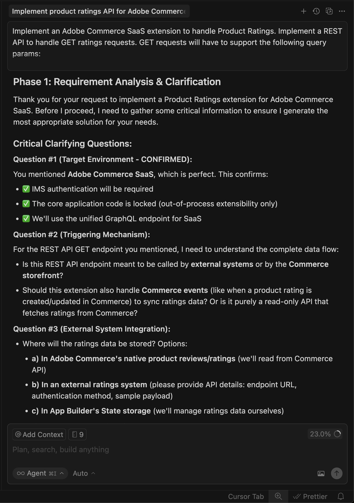
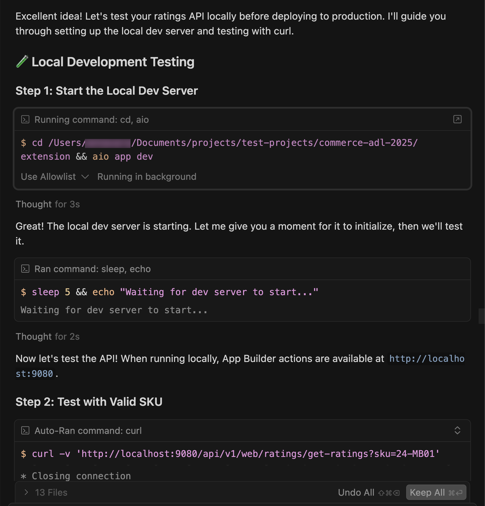
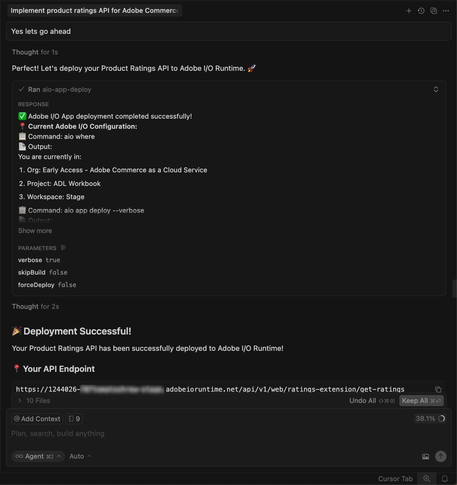
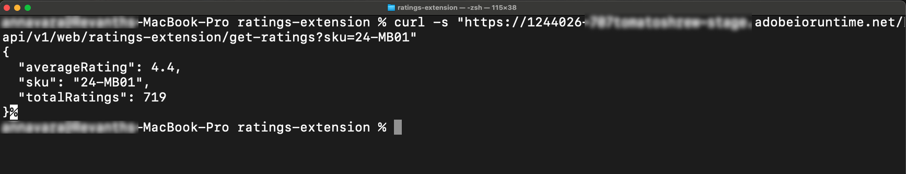

# Zelfstudie over het verlengen van beoordelingen

Deze zelfstudie begeleidt u bij het maken van een productrating-extensie voor [!DNL Adobe Commerce as a Cloud Service] gebruik van [!DNL Adobe App Builder] - en AI-ontwikkelingsprogramma&#39;s.

Alvorens u begint, voltooi de [ eerste vereisten ](./tutorial-prerequisites.md).

## Voorwaarden verifiëren

Controleer of de volgende voorwaarden zijn geïnstalleerd:

```bash
# Check Node.js version (should be 22.x.x)
node --version

# Check npm version (should be 9.0.0 or higher)
npm --version

# Check Git installation
git --version

# Check Bash shell installation
bash --version
```

Als om het even welke voorafgaande bevelen niet de verwachte resultaten terugkeren, verwijs naar de [ eerste vereisten ](./tutorial-prerequisites.md) voor begeleiding.

## Uitbreiding

In deze sectie vindt u instructies voor het ontwikkelen van een extensie voor beoordelingen voor Adobe Commerce as a Cloud Service met behulp van ontwikkelingstools voor AI.

1. Navigeer naar **[!UICONTROL Cursor]** > **[!UICONTROL Settings]** > **[!UICONTROL Cursor Settings]** > **[!UICONTROL Tools & MCP]** en controleer of de gereedschapset `commerce-extensibility` zonder fouten is ingeschakeld. Als er fouten optreden, schakelt u de gereedschapset in en uit.

   {width="600" zoomable="yes"}

   >[!NOTE]
   >
   >Als u werkt met ontwikkelprogramma&#39;s voor AI, verwacht u natuurlijke variaties in de code en reacties die door de agent worden gegenereerd.
   >Als u om het even welke kwesties met uw code ontmoet, kunt u altijd de agent vragen om u te helpen het zuiveren.

1. Documentatie uitschakelen in Cursor-context:

   * Navigeer naar **[!UICONTROL Cursor]** > **[!UICONTROL Settings]** > **[!UICONTROL Cursor Settings]** > **[!UICONTROL Indexing & Docs]** en verwijder de vermelde documentatie.

   {width="600" zoomable="yes"}

1. Code genereren voor een extensie voor productbeoordelingen:
   * Selecteer de modus **[!UICONTROL Agent]** in het chatvenster Cursor.
   * Voer de volgende vraag in:

   ```shell-session
   Implement an Adobe Commerce as a Cloud Service extension to handle Product Ratings.
   
   Implement a REST API to handle GET ratings requests.
   
   GET requests will have to support the following query parameters:
   
   sku -> product SKU
   ```

   >[!NOTE]
   >
   >Als de agent om de documentatie verzoekt te zoeken, sta het toe.

1. Beantwoord de vragen van de agent precies om het te helpen de beste code produceren.

   {width="600" zoomable="yes"}

   {width="600" zoomable="yes"}

1. Gebruik de volgende voorbeeldtekst om de vragen van de agent aan opstellings willekeurig gevormde classificatiegegevens te beantwoorden:

   ```shell-session
   Yes, this headless extension is for Adobe Commerce as a Cloud Service storefront,
   but we do not need any authentication for the GET API because guest users should be able to use it on the storefront.
   
   This extension is called directly from the storefront, no async invocation, such as events or webhooks, is required.
   
   Start with just the GET API for now, we will implement other CRUD operations at a later time.
   
   We do not need a DB or storage mechanism right now, just return random ratings data between 1 and 5 and a ratings count between 1 and 1000.
   
   The API should only return the average rating for the product and the total number of ratings.
   We do not need to add tests right now.
   ```

   De agent maakt een `requirements.md` -bestand dat als bron van waarheid voor de implementatie fungeert.

   {width="600" zoomable="yes"} wordt gecreeerd

1. Controleer het `requirements.md` -bestand en verifieer het plan.

   Als alles correct kijkt, instrueer de agent om zich aan **Fase 2 te bewegen - de Planning van de Architectuur**.

1. Controleer het architectuurplan.

1. Geef de agent de opdracht om door te gaan met het genereren van code.

   De agent produceert de noodzakelijke code en verstrekt een gedetailleerde samenvatting met uw volgende stappen.

   {width="600" zoomable="yes"}

   {width="600" zoomable="yes"}

   {width="600" zoomable="yes"}

### De extensie lokaal testen

De volgende stappen betreffen hoe u de extensie kunt controleren voordat u deze implementeert.

1. Vraag de agent om u te helpen de code plaatselijk testen.

   ```shell-session
   Test the ratings API locally on a dev server using cURL.
   ```

1. Volg de instructies van de agent en bevestig dat de API lokaal werkt.

   {width="600" zoomable="yes"}

   {width="600" zoomable="yes"}

### De extensie implementeren

Implementeer de extensie in [!DNL Adobe I/O Runtime] met de agent.

1. Na het verifiëren van de geproduceerde code, stel de uitbreiding op gebruikend de volgende herinnering:

   ```shell-session
   Deploy the ratings API.
   ```

   De agent voert een pre-plaatsingsklaar beoordeling uit alvorens op te stellen.

   {width="600" zoomable="yes"}

1. Wanneer u met de beoordelingsresultaten vertrouwd bent, instrueer de agent om met plaatsing te werk te gaan.

   De agent gebruikt toolkit MCP om, automatisch te verifiëren en op te stellen.

   {width="600" zoomable="yes"}

### Implementatie controleren

Test de API voordat u deze integreert in de winkel. De agent moet de locatie van de nieuwe actie en een teststrategie opgeven.

{width="600" zoomable="yes"}

U kunt de API ook handmatig testen met cURL in een terminal:

```bash
curl -s "https://<your-site>.adobeioruntime.net/api/v1/web/ratings/ratings?sku=TEST-SKU-123"
```

{width="600" zoomable="yes"}

### Integreren met Edge Delivery Services

Als u de API voor classificaties wilt integreren met een [!DNL Adobe Commerce] storefront die wordt aangestuurd door [!DNL Edge Delivery Services] , vraagt u de agent een servicecontract te maken met de vereisten voor de API voor classificaties:

```shell-session
Create a service contract for the ratings api that I can pass on to the storefront agent. Name it RATINGS_API_CONTRACT.md
```

{width="600" zoomable="yes"}

{width="600" zoomable="yes"}

Ga terug naar de terminal en voer de volgende opdracht in de map `extension` uit om het contractbestand naar de map `storefront` te kopiëren:

```bash
cp RATINGS_API_CONTRACT.md ../storefront
```

## Verbinding maken met de winkel

Deze sectie begeleidt u door het storefront gedeelte van de classificatieuitbreiding uit te voeren gebruikend [!DNL Edge Delivery Services] en de hulp van AI ontwikkelingshulpmiddelen.

>[!NOTE]
>
>De verstrekte herinneringen zijn beginpunten. Hoewel u hen zonder wijziging kunt gebruiken, denk na hebbend een natuurlijk gesprek met de agent.
>
>Als u werkt met ontwikkelprogramma&#39;s die zijn gebaseerd op AI, zijn er altijd natuurlijke variaties in de code en de reacties die door de agent worden gegenereerd.
>
>Als u om het even welke kwesties met uw code ontmoet, vraag de agent om u te helpen het zuiveren.

### Voorwaarden voor Storefront

Voordat u de storefront-integratie start, moet u controleren of u over het volgende beschikt:

* Een storefront-project dat is verbonden met uw [!DNL Commerce] -instantie
* Commerce storefront AI hulpmiddelen [ geïnstalleerd gebruikend CLI ](./tutorial-prerequisites.md#install-the-storefront-ai-tools)

### De werkruimte van de winkel instellen

Bereid uw lokale opslagmilieu voor ontwikkeling voor.

1. Navigeer naar de map `storefront` :

   ```bash
   cd storefront
   ```

1. Open de opslagmap in een nieuw cursorvenster.

   Alternatief, als u de [ geïnstalleerde Curseur CLI ](https://cursor.com/docs/configuration/shell#installing-cli-commands) hebt, open het venster door het volgende bevel in uw terminal te gebruiken:

   ```bash
   cursor .
   ```

1. Start de lokale ontwikkelingsserver:

   ```bash
   npm run start
   ```

1. Navigeer in een browser naar een productpagina:

   ```shell-session
   http://localhost:3000/products/llama-plush-shortie/adb336
   ```

1. Bekijk de pagina met productdetails van de boilerplate storefront (PDP) en noteer het gebrek aan visuele productclassificaties.

### De API voor classificaties integreren

Gebruik de agent om de classificaties-API te integreren in de detailpagina van het winkelproduct.

1. Gebruik de volgende herinnering met uw agent:

   ```shell-session
   Integrate the ratings API into the PDP to show star ratings and a review count for products. Here's the service contract: @RATINGS_API_CONTRACT.md
   ```

1. De agent beoordeelt de taakingewikkeldheid en roept een gefaseerde werkschema aan. Tijdens **Fase 1 (Vereisten het Verzamelen)**, leidt de agent tot een document van vereisten en vraagt het verduidelijken van vragen zoals:

   * Waar op de PDP moeten classificaties worden weergegeven?
   * Moet dit een nieuw standalone blok, of een groefaanpassing binnen de bestaande PDP drop-in component zijn?
   * Wat zou de reserve moeten zijn als API niet beschikbaar is of geen gegevens terugkeert?
   * Moeten classificaties ook worden weergegeven op de PLP (productaanbieding) of alleen op de PDP?
   * Zijn er ontwerpspecificaties of -modellen?

   Beantwoord deze vragen op basis van uw projectvereisten. De agent werkt het vereiste document bij en merkt de fase als volledig.

1. Tijdens **Fase 2 (de Planning van de Architectuur)**, onderzoekt de agent documentatie en uw codebase alvorens een architectuur voor te stellen. Verwacht dat de agent:

   * Zoek in [!DNL Commerce] documentatie naar PDP drop-in containers, groeven, en gebeurtenislading.
   * Scan de map `blocks` en de map `scripts/initializers/` naar bestaande PDP-gerelateerde code.
   * Verken de definities van TypeScript voor beschikbare containers en groefcontextvormen.

   De agent stelt dan architectuuropties zoals voor:

   * **Optie A:** pas een bestaande drop-in PDP groef aan injecterende classificaties dichtbij de producttitel - een lichtere aanraking aan die verbetering-vriendelijk is.
   * **Optie B:** creeer een nieuw standalone `product-ratings` blok dat van API onafhankelijk ophaalt - flexibeler en losgekoppeld.
   * **Optie C:** creeer een nieuw blok dat ook aan drop-in PDP gebeurtenissen voor productSKU luistert - een hybride benadering.

   Het plan omvat ook details over API integratie, prestatiesoverwegingen (luie lading, caching), veiligheid (inputontsmetting), en een het testen benadering.

   Herzie het architectuurplan en geef de agent op te werk te gaan.

1. Tijdens **Fase 3 (de Benadering van de Implementatie)**, vraagt de agent u om tussen te kiezen:

   * **Optie A:** herzie een gedetailleerd implementatieplan vóór codegeneratie (zie alle dossiers, patronen, en codestructuur eerst).
   * **Optie B:** ga direct aan codegeneratie te werk.

   Selecteer uw voorkeursaanpak.

1. Tijdens **Fase 4 (Implementatie)**, produceert de agent code die op de gekozen architectuur wordt gebaseerd. Afhankelijk van de benadering, gebruikt de agent verscheidene gespecialiseerde vaardigheden:

   * **Inhoud modelleren:** als een nieuw blok nodig is, ontwerpt de agent een auteursvriendelijke inhoudsstructuur, zoals een configuratielijst met het API eindpunt URL.
   * **de ontwikkeling van het Blok:** de agent leidt tot blokdossiers na [!DNL Edge Delivery Services] overeenkomsten, met inbegrip van de versiefuncties van JavaScript, scoped CSS stijlen, de etiketten van ARIA voor toegankelijkheid, en lading en fout staat behandeling.
   * **drop-in aanpassing:** als de architectuur groefaanpassing gebruikt, voert de agent de correcte container in, gebruikt een geverifieerde groef dichtbij de producttitel, en abonneert aan de gebeurtenissen van productgegevens voor huidige SKU.

   Bekijk de code die wordt gegenereerd en stel vragen of richt de agent zo nodig om. De agent produceert een samenvatting van de productiereedheid wanneer de codegeneratie voltooit.

1. Tijdens **Fase 4.5 (het Testen)**, biedt de agent aan om de implementatie te testen. Als u goedkeurt, de agent:

   * Hiermee maakt u een lokale testpagina met de juiste scripts en stijlen.
   * Start een ontwikkelingsserver.
   * Voert op browser-gebaseerde verificatie voor visuele teruggeven, interactiviteit, ontvankelijk gedrag, toegankelijkheid, en prestaties in werking.
   * Genereert een gestructureerd testrapport met de resultaten.

   Volg de procedure in de browser om het gedrag te bevestigen en eventuele problemen te melden.

1. Bekijk de wijzigingen in de codebase en bekijk de productpagina voor updates.

   U zou de volgende veranderingen in uw ontwikkelomgeving en browser moeten zien:

   * Er wordt automatisch een productrating-component gemaakt.
   * De component is geïntegreerd in PDP gebruikend [ drop-in groeven ](https://experienceleague.adobe.com/developer/commerce/storefront/dropins/customize/slots) of als standalone blok, afhankelijk van de gekozen architectuur.
   * De sterren worden weergegeven met de juiste vulverhoudingen op basis van de classificatiewaarden van de API.

   {width="600" zoomable="yes"}

## Zelfstudie

Hier volgt een overzicht van de onderwerpen die in deze zelfstudie worden behandeld:

* **de ontwikkeling van de Uitbreiding:** Lerend hoe te om nieuwe functionaliteit aan een agent te beschrijven AI en werkende REST API te produceren gebruikend [!DNL App Builder].
* **Lokale het testen en plaatsing:** Testen van API plaatselijk en het opstellen van het gebruikend toolkit MCP.
* **de contracten van de Dienst:** Creërend API contracten die achterste uitbreidingen en storefront implementaties overbruggen.
* **Geleidelijke storefront integratie:** Werkend door vereisten, architectuur, en implementatie gebruikend AI-bijgewoonde vaardigheden.
* **drop-in integratie:** Werkend met [!DNL Adobe Commerce] drop-in containers en groeven.
* **Herbruikbaarheid van de Component:** Creërend gedeelde componenten die over veelvoudige blokken worden gebruikt.

## Volgende stappen

Gebruik de volgende suggesties om de extensie van uw beoordelingen aan te passen of om uw eigen wijzigingen te maken:

### De sterkleuren wijzigen

Gebruik de volgende herinnering met uw agent:

```shell-session
Change the star fill color to red.
```

**Verwachte uitkomst:**

De sterren veranderen in rood.

{width="600" zoomable="yes"} worden getoond

### Een modaal classificatiedistributie toevoegen

De volgende stappen tonen hoe de agent complexe eigenschappen UI met visuele verwijzingen behandelt.

1. **alvorens te beginnen:** sparen het volgende modelbeeld en kleef het in het praatje met uw storefront agent.

   {width="600" zoomable="yes"}

1. Ga als volgt te werk om de distributie van classificaties te maken met de referentieafbeelding als richtlijn:

   * Werk API bij om extra gegevens terug te keren die de classificatiedistributie vertegenwoordigen.
   * Werk het API-contract bij.
   * Werk het contract bij in de storefront-codebase.
   * Vraag de storefront agent om het verwijzingsbeeld en bijgewerkte API contract te gebruiken om de classificatiedistributie aan de PDP pagina toe te voegen.

1. Bekijk de volgende wijzigingen in de codebase en bekijk de productpagina voor updates:

   * Hoe de agent het visuele model interpreteert
   * Of de juiste HTML-structuur voor toegankelijkheid wordt gebruikt
   * Hoe de positionering en interactiestatus worden verwerkt

#### Los het distributiemodel problemen op

Probeer het volgende als het modaal zich niet zoals verwacht gedraagt:

* Controleer de browserconsole op fouten als het modaal niet wordt weergegeven.
* Als het plaatsen weg is, vraag de agent om het te bevestigen gebruikend het volgende formaat:

  ```shell-session
  adjust the modal position to be...
  ```

{width="600" zoomable="yes"}
