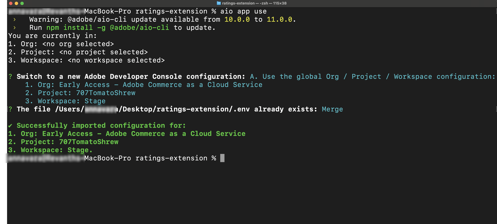

# Voorwaarden voor zelfstudie

Deze pagina maakt een lijst van de eerste vereisten en opstellingsstappen voor [!DNL Adobe Commerce as a Cloud Service] leerprogramma&#39;s, zoals het [ leerprogramma van de classificatieuitbreiding ](./ratings-extension.md) en het [ verschepen zelfstudie van de methodeuitbreiding ](./shipping-method-extension.md).

## Algemene voorwaarden

De volgende gereedschappen zijn vereist voor de ontwikkeling van extensies en winkels in deze zelfstudie.

* [!DNL Node.js] (version `22.x.x` ) en npm ( `9.0.0` of hoger): controleer de installatie met de volgende opdracht:

  ```bash
  node --version
  npm --version
  ```

* Installeer [ Git ](https://git-scm.com) - verifieer uw installatie:

  ```bash
  git --version
  ```

* Schelp
   * macOS/Linux: geen installatie vereist
   * Vensters: Het gebruik [ Bash van de Git ](https://git-scm.com/install) of [ Subsysteem van Vensters voor Linux (WSL) ](https://learn.microsoft.com/en-us/windows/wsl/install)

* Download AI-bijgewoonde winde, zoals [ Cursor ](https://cursor.com/download) (geadviseerd). Andere IDEs, zoals de Code van Claude, Gemini CLI, of Copilot worden ook gesteund, maar kon wijzigingen in de herinneringen en andere stappen in het leerprogramma vereisen.

## [!DNL Adobe Commerce as a Cloud Service] voorwaarden

* De [!DNL Adobe I/O CLI] installeren

  ```bash
  npm install -g @adobe/aio-cli
  ```

* Installeer [ Adobe I/O CLI Commerce ](https://github.com/adobe-commerce/aio-cli-plugin-commerce), [ Adobe I/O CLI Runtime ](https://github.com/adobe/aio-cli-plugin-runtime), en [ App Builder CLI ](https://github.com/adobe/aio-cli-plugin-app-dev) stoppen:

  ```bash
  aio plugins:install https://github.com/adobe-commerce/aio-cli-plugin-commerce @adobe/aio-cli-plugin-app-dev @adobe/aio-cli-plugin-runtime
  ```

Nadat u de [!DNL Adobe I/O CLI] en de vereiste plug-ins hebt geïnstalleerd, stelt u de werkruimte voor uitbreidbaarheid in. Adobe raadt u aan de automatische installatie te gebruiken voor een zo snel mogelijke ervaring.

* **[Geautomatiseerde opstelling ](#automated-setup) (Geadviseerd)** — stel één enkel bevel in werking om uw werkruimte automatisch te vormen.
* **[Handmatige opstelling](#manual-setup)** - volg geleidelijke instructies om elke component individueel te vormen.

### Geautomatiseerde installatie (aanbevolen) {#automated-setup}

>[!TIP]
>
>Als u kwesties met de geautomatiseerde opstelling ontmoet, volg de [ handopstelling ](#manual-setup) stappen hieronder.

De opdracht `app-setup` automatiseert het installatieproces van de werkruimte, inclusief het maken van een [!DNL Adobe Developer Console] -project, het toevoegen van de vereiste API&#39;s, het configureren van de [!DNL Adobe I/O CLI] , het klonen van de startkit, het verbinden van uw lokale werkruimte en het installeren van de uitbreidbare AI-gereedschappen.

De opdracht `app-setup` begeleidt u door de volgende stappen:

* Een [!DNL Adobe Developer Console] -project met de vereiste API&#39;s selecteren of maken
* [!DNL Adobe I/O CLI] configureren met uw organisatie, project en werkruimte
* De juiste startkit klonen en het project instellen
* De omgeving configureren en de lokale werkruimte verbinden met de externe werkruimte
* De uitbreidingshulpmiddelen van Commerce installeren en de vaardigheden van de coderingsagent

Voer de volgende opdracht uit en volg de interactieve aanwijzingen:

```bash
aio commerce extensibility app-setup
```

Nadat het bevel voltooit, navigeer aan uw projectfolder en begin uw coderende agent opnieuw om de nieuwe hulpmiddelen MCP en vaardigheden te laden. Als uw zelfstudie een storefront vereist, voert u de opdracht opnieuw uit en selecteert u de [!DNL AEM Boilerplate Commerce] startkit.

De volgende voorbeeldinstallatie toont de interactieve herinneringen en de output voor de uitcheckstarter kit.

+++Voorbeeld installeren (startkit voor uitchecken)

```shell-session
aio commerce extensibility app-setup

🚀 Adobe Commerce Extensibility App Setup

✔ Logged in
📁 Working directory: /Users/username/projects/my-commerce-project

✔ Which starter kit would you like to use? Checkout Starter Kit
✔ Enter a name for your project directory: my-extension
✔ Which coding agent would you like to install the skills for? Cursor

📦 Cloning Checkout Starter Kit...
   ✔ Repository cloned
   Using npm (package-lock.json found)
   ✔ Dependencies installed

📋 Current Adobe I/O Console configuration:
   Org: My Organization (1234567)
   Project: My Commerce Project (1234567890123456789)
   Workspace: Stage (9876543210987654321)
✔ Do you want to continue with this configuration? (Answer "No" to select a different org/project/workspace)
No

🔧 Selecting Adobe I/O Console org, project, and workspace...

? Select Org: My Organization
Org selected My Organization
You are currently in:
1. Org: My Organization
2. Project: <no project selected>
3. Workspace: <no workspace selected>

? Select Project: My Commerce Project
Project selected : My Commerce Project
You are currently in:
1. Org: My Organization
2. Project: My Commerce Project
3. Workspace: <no workspace selected>

? Select Workspace: Stage
Workspace selected Stage
You are currently in:
1. Org: My Organization
2. Project: My Commerce Project
3. Workspace: Stage

✅ Console configured:
   Org: My Organization
   Project: My Commerce Project
   Workspace: Stage

🔐 Configuring workspace credentials and services...
   ✔ Workspace configuration loaded
   ✔ OAuth server-to-server credentials already configured
   ✔ All required services available in organization
   ✔ Subscribed to: Adobe Commerce as a Cloud Service

📋 Configuring Checkout Starter Kit...
   Creating .env from env.dist...
✔ Select tenant (type to search) My Commerce Instance:
https://<region>.api.commerce.adobe.com/<tenant-id>/graphql
   ✔ Commerce instance configured
✔ Enter the event prefix for your workspace: my-prefix
   ✔ Workspace IDs configured
   ✔ OAuth credentials configured
   ✔ Checkout Starter Kit configured

🔧 Installing Commerce Extensibility tools and agent skills...
   ✔ Commerce Extensibility tools installed

🎉 App setup complete!

📁 Project directory: /Users/username/projects/my-commerce-project/my-extension

Next steps:
   1. cd into your project directory
   2. Restart your coding agent to load the Commerce Extensibility tools and skills
```

+++

### Handmatige installatie {#manual-setup}

In de volgende secties wordt beschreven hoe u handmatig elke component van uw uitbreidbaarheidswerkruimte instelt. Volg deze stappen als u handconfiguratie verkiest, of als u kwesties met de [ geautomatiseerde opstelling ](#automated-setup) ontmoet.

### Adobe Developer Console-voorwaarden

Stel een project in de Adobe Developer Console in met de vereiste API&#39;s en referenties.

1. Navigeer aan [ Adobe Developer Console ](https://developer.adobe.com/console){target="_blank"}.
1. Meld u aan met uw e-mail en wachtwoord.

#### Een nieuw project maken

Maak een App Builder-project in de Adobe Developer Console als host voor uw extensie.

1. Navigeer aan [ Adobe Developer Console ](https://developer.adobe.com/).
1. Klik op **[!UICONTROL Create project from a template]**.
1. Selecteer de sjabloon **[!UICONTROL App Builder]** .
1. Voer een **[!UICONTROL Project Title]** en **[!UICONTROL App Name]** in.
1. Controleer of het selectievakje **[!UICONTROL Include Runtime]** is gemarkeerd.

   {width="600" zoomable="yes"}

1. Klik op **[!UICONTROL Save]**.

#### API&#39;s toevoegen aan de werkruimte

Voeg de vereiste API&#39;s toe aan uw werkruimte van het werkgebied voor gebeurtenisbeheer en Commerce-integratie.

1. Klik op de werkruimte **[!UICONTROL Stage]** en herhaal vervolgens de volgende stappen voor elke API.

   {width="600" zoomable="yes"}

1. Klik op **[!UICONTROL Add Service]** en selecteer **[!UICONTROL API]** .

1. Selecteer een van de volgende API&#39;s. Herhaal dit proces voor elke API hieronder:

   * **[!UICONTROL Adobe Services]** filter:
      * **[!UICONTROL I/O Management API]**
      * **[!UICONTROL I/O Events]** API
   * **[!UICONTROL Experience Cloud]** filter:
      * **[!UICONTROL Adobe I/O Events for Adobe Commerce]** API

1. Klik op **[!UICONTROL Next]**.

1. Klik op **[!UICONTROL Save configured API]**.

1. Herhaal de vorige stappen totdat u alle API&#39;s aan de werkruimte toevoegt.

   {width="600" zoomable="yes"}

### De Adobe I/O CLI configureren

Verbind [!DNL Adobe I/O CLI] met uw organisatie, project, en werkruimte.

1. Wis om het even welke bestaande configuratie:

   ```bash
   aio config clear
   ```

1. Meld u aan met [!DNL Adobe I/O CLI] :

   ```bash
   aio auth login -f
   ```

1. Selecteer uw organisatie, project, en werkruimte gebruikend elk van de volgende bevelen:

   ```bash
   aio console org select
   ```

   ```bash
   aio console project select
   ```

   ```bash
   aio console workspace select
   ```

   {width="600" zoomable="yes"}

### De startkits klonen

Kloont een van de volgende Commerce starter kit repositories voor de extensie die u bouwt en bereidt uw project voor:

Integratiestartkit:

```bash
git clone https://github.com/adobe/commerce-integration-starter-kit.git extension
cd extension
```

Uitchecken startkit:

```bash
git clone https://github.com/adobe/commerce-checkout-starter-kit.git extension
cd extension
```

>[!BEGINTABS]

>[!TAB  Startuitrusting van de Integratie ]

### Een .env-bestand maken

Maak uw configuratiebestand voor de omgeving:

```bash
cp env.dist .env
```

Open het bestand `.env` in een teksteditor en voeg de volgende OAuth-referenties toe:

```bash
OAUTH_CLIENT_ID=
OAUTH_CLIENT_SECRET=
OAUTH_TECHNICAL_ACCOUNT_ID=
OAUTH_TECHNICAL_ACCOUNT_EMAIL=
OAUTH_ORG_ID=
```

Kopieer deze waarden van de **[!UICONTROL Credential details]** pagina in [ Developer Console ](https://developer.adobe.com/) door het **[!UICONTROL OAuth Server-to-Server]** lusje op uw werkruimte te klikken.

{width="600" zoomable="yes"}

#### De Commerce-configuratie toevoegen

Voeg de volgende Commerce-instantiedetails toe aan uw `.env` -bestand:

```bash
COMMERCE_BASE_URL=
COMMERCE_GRAPHQL_ENDPOINT=
```

U kunt als volgt de volgende waarden vinden:

1. Navigeer aan [ instanties van de Dienst van Commerce Cloud ](https://experience.adobe.com/#/@commerce/commerce/cloud-service/instances).
1. Klik op het informatiepictogram naast de instantie.
1. Kopieer het REST-eindpunt als `COMMERCE_BASE_URL` .
1. Kopieer het GraphQL-eindpunt als `COMMERCE_GRAPHQL_ENDPOINT` .

#### Gebeurtenisvoorvoegsel instellen

Stel een tijdelijke waarde in voor het voorvoegsel van de gebeurtenis:

```bash
EVENT_PREFIX=test
```

### De werkruimteconfiguratie downloaden

Voer de volgende opdracht uit om het configuratiebestand van de werkruimte te downloaden:

```bash
aio console workspace download workspace.json
```

Kopieer het configuratiebestand van de werkruimte naar de map `scripts` :

```bash
cp workspace.json scripts/
```

### De lokale werkruimte verbinden met de externe werkruimte

Koppel uw lokale project aan de externe werkruimte:

```bash
aio app use workspace.json -m
```

{width="600" zoomable="yes"}

>[!TAB  Uitchecken starter kit ]

### Lokale werkruimte verbinden met externe werkruimte

Koppel uw lokale project aan de externe werkruimte. Voer vanuit de hoofdmap van het project (de map `extension` ):

```bash
aio app use --merge
```

Wanneer ertoe aangezet, kies de optie die de organisatie, het project, en de werkruimte gebruikt u selecteerde toen het vormen van Adobe I/O CLI. Hiermee schrijft u de werkruimteconfiguratie naar uw app, zodat deze werkruimte wordt gebruikt bij de implementatie en lokale ontwikkeling.

{width="600" zoomable="yes"}

>[!ENDTABS]

### De uitbreidbaarheidsprogramma&#39;s voor AI installeren

Dit proces leidt tot de configuratie MCP (`.<agent>/mcp.json`), de vaardigheidsfolder (`.<agent>/skills/`), en voegt `AGENTS.md` aan de projectwortel toe. U wordt gevraagd een startkit, coderingsagent en pakketbeheer te kiezen.


1. Stel de ontwikkelprogramma&#39;s voor AI-toepassingen in de map `extension` in met behulp van de volgende opdrachten:

   ```bash
   cd extension
   ```

   ```bash
   aio commerce extensibility tools-setup
   ```

   {width="600" zoomable="yes"}

1. Nadat de opstelling voltooit, nieuw begin uw coderingsagent om het toe te staan om de nieuwe hulpmiddelen MCP en vaardigheden te laden. De Commerce App Builder-tools zijn nu beschikbaar in uw omgeving.

   >[!NOTE]
   >
   >Als u een waarschuwing ziet dat er geen vaardigheden zijn gevonden voor de startkit, is er iets fout gegaan, vaak omdat de installatie in een andere map dan waar de startkit is gekloond, is uitgevoerd. Voer `aio commerce extensibility tools-setup` uit vanuit de map `extension` (de hoofdmap van het startkit-project) en selecteer de juiste startkit wanneer hierom wordt gevraagd.

   {width="600" zoomable="yes"}

## Handmatige installatie van Storefront

Deze sectie beschrijft hoe te om uw storefront voor het [ leerprogramma van de uitbreidingsuitbreiding van Classificaties ](./ratings-extension.md) en andere storefront leerprogramma&#39;s manueel te vormen.

Om uw storefront automatisch te vormen, stel het `app-setup` bevel in werking in de [ Geautomatiseerde opstelling ](#automated-setup) sectie wordt beschreven en selecteer [!DNL AEM Boilerplate Commerce] starter uitrusting die.

### Vereisten

De volgende punten worden vereist om de [ opslag ](./ratings-extension.md#connect-to-the-storefront) sectie van de [ de uitbreidingsleerprogramma van classificaties ](./ratings-extension.md) te voltooien en productratings in uw opslag te tonen.

* [ Google Chrome ](https://www.google.com/chrome/) - Vereist voor het testen van de storefront

* Een storefront-project dat is verbonden met uw [!DNL Commerce] -instantie. Als u geen storefront project hebt, volg de stappen in [ creeer een storefront ](https://experienceleague.adobe.com/developer/commerce/storefront/get-started/create-storefront/){target="_blank"}, met inbegrip van de [ reactie van de Verbinding aan handelsgegevens ](https://experienceleague.adobe.com/developer/commerce/storefront/get-started/create-storefront/#link-repo-to-commerce-data){target="_blank"} sectie.

### De opslagplaats klonen

Open uw terminal en kloon de repository:

```bash
git clone https://github.com/hlxsites/aem-boilerplate-commerce.git storefront
cd storefront
```

### De afhankelijkheden installeren

Installeer de projectafhankelijkheden:

```bash
npm install
```

### De storefront AI-gereedschappen installeren

Stel de ontwikkelprogramma&#39;s voor AI-toepassingen in de map `storefront` in.

Voer het volgende bevel van de wortel van uw bouwsteenproject in werking. Het bevel installeert het `@adobe-commerce/commerce-extensibility-tools` pakket als dev gebiedsdeel, kopieert de vaardigheidsdossiers in de vaardigheidsfolder van uw agent, en vormt MCP (ModelContext Protocol) zodat kan uw agent tot de hulpmiddelen van het de documentatieonderzoek van Commerce toegang hebben.

```bash
aio commerce extensibility tools-setup
```

Het bevel loopt u door twee herinneringen:

1. **selecteer een starteruitrusting** - kies **AEM Boilerplate Commerce**.

1. **selecteer uw coderingsagent** — kies uw agent van de lijst van gesteunde agenten.
