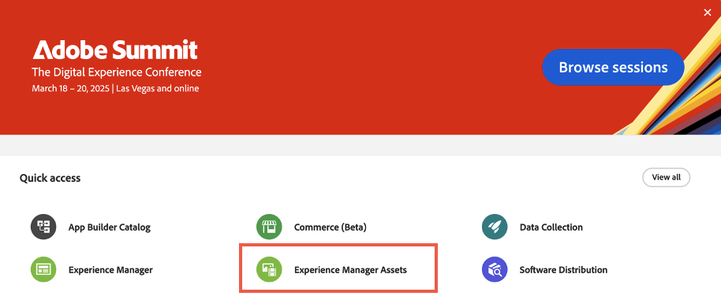
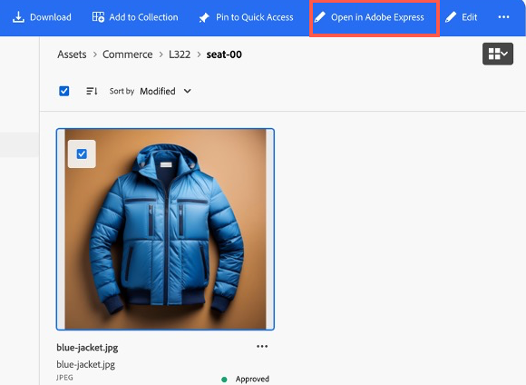

# Gebruik hoofdletters

De volgende gebruiksgevallen tonen de kernfunctionaliteit en bedrijfsscenario&#39;s aan die door [!DNL Adobe Commerce as a Cloud Service] worden ondersteund, zodat u de ontwikkeling kunt versnellen en ervaringen met een hoog effect kunt starten.

Als u om het even welke kwesties ontmoet, controleer de [&#x200B; sectie van het Oplossen van problemen &#x200B;](#troubleshooting) voor begeleiding.

## Vereisten

Voordat u een van deze gebruiksgevallen kunt proberen, moet u aan de volgende voorwaarden voldoen:

1. [&#x200B; creeer uw instantie van Cloud Service &#x200B;](./getting-started.md#create-an-instance) gebruikend de volgende opties:
   1. Selecteer [!UICONTROL **Sandbox**] in [!UICONTROL **Milieu**] dropdown.
   1. Selecteer [!UICONTROL **Opslag van Adobe**] in [!UICONTROL **Gegevens van de Test**] dropdown.
1. [&#x200B; Login aan uw rekening van Adobe Experience Cloud &#x200B;](https://experience.adobe.com)
1. [&#x200B; opstelling uw Cloud Service storefront &#x200B;](./storefront.md) gebruikend de volgende opties:
   1. Selecteer [!UICONTROL `adobe-commerce/adobe-demo-store`] voor de sjabloon.
   1. Selecteer [!UICONTROL **Kiezen een beschikbare instantie (Net -> SaaS)**] voor de verbindingsmethode.

## Workflow voor uitchecken

Deze workflow laat zien hoe een klant een product kan kopen bij de winkel en hoe u als beheerder de bestelling kunt bevestigen.

### Betalingsdiensten inschakelen

1. In Commerce Admin, navigeer aan [!UICONTROL **Opslag**] > [!UICONTROL Settings] > [!UICONTROL **Configuratie**] > [!UICONTROL **de Methoden van de Betaling**].

1. In de [!UICONTROL **Algemene sectie van de Configuratie**], ga uw `Payment Services Sandbox ID` en `Payment Services Sandbox Key` in. U kunt deze IDs krijgen door de stappen te volgen die in [&#x200B; worden beschreven Sandbox onboarding &#x200B;](../payment-services/sandbox.md#sandbox-onboarding)

1. Plaats [!UICONTROL **laat**] dropdown [!UICONTROL **toe ja**].

1. Klik [!UICONTROL **sparen Config**].

### Een product aanschaffen

1. Ga naar [&#x200B; storefront &#x200B;](./storefront.md) u in de eerste vereisten creeerde.

1. Een product zoeken en selecteren. Maak de benodigde aanpassingsselecties. Dan klik [!UICONTROL **toevoegen aan wagentje**].

   {width="600" zoomable="yes"}

1. Selecteer het pictogram van het karretje om uw kar te bekijken.

   {width="600" zoomable="yes"}

1. Klik [!UICONTROL **Controle**].

   {width="600" zoomable="yes"}

1. Voer de vereiste contactgegevens en verzendgegevens in. U kunt fictieve informatie voor deze orde gebruiken.

1. Om te controleren, uitgezochte [!UICONTROL **Controle/Geldorde**]. Als u een creditcard wilt gebruiken, gebruik één van de [&#x200B; testkaarten die door PayPal &#x200B;](https://developer.paypal.com/tools/sandbox/card-testing/#link-teststaticcardnumbers) worden verstrekt. U kunt deze gebruiken met om het even welke toekomstige vervaldatum en om het even welke CVC.

   {width="600" zoomable="yes"} in

   {width="600" zoomable="yes"}

1. Klik [!UICONTROL **de Orde van de Plaats**].

### Bevestig de bestelling

1. Open Commerce Admin: `<your store URL>/admin`.

1. Meld u aan met uw Adobe ID.

1. Navigeer aan [!UICONTROL **Verkoop**] > [!UICONTROL **Orders**].

   {width="600" zoomable="yes"}

1. Zoek naar de orde u plaatste en bevestig de details.

   {width="600" zoomable="yes"}

## Stroominhoud bijwerken

Inhoud rechtstreeks in de winkel maken, bewerken en publiceren.

1. Open [&#x200B; storefront &#x200B;](./storefront.md) u in de eerste vereisten creeerde.

1. Open Store Builder. Door naar `https://da.live/#/<GitHub User Name>/<Repository Name>/main/da/index.md` te navigeren.

1. Open de [!UICONTROL **pagina van de Index**].

1. Voer onder het Carousel-blok een nieuwe titel in door de regel &quot;Welkom bij de Adobe Store Demo&quot; te bewerken.

1. Klik verzenden pictogram en klik [!UICONTROL **Voorproef**].

1. Herzie de voorproefpagina en klik [!UICONTROL **publiceren**].

1. Vernieuw de winkelpagina en bevestig dat uw wijzigingen nu live zijn.

## Contextuele experimenten

Met de functie voor contextafhankelijke experimenten in Adobe Commerce kunt u experimenten op uw winkel maken en beheren om verschillende inhoud en configuraties te testen.

### Vereisten

* Installeer de [&#x200B; uitbreiding van AEM Sidekick &#x200B;](https://www.aem.live/docs/sidekick)

1. In Bouwer Storefront, selecteer uw indexpagina en klik [!UICONTROL **Exemplaar**].

1. Creeer een [!UICONTROL **experimenten**] omslag onder de belangrijkste omslag, door de [!UICONTROL **Nieuwe**] knoop te klikken en [!UICONTROL **Omslag**] te selecteren.

1. Creeer een omslag genoemd **1234** in de [!UICONTROL **experimenten**] omslag.

1. Plak de twee exemplaren van de indexpagina in de **1234** omslag.

1. Open elke pagina en wijzig de naam van deze pagina in &quot;homev1&quot; en &quot;homev2&quot;. Dit zijn uw [&#x200B; uitdagers &#x200B;](https://www.aem.live/docs/experimentation#create-your-challenger-page).

1. Wijzig elke pagina om verschillende inhoud op te nemen. Wijzig bijvoorbeeld de hoofdafbeelding of de tekst. U moet de verschillen tussen elke pagina kunnen identificeren.

1. Publiceer elk van uw pagina&#39;s van de uitdager.

1. Open uw controlepagina, de originele indexpagina.

1. Voeg een nieuw blok met de titel [!UICONTROL **meta-gegevens**] toe.

1. De volgende informatie toevoegen aan de rijen van het metagegevensblok

   * Titel - Adobe Commerce
   * Beschrijving - Een webwinkel
   * Experimenteer - 1234
   * Experimentele varianten
      * `https://<your-site>.aem.live/experiments/1234/indexv1`
      * `https://<your-site>.aem.live/experiments/1234/indexv2`

   {width="600" zoomable="yes"}

1. Open een incognito- of Private Browsing-venster en navigeer naar de hoofdpagina.

1. Sluit het Private Browsing-venster en herhaal de vorige stap. Elke keer dat u de pagina opent, ziet u een willekeurige variant die u hebt gemaakt.

## Verbeter de inhoud van de winkel

Met AEM Assets, Adobe Express en Firefly kunt u nu snel wijzigingen aanbrengen in afbeeldingen die in uw winkel worden weergegeven met een eenvoudige, zelfgestuurde workflow.

### Vereisten

* Vereist toegang tot AEM Assets, Adobe Express en Adobe Firefly.

### De achtergrond van een afbeelding aanpassen

Overweeg een scenario waarin u de achtergrond van een productafbeelding snel wilt wijzigen. Met de combinatie van Adobe Commerce, AEM Assets en Adobe Express kunt u deze wijziging in een paar eenvoudige stappen doorvoeren.

1. Open [&#x200B; storefront &#x200B;](./storefront.md) u in de eerste vereisten creeerde en aan een punt navigeert u wilt veranderen. Noteer de SKU- of productcode van de items.

1. Open [!UICONTROL AEM Assets], door het in [&#x200B; Adobe Experience Cloud &#x200B;](https://experience.adobe.com/#/home) te selecteren.

   {width="600" zoomable="yes"}

1. Klik op [!UICONTROL Assets].

   {width="600" zoomable="yes"}

1. Onderzoek naar het punt door **SKU** of **Code van het Product**.

1. Selecteer het punt u wilt uitgeven en [!UICONTROL **Open in Adobe Express**] klikken.

   {width="600" zoomable="yes"}

1. In het [!UICONTROL **paneel van het Beeld**], uitgezochte [!UICONTROL **voorwerp van het Tussenvoegsel**].

   {width="600" zoomable="yes"}

1. Beschrijf in het tekstvak de afbeelding die u wilt toevoegen. Bijvoorbeeld &quot;sneeuwpijnbomen&quot;.

   {width="600" zoomable="yes"}

1. Pas de [!UICONTROL Brush size] aan en teken waar u de gegenereerde afbeelding wilt toevoegen. In dit voorbeeld tekent u rondom het bestaande object om de achtergrond te selecteren.

1. Klik [!UICONTROL **produceren**] om de resultaten te bekijken.

1. Kies van de verschillende resultaten, door de gewenste optie te selecteren en [!UICONTROL **te klikken houd**].

1. Klik [!UICONTROL **Uw Stuff**] om aan de beeldredacteur terug te keren.

1. Klik [!UICONTROL **sparen**] om het beeldtype te specificeren.

1. Klik [!UICONTROL **sparen**] opnieuw om de veranderingen te bewaren.

1. In [!UICONTROL **sparen activa**] dialoog, selecteer de omslag van de Bestemming van Commerce [!UICONTROL **&#x200B;**].

   {width="600" zoomable="yes"}

1. Klik [!UICONTROL **sparen als nieuwe activa**] om het beeld te bewaren.

#### De afbeelding toevoegen aan Commerce AEM Assets

1. Van het [&#x200B; Comité van de Navigatie &#x200B;](https://experienceleague.adobe.com/nl/docs/experience-manager-cloud-service/content/sites/authoring/basic-handling#navigation-panel) van AEM as a Cloud Service, uitgezochte **Assets** > **Dossiers** > **Commerce** en klik op de activa u in de vorige sectie creeerde.

   {width="600" zoomable="yes"}

1. Klik [!UICONTROL **Eigenschappen**].

   {width="600" zoomable="yes"}

1. Selecteer het [!UICONTROL **Commerce**] lusje.

   {width="600" zoomable="yes"}

1. Zorg ervoor dat [!UICONTROL **het in Adobe Commerce bestaat?**] gebied wordt geplaatst aan [!UICONTROL **ja**].

1. Klik [!UICONTROL **toevoegen**] en ga productSKU in u de activa aan wilt toevoegen.

   {width="600" zoomable="yes"} toe

1. Selecteer de positie voor het element en het type element.

1. Selecteer het [!UICONTROL **Basis**] lusje en verander het [!UICONTROL **lusje van de Status van het Overzicht**] aan [!UICONTROL **Goedgekeurd**].

   {width="600" zoomable="yes"} goed

1. Klik [!UICONTROL **sparen &amp; Sluiten**].

#### De afbeelding bevestigen in Commerce

1. In Adobe Commerce [!UICONTROL **Admin**], navigeer aan [!UICONTROL **Catalogus**] > [!UICONTROL **Producten**].

1. Selecteer het product waaraan u de afbeelding in de vorige sectie hebt toegevoegd.

1. Breid de [!UICONTROL **Beelden en de sectie van Video&#39;s**] uit.

   {width="600" zoomable="yes"}

1. Controleer of de afbeelding nu beschikbaar is in de lijst met afbeeldingen.

1. Ga terug naar de winkel en navigeer naar de pagina voor het gewijzigde product.

1. Controleer of de nieuwe afbeelding wordt weergegeven.

   {width="600" zoomable="yes"}

## Variaties genereren

Adobe Commerce Generate Variations gebruikt Generative AI om het genereren van inhoud van hoge kwaliteit te automatiseren, berichten te verfijnen en elementen naadloos naar uw winkel te publiceren.

### Tekst genereren

1. Open uw storefront plaats gebruikend de [&#x200B; Universele Redacteur &#x200B;](https://experienceleague.adobe.com/nl/docs/experience-manager-cloud-service/content/implementing/developing/universal-editor/introduction).

1. Selecteer het tekstblok dat u wilt bewerken.

1. In het [!UICONTROL **paneel van Eigenschappen**], klik [!UICONTROL **produceer Variaties**].

1. Klik [!UICONTROL **produceren**] knoop.

1. Selecteer of pas de gegenereerde tekst aan.

1. Klik [!UICONTROL **publiceren**] om uw storefront bij te werken.

### Inhoud en afbeeldingen genereren

1. Open [&#x200B; produceer Variaties &#x200B;](https://experienceleague.adobe.com/nl/docs/experience-manager-cloud-service/content/generative-ai/generate-variations)

1. Selecteer het [!UICONTROL **malplaatje van de Banner van de Hero**].

1. In [!UICONTROL **verklaar gebruikersinteractie**] textbox, ga binnen: &quot;Ervaring voor de werknemers en de partners van Adobe om Adobe-branded vistuig te kopen!&quot;

1. In [!UICONTROL **URL voor domeinkennis**], ga **www.adobestore.com** in.

1. Klik [!UICONTROL **produceren**].

1. Selecteer een inhoudsvariatie en klik [!UICONTROL **produceer Beeld**].

1. Van de [!UICONTROL **grootte van het Beeld**] dropdown, uitgezochte [!UICONTROL **Breedbeeld (16 :9)**].

1. Van het [!UICONTROL **type van Inhoud**] dropdown, uitgezochte [!UICONTROL **Foto**].

1. Voor het [!UICONTROL **de verwijzingsbeeld van de Stijl**], selecteer de bestaande de archiefbanner van Adobe.

1. Selecteer het geproduceerde beeld dat u wilt gebruiken en [!UICONTROL **klikken sparen**].

1. Herhaal dit proces met andere referentieafbeeldingen om meer variaties te genereren.

## Problemen oplossen

Gebruik de volgende suggesties om problemen op te lossen die u tegenkomt wanneer u deze zelfstudies uitvoert.

* Als u hulp bij bevelen of vlaggen nodig hebt:
   1. Voer `aio --help` uit om alle beschikbare opdrachten en markeringen weer te geven.
   1. Gebruik de markering `--help` voor specifieke opdrachten. Bijvoorbeeld:
      * `aio console --help`
      * `aio commerce –help`

* Als er zich ongeldige aanmeldingsproblemen voordoen:
   1. Voer `aio config clear ` uit.
   1. Voer `aio auth login –-force ` uit.
   1. Meld u aan in uw browser.
   1. Selecteer uw profiel.
   1. Ga terug naar de terminal om door te gaan.

* Als de opdracht `init` mislukt:
   1. Voer `aio api-mesh delete` uit.
   1. Voer `aio commerce init` opnieuw uit.

* Als u de verkeerde organisatie, het project of de werkruimte hebt geselecteerd voordat u de opdracht `init` uitvoert:
   1. Voer `aio console org select` uit.
   1. Voer `aio console project select` uit.
   1. Voer `aio console workspace select` uit.

* Als u een ongeldige huurderselectie hebt:
   1. Annuleer de huidige CLI uitvoering door **CTRL-C** te drukken.
   1. Voer `aio commerce init` uit.

* Als u een ongeldige installatie van het API-net tegenkomt:
   * Voer `aio api-mesh update mesh-config.json` uit.
