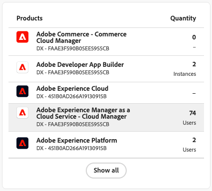
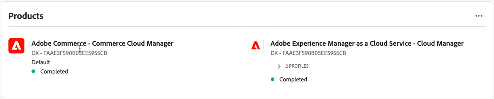

# Gebruiker en Identity Management

Als u gebruikers tot Admin in [!DNL Adobe Commerce as a Cloud Service] wilt toegang hebben, moet u hen als gebruikers in uw organisatie toevoegen en ervoor zorgen zij toegang tot het product van Cloud Service in [&#x200B; Adobe Admin Console &#x200B;](https://adminconsole.adobe.com){target="_blank"} hebben.

Voor dit proces is een IMS-organisatie met toegang tot [!DNL Adobe Commerce as a Cloud Service] vereist. Alleen een systeembeheerder of productbeheerder voor de organisatie kan deze processen uitvoeren.

>[!TIP]
>
>Om veelvoudige gebruikers gelijktijdig toe te voegen, kunt u a [&#x200B; bulkupload CSV &#x200B;](https://helpx.adobe.com/enterprise/using/bulk-upload-users.html){target="_blank"} uitvoeren.
>
> U kunt veelvoudige gebruikers aan een rol ook toevoegen door a [&#x200B; gebruikersgroep &#x200B;](https://helpx.adobe.com/enterprise/using/user-groups.html){target="_blank"} te creëren. Dan kunt u [!UICONTROL **Adobe Commerce toevoegen - de Manager van Commerce Cloud**] product aan de gebruikersgroep.

## Rollen begrijpen

De volgende rollen zijn beschikbaar voor [!DNL Adobe Commerce as a Cloud Service]. Om deze rollen te bekijken of uit te geven, in Commerce Admin navigeert aan **Systeem** > **Toestemmingen** > **Rollen van de Gebruiker**.

* **Gebruikers** - de gebruikers hebben toegang Admin tot Commerce Admin, maar kunnen toegang op productniveau in Admin Console niet beheren. De gebruikers kunnen credits ook gebruiken om [&#x200B; instanties &#x200B;](./getting-started.md#create-an-instance) in [!DNL Commerce Cloud Manager] tot stand te brengen.

  >[!NOTE]
  >
  >Alle Commerce-gebruikers, inclusief ontwikkelaars en beheerders, moeten ook de gebruikersrol hebben die aan hen is toegewezen. Dit is vereist voor Commerce-standaardmachtigingen.

* [**&#x200B;** de Ontwikkelaars van 0&rbrace; Ontwikkelaars &lbrace;hebben gebruikerstoestemmingen en aan de instantie van Commerce als ontwikkelaarsgebruiker toegevoegd. &#x200B;](https://helpx.adobe.com/enterprise/using/manage-developers.html#Adddevelopers){target="_blank"} Dit betekent zij kunnen [&#x200B; Admin UI SDK &#x200B;](https://developer.adobe.com/commerce/extensibility/admin-ui-sdk/){target="_blank"} gebruiken, [&#x200B; gebeurtenissen &#x200B;](https://developer.adobe.com/commerce/extensibility/events/){target="_blank"} vormen, en [&#x200B; Webhooks &#x200B;](https://developer.adobe.com/commerce/extensibility/webhooks/){target="_blank"} creëren.

* Beheerders - Er zijn drie verschillende typen beheerders:
   * [&#x200B; beheerders van het Systeem &#x200B;](https://helpx.adobe.com/enterprise/using/admin-roles.html){target="_blank"} - het systeemadmin heeft toegang tot alle producten en productprofielen in de organisatie door Admin Console.
   * [&#x200B; Admins van het Product &#x200B;](#add-a-product-admin) - de beheerders van het Product kunnen [&#x200B; gebruikers, rollen, en toestemmingen voor het product &#x200B;](#add-users) in [!DNL Adobe Admin Console] beheren en [&#x200B; gebruikers in Commerce beheren Admin &#x200B;](https://experienceleague.adobe.com/en/docs/commerce-admin/systems/user-accounts/permissions-users-all#create-a-user){target="_blank"}.
   * [&#x200B; het profielbeheerders van het Product &#x200B;](#add-developers-and-product-profile-admins) - de profielbeheerders van het Product hebben geen toegang tot Adobe Commerce Admin, maar kunnen gebruikers voor het product in [!DNL Adobe Admin Console] beheren.

Voor gedetailleerde informatie over de toestemmingen die aan elke rol binnen Adobe Commerce worden verleend, verwijs naar [&#x200B; gebruikerstoestemmingen &#x200B;](#user-permissions).

## Een productbeheerder toevoegen

>[!BEGINTABS]

>[!NOTE]
>
>Wijs product toe beheert de [&#x200B; rol van de Gebruiker &#x200B;](#add-users) alvorens hen als productbeheerders toe te voegen. De gebruikersrol is vereist voor eenvoudige Commerce-machtigingen.

>[!TAB  GA (die na 13 oktober, 2025 wordt voorzien) ]

1. Navigeer naar <https://adminconsole.adobe.com> en meld u aan met uw Adobe ID.

1. Selecteer uw organisatie.

1. Selecteer de [!UICONTROL **Gebruikers**] tabel.

1. Selecteer de [!UICONTROL **Beheerders**] tabel.

1. Klik [!UICONTROL **Admin**] toevoegen.

1. Ga de gebruikersbenaming of e-mailadres van de gebruikers in u als beheerders wilt toevoegen en [!UICONTROL **daarna**] klikken.

1. Selecteer de [!UICONTROL **rol van de de profielbeheerder van het Product**].

1. Klik op **+** om producten toe te voegen.

1. Selecteer de bestaande Commerce-instantie waaraan u de beheerder wilt toevoegen. Commerce-instanties gebruiken de volgende indeling: `Adobe Commerce - <instance-name> - ACCS - <environment-type> - <tenant-id>`.

1. Selecteer het productprofiel.

1. Klik [!UICONTROL **toepassen**].

1. Klik [!UICONTROL **sparen**].

>[!TAB  Vroege toegang (die vóór 13 Oktober, 2025 wordt voorzien) ]

1. Navigeer naar <https://adminconsole.adobe.com> en meld u aan met uw Adobe ID.

1. Selecteer uw organisatie.

1. Op het [!UICONTROL **lusje van Producten**], onder [!UICONTROL **Producten en de Diensten**], selecteer [!UICONTROL **Adobe Commerce - de Manager van Commerce Cloud**] product.

   {width="600" zoomable="yes"}

1. Selecteer [!UICONTROL **Admins**] tabel.

1. Klik [!UICONTROL **Admin**] toevoegen.

1. Ga de gebruikersbenaming of e-mailadres van de gebruikers in u als beheerders wilt toevoegen en [!UICONTROL **sparen**] klikken.

>[!ENDTABS]

## Gebruikers toevoegen

De volgende instructies geven informatie over het toevoegen van gebruikers aan de [!DNL Commerce Cloud Manager] en de Commerce Admin. Met de interface van [!DNL Commerce Cloud Manager] kunt u Commerce-instanties maken en beheren. Dit proces is vereist voor alle gebruikers, inclusief ontwikkelaars en beheerders.

>[!NOTE]
>
>Alleen productbeheerders en systeembeheerders kunnen gebruikers en ontwikkelaars toevoegen aan het Adobe Commerce as a Cloud Service-product.

>[!BEGINTABS]

>[!TAB  GA (die na 13 oktober, 2025 wordt voorzien) ]

1. Navigeer naar <https://adminconsole.adobe.com> en meld u aan met uw Adobe ID.

1. Selecteer uw organisatie.

1. Selecteer de [!UICONTROL **Producten**] tabel.

1. Selecteer het [!UICONTROL **Adobe Commerce**] product.

1. Selecteer het Commerce Cloud Manager-product als u de gebruiker wilt toevoegen aan de interface van de cloud Manager, waar ze Commerce-instanties kunnen maken en beheren, of selecteer de bestaande Commerce-instantie waaraan de gebruiker moet worden toegevoegd. Commerce-instanties gebruiken de volgende indeling: `Adobe Commerce - <instance-name> - ACCS - <environment-type> - <tenant-id>`.

1. Selecteer het [!UICONTROL **lusje van Gebruikers**] en klik [!UICONTROL **toevoegen Gebruikers**].

1. Ga de gebruikersbenaming of e-mailadres van de gebruikers in u [!UICONTROL **sparen**] wilt toevoegen en klikken.

1. Selecteer het gewenste productprofiel.

1. Klik [!UICONTROL **toepassen**].

1. Klik [!UICONTROL **sparen**].

>[!TAB  Vroege toegang (die vóór 13 Oktober, 2025 wordt voorzien) ]

1. Navigeer naar <https://adminconsole.adobe.com> en meld u aan met uw Adobe ID.

1. Selecteer uw organisatie.

1. Op het [!UICONTROL **lusje van Producten**], onder [!UICONTROL **Producten en de Diensten**], selecteer [!UICONTROL **Adobe Commerce - de Manager van Commerce Cloud**] product.

   {width="600" zoomable="yes"}

1. Klik het [!UICONTROL **Gebrek - het productprofiel van Cloud Manager**].

1. Selecteer het [!UICONTROL **lusje van Gebruikers**] en klik [!UICONTROL **toevoegen Gebruikers**].

   {width=600 zoomable="yes"}

1. Ga de gebruikersbenaming of e-mailadres van de gebruikers in u [!UICONTROL **sparen**] wilt toevoegen en klikken.

>[!ENDTABS]

### Ontwikkelaars en beheerders van productprofielen toevoegen

Om ontwikkelaars en productprofielbeheerders toe te voegen, herhaal [&#x200B; gebruikers &#x200B;](#add-users) proces toevoegen, maar selecteer [!UICONTROL **Ontwikkelaars**] of [!UICONTROL **Admins**] lusje in plaats van het [!UICONTROL **Gebruikers**] lusje.

>[!NOTE]
>
>Beheerders van productprofielen hebben geen toegang tot de Commerce-beheerder. Verwijs naar [&#x200B; Begrijpend rollen &#x200B;](#understanding-roles) voor meer informatie.
>
>Wijs ontwikkelaars de rol van de Gebruiker toe alvorens hen als ontwikkelaars toe te voegen. De gebruikersrol is vereist voor eenvoudige Commerce-machtigingen.

{width=600 zoomable="yes"}

## Rolresources

In de volgende lijst worden de bronnen beschreven waartoe standaardrollen toegang hebben binnen Adobe Commerce Admin. Om de standaardtoestemmingen voor elke rol uit te geven, navigeer aan **Systeem** > **Toestemmingen** > **Rollen van de Gebruiker** in Commerce Admin.

**Gebruikers**

* Catalogus
   * Inventaris
      * Producten
         * Productprijs lezen

**Ontwikkelaars**

* Catalogus
   * Inventaris
      * Producten
         * Productprijs lezen
* Systeem
   * Gegevensoverdracht
      * Historie importeren
* Adobe IO Events Configuration
   * Configuratiecontrole
   * Gebeurtenisprovider maken
   * Configuratie-update
   * Gebeurtenissen synchroniseren
   * Lijst met gebeurtenisproviders ophalen
* Eindkader
   * Gebeurtenislijst
   * Verbinding met gebeurtenis testen
   * Abonneren op een gebeurtenis
   * Abonnement op een gebeurtenis opzeggen
   * Status van gebeurtenis
   * API om gebeurtenisabonnementen op te halen
   * Gebruikersinterface voor abonnementen op gebeurtenissen weergeven
   * Gebruikersinterface voor beheerder van abonnementen voor gebeurtenissen maken
   * Nieuwe interface voor gebeurtenisbeheer aanvragen
* Webhaken
   * Webhooks digitale handtekening
      * Instellingen voor webhooks digitale handtekening
      * Webhaks Digital Signature Generate Keys
   * Webhakbeheer
      * Webhakenraster
      * Webhooks bewerken
      * Webhaken testen
      * API-abonnement op webhaak
      * API-abonnement van webhaak
      * Webhakenlijst
      * Nieuwe webhaak aanvragen
      * Webhooks Logs
      * Lijst met webhaken ophalen

**Admins**

Beheerders hebben toegang tot alle machtigingen.

## Een gebruiker toevoegen aan AEM Assets of producthandleidingen

De volgende instellingen zijn vereist voor [!DNL Adobe Experience Manager Assets] - en [!DNL Product Visuals powered by AEM Assets] -gebruikers.

Als uw rekening toegang tot [&#x200B; Adobe Experience Manager as a Cloud Service &#x200B;](https://experienceleague.adobe.com/en/docs/experience-manager-cloud-service) heeft en u een gebruiker wilt toestaan om tot de geavanceerde eigenschappen van [&#x200B; AEM Assets &#x200B;](https://experienceleague.adobe.com/en/docs/commerce/aem-assets-integration/overview){target="_blank"} samen met [!DNL Adobe Commerce as a Cloud Service] toegang te hebben, gebruik het volgende proces:

>[!NOTE]
>
>De gebruikers zonder aangewezen activa toestemmingen zullen tot geavanceerde eigenschappen van [!DNL AEM Assets], zoals [&#x200B; AI beeldgeneratie &#x200B;](https://experienceleague.adobe.com/en/docs/experience-manager-cloud-service/content/generative-ai/generative-ai-in-aem){target="_blank"}, [&#x200B; geproduceerde variaties &#x200B;](https://experienceleague.adobe.com/en/docs/experience-manager-cloud-service/content/generative-ai/generate-variations-integrated-editor){target="_blank"} en meer niet kunnen toegang hebben.

>[!TIP]
>
>Om veelvoudige gebruikers gelijktijdig toe te voegen, kunt u a [&#x200B; bulkupload CSV &#x200B;](https://helpx.adobe.com/enterprise/using/bulk-upload-users.html){target="_blank"} uitvoeren.
>
>U kunt veelvoudige gebruikers aan een rol ook toevoegen door a [&#x200B; gebruikersgroep &#x200B;](https://helpx.adobe.com/enterprise/using/user-groups.html){target="_blank"} te creëren. Dan kunt u [!UICONTROL **Adobe Experience Manager as a Cloud Service toevoegen - Cloud Manager**] product aan de gebruikersgroep.

1. Navigeer naar <https://adminconsole.adobe.com> en meld u aan met uw Adobe ID.

1. Selecteer uw organisatie.

1. Op de [!UICONTROL **Producten**] tabel, onder [!UICONTROL **Producten en de Diensten**], selecteer [!UICONTROL **Adobe Experience Manager as a Cloud Service - Cloud Manager**] product.

   {width="600" zoomable="yes"}

1. Selecteer de [!UICONTROL **Gebruikers**] tabel.

1. Klik [!UICONTROL **toevoegen Gebruiker**].

1. Voer de gebruikersnaam of het e-mailadres in van de gebruikers die u wilt toevoegen.

1. Klik [!UICONTROL **toevoegen Product**].

1. Selecteer de volgende productprofielen die nodig zijn voor de integratie van AEM Assets met Commerce:

   * Bedrijfseigenaar - vereist om programma&#39;s te maken en te beheren.
   * Implementatiebeheer - vereist om code van uw opslagplaatsen te implementeren naar AEM.

   Als u een ontwikkelaar toevoegt die geen toegang tot de interfaces van Cloud Manager of van Experience Manager vereist, kunt u hen in plaats daarvan de ontwikkelaarrol toewijzen.

   >[!NOTE]
   >
   >Voor meer informatie over hoe deze toestemmingen uw toegang tot AEM Assets beïnvloeden, verwijs naar [&#x200B; Profielen van het Product van Cloud Manager &#x200B;](https://experienceleague.adobe.com/en/docs/experience-manager-cloud-service/content/onboarding/concepts/aem-cs-team-product-profiles#cloud-manager-product-profiles){target="_blank"}.

1. Klik [!UICONTROL **toepassen**].

1. Klik [!UICONTROL **sparen**].

Om te bevestigen dat de gebruiker toegang heeft, klikt u op de naam van de gebruiker om de profielpagina te openen. In de [!UICONTROL **Producten**] sectie, zou het moeten zeggen [!UICONTROL **Voltooid**] onder [!UICONTROL **Adobe Experience Manager as a Cloud Service - Cloud Manager**] product. Het kan een paar seconden duren nadat de gebruiker is toegevoegd om de status bij te werken in zijn profiel. Vernieuw de pagina om de bijgewerkte status te zien.

{width="600" zoomable="yes"}

## De Experience Manager-interface openen

Na het toevoegen van een gebruiker aan AEM Assets, kunnen zij tot de [!DNL Experience Manager] interface toegang hebben door aan [&#x200B; https://experience.adobe.com/ &#x200B;](https://experience.adobe.com/){target="_blank"} te navigeren.

1. In de [!UICONTROL **Snelle sectie van de Toegang**], klik [!UICONTROL **Experience Manager**] of klik [!UICONTROL **Mening allen**] als u [!UICONTROL **Experience Manager**] niet ziet. Dan klik [!UICONTROL **Cloud Manager**] of navigeer direct aan [&#x200B; https://my.cloudmanager.adobe.com &#x200B;](https://my.cloudmanager.adobe.com){target="_blank"}.

1. Van de [!UICONTROL **Cloud Manager**] pagina, klik [!UICONTROL **voeg Programma**] toe om begonnen te worden.

1. [&#x200B; creeer een nieuw programma &#x200B;](https://experienceleague.adobe.com/en/docs/experience-manager-cloud-service/content/onboarding/journey/create-program){target="_blank"}.

1. [&#x200B; creeer een nieuw milieu &#x200B;](https://experienceleague.adobe.com/en/docs/experience-manager-cloud-service/content/screens-as-cloud-service/onboarding-screens-cloud/creating-an-environment){target="_blank"}.

1. Na het creëren van het milieu, terugkeer aan [&#x200B; Admin Console &#x200B;](https://adminconsole.adobe.com){target="_blank"} en selecteer [!UICONTROL **Adobe Experience Manager as a Cloud Service**].

1. U moet nu nieuwe productprofielen zien. Selecteer die `- author -` bevat. Bijvoorbeeld `<environment-name> - author - <program-id> - <environment-id>` .

1. [&#x200B; voegt gebruikers aan het productprofiel &#x200B;](https://experienceleague.adobe.com/en/docs/experience-manager-cloud-manager/content/requirements/users-and-roles){target="_blank"} toe.

* [&#x200B; vorm AEM Assets om de meta-gegevens van Commerce te steunen &#x200B;](https://experienceleague.adobe.com/en/docs/commerce/aem-assets-integration/get-started/configure-aem)
* [&#x200B; integreer AEM Assets met Commerce voor activasynchronisatie &#x200B;](https://experienceleague.adobe.com/en/docs/commerce/aem-assets-integration/get-started/setup-synchronization)

## Identiteitsbeheer en Single Sign-On configuratie

{{ims-identity-and-sso-config}}

