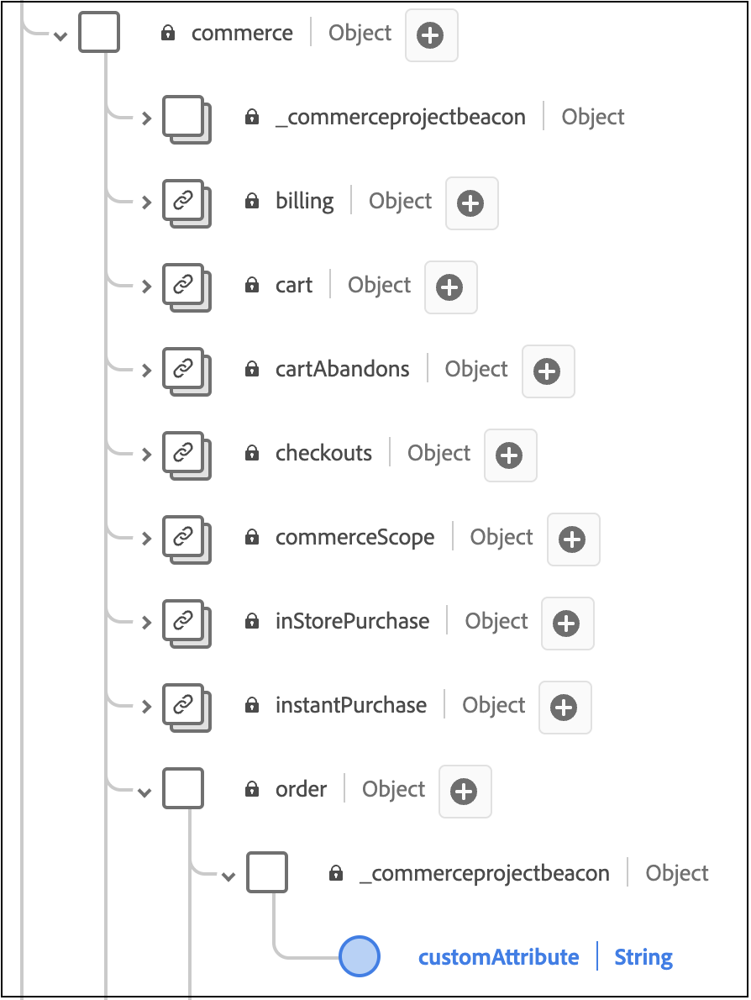

# Aangepaste orderkenmerken toevoegen

In dit artikel leert u hoe u aangepaste kenmerken kunt toevoegen aan back office-gebeurtenissen. Met aangepaste kenmerken kunt u rijke gegevensinzichten vastleggen om de analysemogelijkheden te verbeteren en persoonlijke ervaringen voor uw klanten verder te creëren.

Aangepaste kenmerken worden op twee niveaus ondersteund:

- Orderniveau
- Itemniveau bestellen

>[!NOTE]
>
>Adobe [!DNL Commerce] ondersteunt aangepaste kenmerken met een gegevenstype van een tekenreeks, Boolean of datum.

Wanneer u aangepaste kenmerken aan back office-gebeurtenissen toevoegt, moet u:

1. Maak een project in uw [!DNL Commerce] -installatie.
1. Werk het schema bij zodat de nieuwe aangepaste kenmerken correct in Experience Platform kunnen worden ingevoerd.
1. Controleer in de beheerfunctie of de aangepaste kenmerken worden vastgelegd en verzonden naar Experience Platform.

>[!IMPORTANT]
>
>De mapstructuur en de codevoorbeelden hieronder laten zien hoe u aangepaste kenmerken kunt implementeren. De daadwerkelijke vereiste folderstructuur en code hangt van uw archiefconfiguratie en milieu af.

## Stap 1: De mappenstructuur maken

1. Navigeer naar de map `app/code` in de [!DNL Commerce] -installatie en maak een modulemap. Bijvoorbeeld: `Magento/AepCustomAttributes` . Deze map bevat de bestanden die nodig zijn voor uw aangepaste kenmerken.
1. Maak een submap met de naam `etc` in de modulemap. De map `etc` bevat de bestanden `module.xml` , `query.xml` , `di.xml` en `et_schema.xml` .

## Stap 2: Bepaal de gebiedsdelen en de opstellingsversie

Maak een `module.xml` -bestand dat de afhankelijkheden en de instellingsversie definieert. Bijvoorbeeld:

```xml
<?xml version="1.0"?>
<config xmlns:xsi="http://www.w3.org/2001/XMLSchema-instance" xsi:noNamespaceSchemaLocation="urn:magento:framework:Module/etc/module.xsd">
    <module name="Magento_AepCustomAttributes">
        <sequence>
            <module name="Magento_SalesOrderDataExporter"/>
        </sequence>
    </module>
</config>
```

## Stap 3: Gegevens van de verkooporder ophalen

Maak een `query.xml` -bestand dat de gegevens van de verkooporder ophaalt. Bijvoorbeeld:

```xml
<?xml version="1.0"?>
<config xmlns:xsi="http://www.w3.org/2001/XMLSchema-instance" xsi:noNamespaceSchemaLocation="urn:magento:Module:Magento_QueryXml:etc/query.xsd">
  <query name="salesOrdersV2">
    <source name="sales_order">
      <link-source name="sales_order_inventory_source" link-type="inner">
        <attribute name="inventory_source_code" alias="inventory_source" />
        <using glue="and">
          <condition attribute="order_id" operator="eq" type="identifier">entity_id</condition>
         </using> 
        </link-source>
    </source>
  </query>
  </config>
```

## Stap 4: De injectie voor afhankelijkheid instellen

Maak een `di.xml` -bestand waarmee de injectie van afhankelijkheid wordt ingesteld. Bijvoorbeeld:

```xml
  <?xml version="1.0"?>
  <config xmlns:xsi="http://www.w3.org/2001/XMLSchema-instance" xsi:noNamespaceSchemaLocation="urn:magento:framework:ObjectManager/etc/config.xsd">
      <type name="Magento\AepCustomAttributes\Model\Provider\CustomAttribute">
          <arguments>
              <argument name="usingField" xsi:type="string">commerceOrderId</argument>
          </arguments>
      </type>
      <type name="Magento\AepCustomAttributes\Model\Provider\OrderItemCustomAttribute">
          <arguments>
              <argument name="usingField" xsi:type="string">entityId</argument>
          </arguments>
      </type>
      <type name="Magento\DataServices\Model\ProductContext">
          <plugin name="product-context-plugin" type="Magento\AepCustomAttributes\Plugin\Model\ProductContext"/>
      </type>
  </config>
```

## Stap 5: Bepaal de diensten die voor de gebiedsdeelinjectie worden gebruikt

Maak een `et_schema.xml` -bestand dat de services definieert die worden gebruikt voor het injecteren van afhankelijkheid. Bijvoorbeeld:

```xml
  <?xml version="1.0"?>
  <config xmlns:xsi="http://www.w3.org/2001/XMLSchema-instance" xsi:noNamespaceSchemaLocation="urn:magento:module:Magento_DataExporter:etc/et_schema.xsd">
      <record name="OrderV2">
          <field name="additionalInformation" type="CustomAttribute" repeated="true" provider="Magento\AepCustomAttributes\Model\Provider\CustomAttribute">
              <using field="commerceOrderId"/>
          </field>
      </record>
      <record name="OrderItemV2">
          <field name="additionalInformation" type="CustomAttribute" repeated="true" provider="Magento\AepCustomAttributes\Model\Provider\OrderItemCustomAttribute">
              <using field="entityId"/>
          </field>
      </record>
  </config>
```

## Stap 6: Een map maken voor de PHP-bestanden

Maak op hetzelfde niveau als de map `etc` een map met de naam `Module/Provider` . Deze map bevat de `OrderCustomAttributes` - en `OrderItemCustomAttributes` PHP-bestanden.

## Stap 7: Definieer de OrderCustomAttributes

Maak een `OrderCustomAttributes.php` -bestand dat de aangepaste orderkenmerken definieert. Bijvoorbeeld:

```php
declare(strict_types=1);

namespace Magento\AepCustomAttributes\Model\Provider;

use Magento\Framework\Serialize\Serializer\Json;

class CustomAttribute
{
  /**
   * @var Json
   */
  private Json $jsonSerializer;

  /**
   * @var string
   */
  private string $usingField = '';

  /**
   * @param string $usingField
   * @param Json $jsonSerializer
   */
  public function __construct(
      string $usingField,
      Json $jsonSerializer
  ) {
      $this->usingField = $usingField;
      $this->jsonSerializer = $jsonSerializer;
  }

  /**
   * @param array $values
   * @return array
   */
  public function get(array $values): array
  {
      $output = [];

      /**
       * Entity IDs
       */
      $ids = array_column($values, $this->usingField);

      foreach ($this->flatten($values) as $row) {
          $info = \is_string($row['additionalInformation']) ? $row['additionalInformation'] : '{}';
          $unserializedData = $this->jsonSerializer->unserialize($info) ?? [];

          if (isset($row)) {
              $unserializedData['order_channel'] = 'order_channel';
              $unserializedData['order_status'] = 'order_status';

              $additionalInformation = [];
              foreach ($unserializedData as $name => $value) {
                  $additionalInformation[] = [
                      'name' => $name,
                      'value' => \is_string($value) ? $value : $this->jsonSerializer->serialize($value)
                  ];
              }
              foreach ($additionalInformation as $information) {
                  $output[] = [
                      'additionalInformation' => $information,
                      $this->usingField => $row[$this->usingField],
                  ];
              }
          }
      }
      return $output;
  }

  /**
   * @param $values
   * @return array
   */
  private function flatten($values): array
  {
      if (isset(current($values)[0])) {
          return array_merge([], ...array_values($values));
      }
      return $values;
  }
}
```

## Stap 8: Definieer de OrderItemCustomAttributes

Maak een `OrderItemCustomAttributes.php` -bestand dat de aangepaste kenmerken voor de items van de volgorde definieert. Bijvoorbeeld:

```php
declare(strict_types=1);

namespace Magento\AepCustomAttributes\Model\Provider;

use Magento\Framework\Serialize\Serializer\Json;

class OrderItemCustomAttribute
{
  /**
   * @var Json
   */
  private Json $jsonSerializer;

  /**
   * @var string
   */
  private string $usingField = '';

  /**
   * @param Json $jsonSerializer
   * @param string $usingField
   */
  public function __construct(
      Json $jsonSerializer,
      string $usingField
  ) {
      $this->jsonSerializer = $jsonSerializer;
      $this->usingField = $usingField;
  }

  /**
   * Getting additional attributes data.
   *
   * @param array $values
   * @return array
   */
  public function get(array $values): array
  {
      $output = [];
      $values = $this->flatten($values);

      foreach ($values as $row) {
          $info = \is_string($row['additionalInformation']) ? $row['additionalInformation'] : '{}';
          $unserializedData = $this->jsonSerializer->unserialize($info) ?? [];
          $unserializedData['product_brand'] = implode(',', ['label 1', 'label 2']);

          $additionalInformation = [];
          foreach ($unserializedData as $name => $value) {
              $additionalInformation[] = [
                  'name' => $name,
                  'value' => \is_string($value) ? $value : $this->jsonSerializer->serialize($value)
              ];
          }
          foreach ($additionalInformation as $information) {
              $output[] = [
                  'additionalInformation' => $information,
                  $this->usingField => $row[$this->usingField],
              ];
          }
      }
      return $output;
  }

  /**
   * @param $values
   * @return array
   */
  private function flatten($values): array
  {
      if (isset(current($values)[0])) {
          return array_merge([], ...array_values($values));
      }
      return $values;
  }
}
```

## Stap 9: Maak een map voor het productContext-bestand

Maak op hetzelfde niveau als de map `etc` een map met de naam `Plugin/Module` . Deze map bevat het `ProductContext.php` -bestand.

## Stap 10: Bepaal de klasse ProductContext

Maak een bestand met de naam `ProductContext.php` dat de klasse `ProductContext` definieert. Bijvoorbeeld:

```php
<?php>
namespace Magento\AepCustomAttributes\Plugin\Model;
use Magento\Catalog\Model\Product;
use Magento\DataServices\Model\ProductContext as Subject;
use Magento\Framework\App\ResourceConnection;

class ProductContext
{
    private ?array $brandCache = [];
    public function __construct(
        private ResourceConnection $resourceConnection ) {
    }  

    public function afterGetContextData(Subject $subject, array $result Product $product)
    {
        $brand = $product->getCustomAttribute('cust_attr1');
        if (!empty($brand) && $brand->getValue()) {
            $result['brands'] = ['brand_label_1', 'brand_label_2'];
            }
            return $result;
      }
  }
```

## Stap 11: Registreer de module

Maak op hetzelfde niveau als de map `etc` een `registration.php` -bestand dat de module registreert. Bijvoorbeeld:

```php
<?php>
declare(strict_types=1);

use \Magento\Framework\Component\ComponentRegistrar;

ComponentRegistrar::register(
    ComponentRegistrar::MODULE,
    'Magento_AepCustomAttributes',
    __DIR__
);
```

## Stap 12: Het bestaande XDM-schema uitbreiden

Als u er zeker van wilt zijn dat de nieuwe aangepaste orderkenmerken door uw [!DNL Commerce] -schema in Experience Platform kunnen worden opgenomen, moet u het schema uitbreiden en deze aangepaste velden opnemen.

Leren hoe te om een bestaand schema uit te breiden XDM om deze douanegebieden te omvatten, zie [ schema&#39;s in het UI ](https://experienceleague.adobe.com/en/docs/experience-platform/xdm/ui/resources/schemas#custom-fields-for-standard-groups) artikel in de documentatie van Experience Platform creëren en uitgeven. Het veld Tenant-id wordt dynamisch gegenereerd, maar de veldstructuur moet overeenkomen met het voorbeeld in de Experience Platform-documentatie.

>[!IMPORTANT]
>
>Aangepaste XDM-kenmerken moeten overeenkomen met de kenmerken die vanuit [!DNL Commerce] worden verzonden.

Voeg aan `commerce.order` een veld toe voor Order-niveau:



Voeg velden toe voor het itemniveau Volgorde aan `productListItems` :


## Stap 12: Bevestig dat de gegevens worden vastgelegd

Bekijk het [ lusje van de Aanpassing van Gegevens ](connect-data.md#data-customization) in Admin om te bevestigen dat de gegevens van de douanekenmerken worden gevangen en naar Experience Platform verzonden.

### Problemen oplossen

Bevestig het volgende als het bericht `No custom order attributes found.` wordt weergegeven op het tabblad **[!UICONTROL Data Customization]** :

1. U hebt de eerste vereisten voltooid om de [ uitbreiding van de Verbinding van Gegevens ](overview.md#prerequisites) toe te laten.
1. U hebt [ attributen van de douaneorde ](#add-custom-order-attributes) gevormd.
1. Er is ten minste één bestelgebeurtenis gegenereerd.
