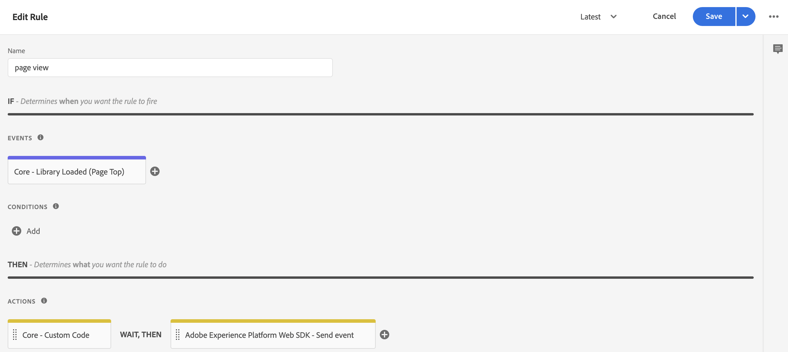

# Commerce-gegevens verzamelen met Adobe Experience Platform-tags

Terwijl u de [!DNL Data Connection] uitbreiding kunt gebruiken om te publiceren en aan storefront gebeurtenissen in te tekenen, zouden sommige handelaren reeds een oplossing van de gegevensinzameling, zoals de [&#x200B; markeringen van Adobe Experience Platform &#x200B;](https://experienceleague.adobe.com/docs/platform-learn/data-collection/tags/create-a-property.html?lang=nl-NL) kunnen gebruiken. Voor die handelaren biedt Adobe Commerce een alleen-publicatieoptie in de extensie [!DNL Data Connection] die de Adobe Commerce Event SDK gebruikt.

![[!DNL Data Connection] Gegevensstroom van extensies &#x200B;](assets/tags-data-flow.png)
_[!DNL Data Connection]Gegevensstroom van extensies met tags_

In dit onderwerp leert u hoe u de storefront-gebeurteniswaarden die door de extensie [!DNL Data Connection] worden geboden, kunt toewijzen aan de Adobe Experience Platform-tagoplossing die u al gebruikt.

## Gebeurtenisgegevens verzamelen vanuit Adobe Commerce

Commerce-gebeurtenisgegevens verzamelen:

- Installeer de [&#x200B; SDK van de Gebeurtenissen van Adobe Commerce &#x200B;](https://github.com/adobe/commerce-events/tree/main/packages/storefront-events-sdk). Voor PHP storefronts, zie [&#128279;](install.md) onderwerp installeren. Voor PWA Studio storefronts, zie de [&#x200B; gids van PWA Studio &#x200B;](https://developer.adobe.com/commerce/pwa-studio/integrations/adobe-commerce/aep/).

  >[!NOTE]
  >
  > Vorm **[&#128279;](connect-data.md) identiteitskaart van de Organisatie en identiteitskaart DataStream niet.**

## Commerce-storefrongegevens toewijzen aan Adobe Experience Platform

Om Commerce storefront gegevens aan Adobe Experience Platform in kaart te brengen, vorm en installeer het volgende van binnen de markeringen van Adobe Experience Platform:

1. [&#x200B; opstelling een markeringsbezit &#x200B;](https://experienceleague.adobe.com/docs/platform-learn/implement-in-websites/configure-tags/create-a-property.html?lang=nl-NL) in de Inzameling van Gegevens van Adobe Experience Platform.

1. Onder **Authoring**, uitgezochte **Uitbreidingen** en installeer en vorm de volgende uitbreidingen:

   - [&#x200B; de Laag van Gegevens van de Cliënt van Adobe &#x200B;](https://experienceleague.adobe.com/docs/experience-platform/tags/extensions/client/client-data-layer/overview.html?lang=nl-NL)

   - [&#x200B; SDK van het Web van Adobe Experience Platform &#x200B;](https://experienceleague.adobe.com/docs/experience-platform/edge/fundamentals/installing-the-sdk.html?lang=nl-NL)

1. [&#x200B; publiceer markering &#x200B;](https://experienceleague.adobe.com/docs/experience-platform/tags/publish/overview.html?lang=nl-NL) aan uw ontwikkelomgeving.

1. Volg de **stappen 1&rbrace; hieronder van de Toewijzing van de Gebeurtenis 0&rbrace; om gegevenselementen en regels voor specifieke gebeurtenissen te vormen.**

### Gebeurtenistoewijzing

Omdat gegevensverzameling met tags verschilt van het gebruik van de Adobe Commerce Event SDK, is het belangrijk dat u de equivalente termen begrijpt die in beide frameworks worden gebruikt.

| Adobe Experience Platform-tagterm | Adobe Commerce Event SDK term |
|---|---|
| _gegevenselementen_ | context |
| _regels_ | event |
|  | _regelvoorwaarden_ - gebeurtenisluisteraars (van ACDL) <br><br>_regelacties_ - gebeurtenismanagers (verzenden naar Adobe Experience Platform) |

Wanneer u de gegevenselementen en regels in Adobe Experience Platform-tags bijwerkt met Adobe Commerce-specifieke gebeurtenisgegevens, worden een aantal veelvoorkomende stappen uitgevoerd.

Laten we bijvoorbeeld de Adobe Commerce `signOut` -gebeurtenis toevoegen aan Adobe Experience Platform-tags. De hieronder geschetste stappen, behalve specifieke waarden u plaatst, beschrijven hoe te om [&#x200B; gegevenselementen &#x200B;](https://experienceleague.adobe.com/docs/experience-platform/collection/e2e.html?lang=nl-NL#data-element) toe te voegen en [&#x200B; regels &#x200B;](https://experienceleague.adobe.com/docs/experience-platform/collection/e2e.html?lang=nl-NL#create-a-rule), die op alle gebeurtenissen van Adobe Commerce van toepassing zijn u aan markeringen toevoegt.

1. Een gegevenselement maken:

   
   _creeer Nieuw Element van Gegevens_

1. Plaats **Naam** aan `sign out`.

1. Plaats **Uitbreiding** aan `Adobe Experience Platform Web SDK`.

1. Plaats **Type van Element van Gegevens** aan `XDM object`.

1. Selecteer **Sandbox** en **Schema** dat u wilt bijwerken.

1. Onder **userAccount** > **logout**, plaats de **waarde** in **Logout van de Bezoeker** aan `1`.

   
   _Ondertekeningswaarde van de Update_

1. Selecteer **sparen**.

1. Een regel maken:

   
   _creeer Nieuwe Regel_

1. Selecteer **toevoegen** onder **GEBEURTENISSEN**.

1. Plaats **Uitbreiding** aan `Adobe Client Data Layer`.

1. Plaats **Type van Gebeurtenis** aan `Data Pushed`.

1. Selecteer **Specifieke Gebeurtenis** en plaats de **Gebeurtenis/Sleutel voor** aan `sign-out` te registreren.

1. Selecteer **houden Veranderingen** om de nieuwe regel te bewaren.

1. Voeg een handeling toe.

1. Plaats **Uitbreiding** aan `Adobe Experience Platform Web SDK`.

1. Plaats **Type van Actie** aan `Send Event`.

1. Plaats **Instantie** aan `Alloy`.

1. Plaats **Type** aan `userAccount.logout`.

1. Plaats **XDM gegevens** aan `%sign out%`.

1. Klik **sparen**.

   U hebt in uw schema een gegevenselement gemaakt voor de gebeurtenis `signOut` vanuit Adobe Commerce. U hebt ook een regel gemaakt met een specifieke actie die moet worden uitgevoerd wanneer die gebeurtenis vanuit de Adobe Commerce-storefront wordt geactiveerd.

Herhaal bovenstaande stappen in tags voor elk van de Adobe Commerce-gebeurtenissen die hieronder worden beschreven.

## Beschikbare gebeurtenissen

Wijs voor elk van de volgende gebeurtenissen de Adobe Commerce-gebeurtenissen toe aan uw XDM door de bovenstaande stappen uit te voeren.

- [` signOut`](#signout)
- [` signIn`](#signin)
- [` createAccount`](#createaccount)
- [` editAccount`](#editaccount)
- [` pageView`](#pageview)
- [` productView`](#productview)
- [` searchRequestSent`](#searchrequestsent)
- [` searchResponseReceived`](#searchresponsereceived)
- [` addToCart`](#addtocart)
- [` openCart`](#opencart)
- [` viewCart`](#viewcart)
- [` removeFromCart`](#removefromcart)
- [&quot;initilCheckout&quot;](#initiatecheckout)
- [` placeOrder`](#placeorder)

### signOut

Wordt geactiveerd wanneer een winkelier zich afmeldt.

#### Gegevenselementen

Maak het volgende gegevenselement:

1. Afmelden:

   - **Naam**: `Sign out`
   - **Uitbreiding**: `Adobe Experience Platform Web SDK`
   - **Type van Element van Gegevens**: `XDM object`
   - **Groep van het Gebied**: `userAccount` > `logout`
   - **Logout van de Bezoeker**: **Waarde** = `1`

#### Regels 

- **Naam**: `Sign out`
- **Uitbreiding**: `Adobe Client Data Layer`
- **Type van Gebeurtenis**: `Data Pushed`
- **Specifieke gebeurtenis**: `sign-out`

##### Handelingen

- **Uitbreiding**: `Adobe Experience Platform Web SDK`
- **Type van Actie**: `Send event`
- **Type**: `userAccount.logout`
- **XDM gegevens**: `%sign-out%`

### signIn

Wordt geactiveerd wanneer een winkelier zich aanmeldt.

#### Gegevenselementen

Maak de volgende gegevenselementen:

1. E-mailadres account:

   - **Naam**: `account email`
   - **Uitbreiding**: `Adobe Client Data Layer`
   - **Type van Element van Gegevens**: `Data Layer Computed State`
   - **[Facultatieve ] weg**: `accountContext.emailAddress`

1. Accounttype:

   - **Naam**: `account type`
   - **Uitbreiding**: `Adobe Client Data Layer`
   - **Type van Element van Gegevens**: `Data Layer Computed State`
   - **[Facultatieve ] weg**: `accountContext.accountType`

1. Account-id:

   - **Naam**: `account id`
   - **Uitbreiding**: `Adobe Client Data Layer`
   - **Type van Element van Gegevens**: `Data Layer Computed State`
   - **[Facultatieve ] weg***: `accountContext.accountId`

1. Aanmelden:

   - **Naam**: `sign in`
   - **Uitbreiding**: `Adobe Experience Platform Web SDK`
   - **Type van Element van Gegevens**: `XDM object`
   - **Groep van het Gebied**: `person` > `accountID`
   - **identiteitskaart van de Rekening**: **Waarde** = `%account id%`
   - **Groep van het Gebied**: `person` > `accountType`
   - **Type van Rekening**: **Waarde** = `%account type%`
   - **Groep van het Gebied**: `person` > `personalEmailID`
   - **Persoonlijk E-mailadres**: **Waarde** = `%account email%`
   - **Groep van het Gebied**: `personalEmail` > `address`
   - **Adres**: **Waarde** = `%account email%`
   - **Groep van het Gebied**: `userAccount` > `login`
   - **Login van de Bezoeker**: **Waarde** = `1`

#### Regels 

- **Naam**: `sign in`
- **Uitbreiding**: `Adobe Client Data Layer`
- **Type van Gebeurtenis**: `Data Pushed`
- **Specifieke gebeurtenis**: `sign-in`

##### Handelingen

- **Uitbreiding**: `Adobe Experience Platform Web SDK`
- **Type van Actie**: `Send event`
- **Type**: `userAccount.login`
- **XDM gegevens**: `%sign in%`

### createAccount

Wordt geactiveerd wanneer een winkelier een account probeert te maken.

#### Gegevenselementen

Maak de volgende gegevenselementen:

1. E-mailadres account:

   - **Naam**: `account email`
   - **Uitbreiding**: `Adobe Client Data Layer`
   - **Type van Element van Gegevens**: `Data Layer Computed State`
   - **[Facultatieve ] weg**: `accountContext.emailAddress`

1. Accounttype:

   - **Naam**: `account type`
   - **Uitbreiding**: `Adobe Client Data Layer`
   - **Type van Element van Gegevens**: `Data Layer Computed State`
   - **[Facultatieve ] weg**: `accountContext.accountType`

1. Account-id:

   - **Naam**: `account id`
   - **Uitbreiding**: `Adobe Client Data Layer`
   - **Type van Element van Gegevens**: `Data Layer Computed State`
   - **[Facultatieve ] weg**: `accountContext.accountId`

1. Account maken:

   - **Naam**: `Create account`
   - **Uitbreiding**: `Adobe Experience Platform Web SDK`
   - **Type van Element van Gegevens**: `XDM object`
   - **Groep van het Gebied**: `person` > `accountID`
   - **identiteitskaart van de Rekening**: **Waarde** = `%account id%`
   - **Groep van het Gebied**: `person` > `accountType`
   - **Type van Rekening**: **Waarde** = `%account type%`
   - **Groep van het Gebied**: `person` > `personalEmailID`
   - **Persoonlijk E-mailadres**: **Waarde** = `%account email%`
   - **Groep van het Gebied**: `personalEmail` > `address`
   - **Adres**: **Waarde** = `%account email%`
   - **Groep van het Gebied**: `userAccount` > `createProfile`
   - **het Profiel van de Rekening leidt tot**: **Waarde** = `1`

#### Regels 

- **Naam**: `Create account`
- **Uitbreiding**: `Adobe Client Data Layer`
- **Type van Gebeurtenis**: `Data Pushed`
- **Specifieke gebeurtenis**: `create-account`

##### Handelingen

- **Uitbreiding**: `Adobe Experience Platform Web SDK`
- **Type van Actie**: `Send event`
- **Type**: `userAccount.createProfile`
- **XDM gegevens**: `%create account%`

### editAccount

Wordt geactiveerd wanneer een gebruiker een account probeert te bewerken.

#### Gegevenselementen

Maak de volgende gegevenselementen:

1. E-mailadres account:

   - **Naam**: `account email`
   - **Uitbreiding**: `Adobe Client Data Layer`
   - **Type van Element van Gegevens**: `Data Layer Computed State`
   - **[Facultatieve ] weg**: `accountContext.emailAddress`

1. Accounttype:

   - **Naam**: `account type`
   - **Uitbreiding**: `Adobe Client Data Layer`
   - **Type van Element van Gegevens**: `Data Layer Computed State`
   - **[Facultatieve ] weg**: `accountContext.accountType`

1. Account-id:

   - **Naam**: `account id`
   - **Uitbreiding**: `Adobe Client Data Layer`
   - **Type van Element van Gegevens**: `Data Layer Computed State`
   - **[Facultatieve ] weg**: `accountContext.accountId`

1. Account bewerken:

   - **Naam**: `Edit account`
   - **Uitbreiding**: `Adobe Experience Platform Web SDK`
   - **Type van Element van Gegevens**: `XDM object`
   - **Groep van het Gebied**: `person` > `accountID`
   - **identiteitskaart van de Rekening**: **Waarde** = `%account id%`
   - **Groep van het Gebied**: `person` > `accountType`
   - **Type van Rekening**: **Waarde** = `%account type%`
   - **Groep van het Gebied**: `person` > `personalEmailID`
   - **Persoonlijk E-mailadres**: **Waarde** = `%account email%`
   - **Groep van het Gebied**: `personalEmail` > `address`
   - **Adres**: **Waarde** = `%account email%`
   - **Groep van het Gebied**: `userAccount` > `updateProfile`
   - **het Profiel van de Rekening leidt tot**: **Waarde** = `1`

#### Regels

- **Naam**: `Edit account`
- **Uitbreiding**: `Adobe Client Data Layer`
- **Type van Gebeurtenis**: `Data Pushed`
- **Specifieke gebeurtenis**: `edit-account`

##### Handelingen

- **Uitbreiding**: `Adobe Experience Platform Web SDK`
- **Type van Actie**: `Send event`
- **Type**: `userAccount.updateProfile`
- **XDM gegevens**: `%edit account%`

### pageView

Wordt geactiveerd wanneer een pagina wordt geladen.

#### Gegevenselementen

Maak de volgende gegevenselementen:

1. Paginanaam:

   - **Naam**: `page name`
   - **Uitbreiding**: `Adobe Client Data Layer`
   - **Type van Element van Gegevens**: `Data Layer Computed State`
   - **[Facultatieve ] weg**: `pageContext.pageName`

#### Regels 

- **Naam**: `page view`
- **Uitbreiding**: `Adobe Client Data Layer`
- **Type van Gebeurtenis**: `Data Pushed`
- **Specifieke gebeurtenis**: `page-view`

##### Handelingen

- **Uitbreiding**: `Adobe Experience Platform Web SDK`
- **Type van Actie**: `Send event`
- **Type**: `web.webPageDetails.pageViews`
- **XDM gegevens**: `%page view%`

### productView

Wordt geactiveerd wanneer een productpagina wordt geladen.

#### Gegevenselementen

Maak de volgende gegevenselementen:

1. Productnaam:

   - **Naam**: `product name`
   - **Uitbreiding**: `Adobe Client Data Layer`
   - **Type van Element van Gegevens**: `Data Layer Computed State`
   - **[Facultatieve ] weg**: `productContext.name`

1. Product SKU:

   - **Naam**: `product sku`
   - **Uitbreiding**: `Adobe Client Data Layer`
   - **Type van Element van Gegevens**: `Data Layer Computed State`
   - **[Facultatieve ] weg**: `productContext.sku`

1. URL van productafbeelding:

   - **Naam**: `product image`
   - **Uitbreiding**: `Adobe Client Data Layer`
   - **Type van Element van Gegevens**: `Data Layer Computed State`
   - **[Facultatieve ] weg**: `productContext.mainImageUrl`

1. Productvaluta:

   - **Naam**: `product currency`
   - **Uitbreiding**: `Adobe Client Data Layer`
   - **Type van Element van Gegevens**: `Data Layer Computed State`
   - **[Facultatieve ] weg**: `productContext.pricing.currencyCode`

1. Valuta:

   - **Naam**: `currency code`
   - **Uitbreiding**: `Core`
   - **Type van Element van Gegevens**: `Custom Code`
   - **Open Redacteur**:

   ```bash
   return _satellite.getVar('product currency') || _satellite.getVar('storefront').storeViewCurrencyCode
   ```

1. Speciale prijs:

   - **Naam**: `special price`
   - **Uitbreiding**: `Adobe Client Data Layer`
   - **Type van Element van Gegevens**: `Data Layer Computed State`
   - **[Facultatieve ] weg**: `productContext.pricing.specialPrice`

1. Gewone prijs:

   - **Naam**: `regular price`
   - **Uitbreiding**: `Adobe Client Data Layer`
   - **Type van Element van Gegevens**: `Data Layer Computed State`
   - **[Facultatieve ] weg**: `productContext.pricing.regularPrice`

1. Productprijs:

   - **Naam**: `product price`
   - **Uitbreiding**: `Core`
   - **Type van Element van Gegevens**: `Custom Code`
   - **Open Redacteur**:

   ```bash
   return _satellite.getVar('product regular price') || _satellite.getVar('product special price')
   ```

1. Productweergave:

   - **Naam**: `product view`
   - **Uitbreiding**: `Adobe Experience Platform Web SDK`
   - **Type van Element van Gegevens**: `XDM object`
   - **Groep van het Gebied**: `productListItems`. Selecteer **verstrekken individuele punten** en klik **toevoegen punt** knoop. Omdat deze weergave voor een PDP is, kunt u één item vullen.
   - **Groep van het Gebied**: `productListItems` > `name`
   - **Naam**: **Waarde** = `%product name%`
   - **Groep van het Gebied**: `productListItems` > `SKU`
   - **SKU**: **Waarde** = `%product sku%`
   - **Groep van het Gebied**: `productListItems` > `priceTotal`
   - **het totaal van de Prijs**: **Waarde** = `%product price%`
   - **Groep van het Gebied**: `productListItems` > `currencyCode`
   - **de code van de Valuta**: **Waarde** = `%currency code%`
   - **Groep van het Gebied**: `productListItems` > `ProductImageUrl`
   - **ProductImageUrl**: **Waarde** = `%product image%`
   - **Groep van het Gebied**: `commerce` > `productViews` > `value`
   - **waarde**: **Waarde** = `1`

#### Regels 

- **Naam**: `product view`
- **Uitbreiding**: `Adobe Client Data Layer`
- **Type van Gebeurtenis**: `Data Pushed`
- **Specifieke gebeurtenis**: `product-page-view`

##### Handelingen

- **Uitbreiding**: `Adobe Experience Platform Web SDK`
- **Type van Actie**: `Send event`
- **Type**: `commerce.productViews`
- **XDM gegevens**: `%product view%`

### searchRequestSent

Wordt geactiveerd door gebeurtenissen in het pop-upvenster &quot;Zoeken terwijl u typt&quot; en door gebeurtenissen op pagina&#39;s met zoekresultaten.

#### Gegevenselementen

Maak de volgende gegevenselementen:

1. Zoeken in invoer

   - **Naam**: `search input`
   - **Uitbreiding**: `Adobe Client Data Layer`
   - **Type van Element van Gegevens**: `Data Layer Computed State`
   - **[Facultatieve ] weg**: `searchInputContext.units[0]`

1. Invoeruitdrukking zoeken

   - **Naam**: `search input phrase`
   - **Uitbreiding**: `Core`
   - **Type van Element van Gegevens**: `Custom Code`
   - **Open Redacteur**:

   ```bash
   return _satellite.getVar('search input').phrase;
   ```

1. Invoersortering zoeken

   - **Naam**: `search input sort`
   - **Uitbreiding**: `Core`
   - **Type van Element van Gegevens**: `Custom Code`
   - **Open Redacteur**:

   ```bash
   const searchInput = _satellite.getVar('search input');
   const sortFromInput = searchInput ? searchInput.sort : [];
   const sort = sortFromInput.map((searchSort) => {
       return {
           attribute: searchSort.attribute,
           order: searchSort.direction,
       };
   });
   return sort;
   ```

1. Invoerfilters zoeken

   - **Naam**: `search input filters`
   - **Uitbreiding**: `Core`
   - **Type van Element van Gegevens**: `Custom Code`
   - **Open Redacteur**:

   ```bash
   const searchInput = _satellite.getVar('search input');
   const filtersFromInput = searchInput ? searchInput.filter : [];
   const filters = filtersFromInput.map(
       (searchFilter) => {
           let value = [];
           let isRange = false;
           if (searchFilter.eq) {
               value.push(searchFilter.eq);
           } else if (searchFilter.in) {
               value = searchFilter.in;
           } else if (searchFilter.range) {
               isRange = true;
               value.push(String(searchFilter.range.from));
               value.push(String(searchFilter.range.to));
           }
           return {
               attribute: searchFilter.attribute,
               value,
               isRange,
           };
       }
   );
   
   return filters;
   ```

1. Zoekverzoek:

   - **Naam**: `search request`
   - **Uitbreiding**: `Adobe Experience Platform Web SDK`
   - **Type van Element van Gegevens**: `XDM object`
   - **Groep van het Gebied**: `siteSearch` > `phrase`
   - **waarde**: Nog niet beschikbaar
   - **Groep van het Gebied**: `siteSearch` > `sort`. Selecteer **verstrekken volledig voorwerp**.
   - **Groep van het Gebied**: `siteSearch` > `filter`. Selecteer **verstrekken volledig voorwerp**.
   - **Groep van het Gebied**: `searchRequest` > `id`
   - **Unieke Herkenningsteken**: **Waarde** = `%search request ID%`
   - **Groep van het Gebied**: `searchRequest` > `value`
   - **waarde**: **Waarde** = `1`

#### Regels 

- **Naam**: `search request sent`
- **Uitbreiding**: `Adobe Client Data Layer`
- **Type van Gebeurtenis**: `Data Pushed`
- **Specifieke gebeurtenis**: `search-request-sent`

##### Handelingen

- **Uitbreiding**: `Adobe Experience Platform Web SDK`
- **Type van Actie**: `Send event`
- **Type**: `searchRequest`
- **XDM gegevens**: `%search request%`

### searchResponseReceived

Wordt geactiveerd wanneer Live zoeken resultaten oplevert voor de popover- of zoekresultatenpagina &quot;Zoeken zoals u typt&quot;.

#### Gegevenselementen

Maak de volgende gegevenselementen:

1. Zoekresultaten:

   - **Naam**: `search results`
   - **Uitbreiding**: `Adobe Client Data Layer`
   - **Type van Element van Gegevens**: `Data Layer Computed State`
   - **[Facultatieve ] weg**: `searchResultsContext.units[0]`

1. Zoekresultaat aantal producten:

   - **Naam**: `search result number of products`
   - **Uitbreiding**: `Core`
   - **Type van Element van Gegevens**: `Custom Code`
   - **Open Redacteur**:

   ```bash
   return _satellite.getVar('search result').products.length;
   ```

1. Producten zoekresultaten:

   - **Naam**: `search result products`
   - **Uitbreiding**: `Core`
   - **Type van Element van Gegevens**: `Custom Code`
   - **Open Redacteur**:

   ```bash
   const searchResult = _satellite.getVar('search result');
   const productsFromResult = searchResult.products ? searchResult.products : [];
   const products = productsFromResult.map(
       (product) => {
           return { SKU: product.sku, name: product.name };
       }
   );
   return products;
   ```

1. Suggesties voor zoekresultaten:

   - **Naam**: `search result products`
   - **Uitbreiding**: `Core`
   - **Type van Element van Gegevens**: `Custom Code`
   - **Open Redacteur**:

   ```bash
   const searchResult = _satellite.getVar('search result');
   const suggestionsFromResult = searchResult.suggestions ? searchResult.suggestions : [];
   const suggestions = suggestionsFromResult.map((suggestion) => suggestion.suggestion);
   return suggestions;
   ```

1. URL van productafbeelding:

   - **Naam**: `product image`
   - **Uitbreiding**: `Adobe Client Data Layer`
   - **Type van Element van Gegevens**: `Data Layer Computed State`
   - **[Facultatieve ] weg**: `productContext.mainImageUrl`

1. Zoeken in reactie:

   - **Naam**: `search response`
   - **Uitbreiding**: `Adobe Experience Platform Web SDK`
   - **Type van Element van Gegevens**: `XDM object`
   - **Groep van het Gebied**: `siteSearch` > `suggestions`. Selecteer **verstrekken volledig voorwerp**.
   - **element van Gegevens**: `%search result suggestions%`
   - **Groep van het Gebied**: `siteSearch` > `numberOfResults`
   - **waarde**: `%search result number of products%`
   - **Groep van het Gebied**: `productListItems`. Selecteer **verstrekken volledig voorwerp**.
   - **Groep van het Gebied**: `productListItems` > `ProductImageUrl`
   - **ProductImageUrl**: **Waarde** = `%product image%`
   - **element van Gegevens**: `%search result products%`
   - **Groep van het Gebied**: `searchResponse` > `id`
   - **Unieke Herkenningsteken**: **Waarde** = `%search response ID%`
   - **Groep van het Gebied**: `searchResponse` > `value`
   - **waarde**: **Waarde** = `1`

#### Regels 

- **Naam**: `search response received`
- **Uitbreiding**: `Adobe Client Data Layer`
- **Type van Gebeurtenis**: `Data Pushed`
- **Specifieke gebeurtenis**: `search-response-received`

##### Handelingen

- **Uitbreiding**: `Adobe Experience Platform Web SDK`
- **Type van Actie**: `Send event`
- **Type**: `searchResponse`
- **XDM gegevens**: `%search response%`

### addToCart

Wordt geactiveerd wanneer een product aan een winkelwagen wordt toegevoegd of telkens wanneer de hoeveelheid van een product in het winkelwagentje wordt verhoogd.

#### Gegevenselementen

Maak de volgende gegevenselementen:

1. Productnaam:

   - **Naam**: `product name`
   - **Uitbreiding**: `Adobe Client Data Layer`
   - **Type van Element van Gegevens**: `Data Layer Computed State`
   - **[Facultatieve ] weg**: `productContext.name`

1. Productsku:

   - **Naam**: `product sku`
   - **Uitbreiding**: `Adobe Client Data Layer`
   - **Type van Element van Gegevens**: `Data Layer Computed State`
   - **[Facultatieve ] weg**: `productContext.sku`

1. Valuta:

   - **Naam**: `currency code`
   - **Uitbreiding**: `Adobe Client Data Layer`
   - **Type van Element van Gegevens**: `Data Layer Computed State`
   - **[Facultatieve ] weg**: `productContext.pricing.currencyCode`

1. Speciale prijs product:

   - **Naam**: `product special price`
   - **Uitbreiding**: `Adobe Client Data Layer`
   - **Type van Element van Gegevens**: `Data Layer Computed State`
   - **[Facultatieve ] weg**: `productContext.pricing.specialPrice`

1. URL van productafbeelding:

   - **Naam**: `product image`
   - **Uitbreiding**: `Adobe Client Data Layer`
   - **Type van Element van Gegevens**: `Data Layer Computed State`
   - **[Facultatieve ] weg**: `productContext.mainImageUrl`

1. Gewone prijs product:

   - **Naam**: `product regular price`
   - **Uitbreiding**: `Adobe Client Data Layer`
   - **Type van Element van Gegevens**: `Data Layer Computed State`
   - **[Facultatieve ] weg**: `productContext.pricing.regularPrice`

1. Product  prijs:

   - **Naam**: `product price`
   - **Uitbreiding**: `Core`
   - **Type van Element van Gegevens**: `Custom Code`
   - **Open Redacteur**:

   ```bash
   return _satellite.getVar('product regular price') || _satellite.getVar('product special price') 
   ```

1. Kar:

   - **Naam**: `cart`
   - **Uitbreiding**: `Adobe Client Data Layer`
   - **Type van Element van Gegevens**: `Data Layer Computed State`
   - **[Facultatieve ] weg**: `shoppingCartContext`

1. Kart-id:

   - **Naam**: `cart id`
   - **Uitbreiding**: `Core`
   - **Type van Element van Gegevens**: `Custom Code`
   - **Open Redacteur**:

   ```bash
   return _satellite.getVar('cart').id
   ```

1. Toevoegen aan winkelwagen:

   - **Naam**: `add to cart`
   - **Uitbreiding**: `Adobe Experience Platform Web SDK`
   - **Type van Element van Gegevens**: `XDM object`
   - **Groep van het Gebied**: `productListItems`. Selecteer **verstrekken individuele punten** en klik **toevoegen punt** knoop. Omdat deze weergave voor een PDP is, kunt u één item vullen.
   - **Groep van het Gebied**: `productListItems` > `name`
   - **Naam**: **Waarde** = `%product name%`
   - **Groep van het Gebied**: `productListItems` > `SKU`
   - **SKU**: **Waarde** = `%product sku%`
   - **Groep van het Gebied**: `productListItems` > `priceTotal`
   - **het totaal van de Prijs**: **Waarde** = `%product price%`
   - **Groep van het Gebied**: `productListItems` > `currencyCode`
   - **Groep van het Gebied**: `productListItems` > `ProductImageUrl`
   - **ProductImageUrl**: **Waarde** = `%product image%`
   - **de code van de Valuta**: **Waarde** = `%currency code%`
   - **Groep van het Gebied**: `commerce` > `cart` > `cartID`
   - **identiteitskaart van het Kart**: **Waarde** = `%cart id%`
   - **Groep van het Gebied**: `commerce` > `productListAdds` > `value`
   - **waarde**: **Waarde** = `1`

#### Regels 

- **Naam**: `add to cart`
- **Uitbreiding**: `Adobe Client Data Layer`
- **Type van Gebeurtenis**: `Data Pushed`
- **Specifieke gebeurtenis**: `add-to-cart`

##### Handelingen

- **Uitbreiding**: `Adobe Experience Platform Web SDK`
- **Type van Actie**: `Send event`
- **Type**: `commerce.productListAdds`
- **XDM gegevens**: `%add to cart%`

### openCart

Wordt geactiveerd wanneer een nieuw winkelwagentje wordt gemaakt, wat gebeurt wanneer een product aan een leeg winkelwagentje wordt toegevoegd.

#### Gegevenselementen

Maak het volgende gegevenselement:

1. Open kar:

   - **Naam**: `open cart`
   - **Uitbreiding**: `Adobe Experience Platform Web SDK`
   - **Type van Element van Gegevens**: `XDM object`
   - **Groep van het Gebied**: `commerce` > `productListOpens` > `value`
   - **waarde**: **Waarde** = `1`
   - **Groep van het Gebied**: `commerce` > `cart` > `cartID`
   - **identiteitskaart van het Kart**: **Waarde** = `%cart id%`
   - **Groep van het Gebied**: `productListItems`. Voor `productListItems` kunnen meerdere items vooraf worden berekend. Selecteer **productListItems** > **volledige serie** verstrekken.

#### Regels 

- **Naam**: `open cart`
- **Uitbreiding**: `Adobe Client Data Layer`
- **Type van Gebeurtenis**: `Data Pushed`
- **Specifieke gebeurtenis**: `open-cart`

##### Handelingen

- **Uitbreiding**: `Adobe Experience Platform Web SDK`
- **Type van Actie**: `Send event`
- **Type**: `commerce.productListOpens`
- **XDM gegevens**: `%open cart%`

### viewCart

Wordt geactiveerd wanneer een winkelwagenpagina wordt geladen.

#### Gegevenselementen

Maak de volgende gegevenselementen:

1. Storefront:

   - **Naam**: `storefront`
   - **Uitbreiding**: `Adobe Client Data Layer`
   - **Type van Element van Gegevens**: `Data Layer Computed State`
   - **[Facultatieve ] weg**: `storefrontInstanceContext`

1. URL van productafbeelding:

   - **Naam**: `product image`
   - **Uitbreiding**: `Adobe Client Data Layer`
   - **Type van Element van Gegevens**: `Data Layer Computed State`
   - **[Facultatieve ] weg**: `productContext.mainImageUrl`

   1. Kar:

   - **Naam**: `cart`
   - **Uitbreiding**: `Adobe Client Data Layer`
   - **Type van Element van Gegevens**: `Data Layer Computed State`
   - **[Facultatieve ] weg**: `shoppingCartContext`

1. Kart-id:

   - **Naam**: `cart id`
   - **Uitbreiding**: `Core`
   - **Type van Element van Gegevens**: `Custom Code`
   - **Open Redacteur**:

   ```bash
   return _satellite.getVar('cart').id
   ```

1. Objecten in de productlijst:

   - **Naam**: `product list items:`
   - **Uitbreiding**: `Core`
   - **Type van Element van Gegevens**: `Custom Code`
   - **Open Redacteur**:

   ```bash
   const storefrontContext = _satellite.getVar('storefront');
   const cart = _satellite.getVar('cart');
   
   const returnList = [];
   cart.items.forEach(item => {
       const selectedOptions = [];
       item.configurableOptions?.forEach(option => {
           selectedOptions.push({
               attribute: option.optionLabel,
               value: option.valueLabel,
           });
       });
   
       const productListItem = {
           SKU: item.product.sku,
           name: item.product.name,
           quantity: item.quantity,
           priceTotal: item.prices.price.value * item.quantity,
           currencyCode: item.prices.price.currency ? item.prices.price.currency : storefrontContext.storeViewCurrencyCode,
           selectedOptions: selectedOptions,
       };
   
       returnList.push(productListItem);
   });
   return returnList;
   ```

1. Kaart weergeven:

   - **Naam**: `view cart`
   - **Uitbreiding**: `Adobe Experience Platform Web SDK`
   - **Type van Element van Gegevens**: `XDM object`
   - **Groep van het Gebied**: `productListItems`. Voor `productListItems` kunnen er meerdere vooraf berekende items zijn. Selecteer **productListItems** > **bevolken volledige serie**.
   - **element van Gegevens**: `%product list items%`
   - **Groep van het Gebied**: `productListItems` > `ProductImageUrl`
   - **ProductImageUrl**: **Waarde** = `%product image%`
   - **Groep van het Gebied**: `commerce` > `cart` > `cartID`
   - **identiteitskaart van het Kart**: **Waarde** = `%cart id%`
   - **Groep van het Gebied**: `commerce` > `productListViews` > `value`
   - **waarde**: **Waarde** = `1`

#### Regels

- **Naam**: `view cart`
- **Uitbreiding**: `Adobe Client Data Layer`
- **Type van Gebeurtenis**: `Data Pushed`
- **Specifieke gebeurtenis**: `shopping-cart-view`

##### Handelingen

- **Uitbreiding**: `Adobe Experience Platform Web SDK`
- **Type van Actie**: `Send event`
- **Type**: `commerce.productListViews`
- **XDM gegevens**: `%view cart%`

### removeFromCart

Wordt geactiveerd wanneer een product uit een winkelwagentje wordt verwijderd of telkens wanneer de hoeveelheid van een product in het winkelwagentje wordt verlaagd.

#### Gegevenselementen

Maak de volgende gegevenselementen:

1. Productnaam:

   - **Naam**: `product name`
   - **Uitbreiding**: `Adobe Client Data Layer`
   - **Type van Element van Gegevens**: `Data Layer Computed State`
   - **[Facultatieve ] weg**: `productContext.name`

1. Productsku:

   - **Naam**: `product sku`
   - **Uitbreiding**: `Adobe Client Data Layer`
   - **Type van Element van Gegevens**: `Data Layer Computed State`
   - **[Facultatieve ] weg**: `productContext.sku`

1. Valuta:

   - **Naam**: `currency code`
   - **Uitbreiding**: `Adobe Client Data Layer`
   - **Type van Element van Gegevens**: `Data Layer Computed State`
   - **[Facultatieve ] weg**: `productContext.pricing.currencyCode`

1. Speciale prijs product:

   - **Naam**: `product special price`
   - **Uitbreiding**: `Adobe Client Data Layer`
   - **Type van Element van Gegevens**: `Data Layer Computed State`
   - **[Facultatieve ] weg**: `productContext.pricing.specialPrice`

1. Gewone prijs product:

   - **Naam**: `product regular price`
   - **Uitbreiding**: `Adobe Client Data Layer`
   - **Type van Element van Gegevens**: `Data Layer Computed State`
   - **[Facultatieve ] weg**: `productContext.pricing.regularPrice`

1. Product  prijs:

   - **Naam**: `product price`
   - **Uitbreiding**: `Core`
   - **Type van Element van Gegevens**: `Custom Code`
   - **Open Redacteur**:

   ```bash
   return _satellite.getVar('product regular price') || _satellite.getVar('product special price') 
   ```

1. Kar:

   - **Naam**: `cart`
   - **Uitbreiding**: `Adobe Client Data Layer`
   - **Type van Element van Gegevens**: `Data Layer Computed State`
   - **[Facultatieve ] weg**: `shoppingCartContext`

1. Kart-id:

   - **Naam**: `cart id`
   - **Uitbreiding**: `Core`
   - **Type van Element van Gegevens**: `Custom Code`
   - **Open Redacteur**:

   ```bash
   return _satellite.getVar('cart').id
   ```

1. Verwijderen uit winkelwagen:

   - **Naam**: `remove from cart`
   - **Uitbreiding**: `Adobe Experience Platform Web SDK`
   - **Type van Element van Gegevens**: `XDM object`
   - **Groep van het Gebied**: `productListItems`. Selecteer **verstrekken individuele punten** en klik **toevoegen punt** knoop. Omdat deze weergave voor een PDP is, kunt u één item vullen.
   - **Groep van het Gebied**: `productListItems` > `name`
   - **Naam**: **Waarde** = `%product name%`
   - **Groep van het Gebied**: `productListItems` > `SKU`
   - **SKU**: **Waarde** = `%product sku%`
   - **Groep van het Gebied**: `productListItems` > `priceTotal`
   - **het totaal van de Prijs**: **Waarde** = `%product price%`
   - **Groep van het Gebied**: `productListItems` > `currencyCode`
   - **de code van de Valuta**: **Waarde** = `%currency code%`
   - **Groep van het Gebied**: `commerce` > `cart` > `cartID`
   - **identiteitskaart van het Kart**: **Waarde** = `%cart id%`
   - **Groep van het Gebied**: `commerce` > `productListRemovals` > `value`
   - **waarde**: **Waarde** = `1`

#### Regels 

- **Naam**: `remove from cart`
- **Uitbreiding**: `Adobe Client Data Layer`
- **Type van Gebeurtenis**: `Data Pushed`
- **Specifieke gebeurtenis**: `remove-from-cart`

##### Handelingen

- **Uitbreiding**: `Adobe Experience Platform Web SDK`
- **Type van Actie**: `Send event`
- **Type**: `commerce.productListRemovals`
- **XDM gegevens**: `%remove from cart%`

### initikout

Wordt geactiveerd wanneer de gebruiker op een uitcheckknop klikt.

#### Gegevenselementen

Maak de volgende gegevenselementen:

1. Storefront:

   - **Naam**: `storefront`
   - **Uitbreiding**: `Adobe Client Data Layer`
   - **Type van Element van Gegevens**: `Data Layer Computed State`
   - **[Facultatieve ] weg**: `storefrontInstanceContext`

1. URL van productafbeelding:

   - **Naam**: `product image`
   - **Uitbreiding**: `Adobe Client Data Layer`
   - **Type van Element van Gegevens**: `Data Layer Computed State`
   - **[Facultatieve ] weg**: `productContext.mainImageUrl`

1. Kar:

   - **Naam**: `cart`
   - **Uitbreiding**: `Adobe Client Data Layer`
   - **Type van Element van Gegevens**: `Data Layer Computed State`
   - **[Facultatieve ] weg**: `shoppingCartContext`

1. Kart-id:

   - **Naam**: `cart id`
   - **Uitbreiding**: `Core`
   - **Type van Element van Gegevens**: `Custom Code`
   - **Open Redacteur**:

   ```bash
   return _satellite.getVar('cart').id
   ```

1. Objecten in de productlijst:

   - **Naam**: `product list items`
   - **Uitbreiding**: `Core`
   - **Type van Element van Gegevens**: `Custom Code`
   - **Open Redacteur**:

   ```bash
   const storefrontContext = _satellite.getVar('storefront');
   const cart = _satellite.getVar('cart');
   
   const returnList = [];
   cart.items.forEach(item => {
       const selectedOptions = [];
       item.configurableOptions?.forEach(option => {
           selectedOptions.push({
               attribute: option.optionLabel,
               value: option.valueLabel,
           });
       });
   
       const productListItem = {
           SKU: item.product.sku,
           name: item.product.name,
           quantity: item.quantity,
           priceTotal: item.prices.price.value * item.quantity,
           currencyCode: item.prices.price.currency ? item.prices.price.currency : storefrontContext.storeViewCurrencyCode,
           selectedOptions: selectedOptions,
       };
   
       returnList.push(productListItem);
   });
   return returnList;
   ```

1. Afhandeling starten:

   - **Naam**: `initiate checkout`
   - **Uitbreiding**: `Adobe Experience Platform Web SDK`
   - **Type van Element van Gegevens**: `XDM object`
   - **Groep van het Gebied**: `productListItems`. Voor `productListItems` kunnen er meerdere vooraf berekende items zijn. Selecteer **productListItems** > **bevolken volledige serie**.
   - **element van Gegevens**: `%product list items%`
   - **Groep van het Gebied**: `productListItems` > `ProductImageUrl`
   - **ProductImageUrl**: **Waarde** = `%product image%`
   - **Groep van het Gebied**: `commerce` > `cart` > `cartID`
   - **identiteitskaart van het Kart**: **Waarde** = `%cart id%`
   - **Groep van het Gebied**: `commerce` > `checkouts` > `value`
   - **waarde**: **Waarde** = `1`

#### Regels 

- **Naam**: `initiate checkout`
- **Uitbreiding**: `Adobe Client Data Layer`
- **Type van Gebeurtenis**: `Data Pushed`
- **Specifieke gebeurtenis**: `initiate-checkout`

##### Handelingen

- **Uitbreiding**: `Adobe Experience Platform Web SDK`
- **Type van Actie**: `Send event`
- **Type**: `commerce.checkouts`
- **XDM gegevens**: `%initiate checkout%`

### placeOrder

Wordt geactiveerd wanneer de gebruiker een bestelling plaatst.

#### Gegevenselementen

Maak de volgende gegevenselementen:

1. E-mailadres account:

   - **Naam**: `account email`
   - **Uitbreiding**: `Adobe Client Data Layer`
   - **Type van Element van Gegevens**: `Data Layer Computed State`
   - **[Facultatieve ] weg**: `accountContext.emailAddress`

1. Storefront:

   - **Naam**: `storefront`
   - **Uitbreiding**: `Adobe Client Data Layer`
   - **Type van Element van Gegevens**: `Data Layer Computed State`
   - **[Facultatieve ] weg**: `storefrontInstanceContext`

1. URL van productafbeelding:

   - **Naam**: `product image`
   - **Uitbreiding**: `Adobe Client Data Layer`
   - **Type van Element van Gegevens**: `Data Layer Computed State`
   - **[Facultatieve ] weg**: `productContext.mainImageUrl`

1. Kar:

   - **Naam**: `cart`
   - **Uitbreiding**: `Adobe Client Data Layer`
   - **Type van Element van Gegevens**: `Data Layer Computed State`
   - **[Facultatieve ] weg**: `shoppingCartContext`

1. Kart-id:

   - **Naam**: `cart id`
   - **Uitbreiding**: `Core`
   - **Type van Element van Gegevens**: `Custom Code`
   - **Open Redacteur**:

   ```bash
   return _satellite.getVar('cart').id
   ```

1. Volgorde:

   - **Naam**: `order`
   - **Uitbreiding**: `Adobe Client Data Layer`
   - **Type van Element van Gegevens**: `Data Layer Computed State`
   - **[Facultatieve ] weg**: `orderContext`

1. Commerce-bestelling:

   - **Naam**: `commerce order`
   - **Uitbreiding**: `Core`
   - **Type van Element van Gegevens**: `Custom Code`
   - **Open Redacteur**:

   ```bash
   const order = _satellite.getVar('order');
   const storefront = _satellite.getVar('storefront');
   
   if (order.payments && order.payments.length) {
       payments = order.payments.map(payment => {
           return {
               paymentAmount: payment.total,
               paymentType: payment.paymentMethodCode,
               transactionID: order.orderId.toString(),
           };
       });
   } else {
       payments = [
           {
               paymentAmount: order.grandTotal,
               paymentType: order.paymentMethodCode,
               transactionID: order.orderId.toString(),
           },
       ];
   }
   
   return {
       purchaseID: order.orderId.toString(),
       currencyCode: storefront.storeViewCurrencyCode,
       payments,
   };
   ```

1. Verzending bestellen:

   - **Naam**: `order shipping`
   - **Uitbreiding**: `Core`
   - **Type van Element van Gegevens**: `Custom Code`
   - **Open Redacteur**:

   ```bash
   const order = _satellite.getVar('order');
   return {
       shippingMethod: order.shipping.shippingMethod,
       shippingAmount: order.shipping.shippingAmount || 0,
   }
   ```

1. Promotie-id:

   - **Naam**: `promotion id`
   - **Uitbreiding**: `Core`
   - **Type van Element van Gegevens**: `Custom Code`
   - **Open Redacteur**:

   ```bash
   return _satellite.getVar('order').appliedCouponCode
   ```

1. Objecten in de productlijst:

   - **Naam**: `product list items`
   - **Uitbreiding**: `Core`
   - **Type van Element van Gegevens**: `Custom Code`
   - **Open Redacteur**:

   ```bash
   const storefrontContext = _satellite.getVar('storefront');
   const cart = _satellite.getVar('cart');
   
   const returnList = [];
   cart.items.forEach(item => {
       const selectedOptions = [];
       item.configurableOptions?.forEach(option => {
           selectedOptions.push({
               attribute: option.optionLabel,
               value: option.valueLabel,
           });
       });
   
       const productListItem = {
           SKU: item.product.sku,
           name: item.product.name,
           quantity: item.quantity,
           priceTotal: item.prices.price.value * item.quantity,
           currencyCode: item.prices.price.currency ? item.prices.price.currency : storefrontContext.storeViewCurrencyCode,
           selectedOptions: selectedOptions,
       };
   
       returnList.push(productListItem);
   });
   return returnList;
   ```

1. Plaatsingsvolgorde:

   - **Naam**: `place order`
   - **Uitbreiding**: `Adobe Experience Platform Web SDK`
   - **Type van Element van Gegevens**: `XDM object`
   - **Groep van het Gebied**: `productListItems`. Voor `productListItems` kunnen er meerdere vooraf berekende items zijn. Selecteer **productListItems** > **bevolken volledige serie**.
   - **element van Gegevens**: `%product list items%`
   - **Groep van het Gebied**: `productListItems` > `ProductImageUrl`
   - **ProductImageUrl**: **Waarde** = `%product image%`
   - **Groep van het Gebied**: `commerce` > `order`
   - **Unieke Herkenningsteken**: **Waarde** = `%commerce order%`
   - **Groep van het Gebied**: `commerce` > `shipping`
   - **Unieke Herkenningsteken**: **Waarde** = `%order shipping%`
   - **Groep van het Gebied**: `commerce` > `promotionID`
   - **identiteitskaart van de Bevordering**: **Waarde** = `%promotion id%`
   - **Groep van het Gebied**: `commerce` > `purchases` > `value`
   - **waarde**: **Waarde** = `1`
   - **Persoonlijk E-mailadres**: **Waarde** = `%account email%`
   - **Groep van het Gebied**: `personalEmail` > `address`
   - **Adres**: **Waarde** = `%account email%`

#### Regels 

- **Naam**: `place order`
- **Uitbreiding**: `Adobe Client Data Layer`
- **Type van Gebeurtenis**: `Data Pushed`
- **Specifieke gebeurtenis**: `place-order`

##### Handelingen

- **Uitbreiding**: `Adobe Experience Platform Web SDK`
- **Type van Actie**: `Send event`
- **Type**: `commerce.order`
- **XDM gegevens**: `%place order%`

## Identiteit instellen in storefront-gebeurtenissen

Storefront-gebeurtenissen bevatten profielgegevens die zijn gebaseerd op de velden `personalEmail` (voor accountgebeurtenissen) en `identityMap` (voor alle andere storefront-gebeurtenissen). De extensie [!DNL Data Connection] sluit zich aan bij en genereert profielen op basis van deze twee velden. Voor elk veld zijn echter verschillende stappen nodig om profielen te maken:

>[!NOTE]
>
>Als u een vorige instelling hebt die afhankelijk is van verschillende velden, kunt u deze instellingen blijven gebruiken.

- `personalEmail` - Alleen van toepassing op accountgebeurtenissen. Volg de stappen, de regels, en de acties hierboven geschetst [&#128279;](#createaccount)
- `identityMap` - Is van toepassing op alle andere storefront-gebeurtenissen. Zie het volgende voorbeeld.

### Voorbeeld

In de volgende stappen wordt getoond hoe u een `pageView` -gebeurtenis configureert met de extensie `identityMap` in [!DNL Data Connection] :

1. Gegevenselement configureren met aangepaste code voor ECID:

   
   _vorm gegevenselement met douanecode_

1. Selecteer [!UICONTROL Open Editor] en voeg de volgende aangepaste code toe:

   ```javascript
   return alloy("getIdentity").then((result) => {
       var identityMap = {
           ECID: [
           {
               id: ecid,
               primary: true
           }
           ],
           email: [
           {
               id: email,
               primary: false
           }
           ]
       };
     _satelite.setVar("identityMap", identityMap);
   });
   ```

1. XDM-schema bijwerken met `identityMap` ingesteld als ECID:

   
   _plaats identityMap als ECID_

1. Bepaal regelacties die ECID terugwinnen:

    terug
   _wint ECID_ terug

## Identiteit instellen in back office-gebeurtenissen

In tegenstelling tot storefront-gebeurtenissen die ECID gebruiken om profielinformatie te identificeren en te koppelen, zijn de gegevens van de back office gebeurtenis gebaseerd op SaaS en daarom is geen ECID beschikbaar. Voor backoffice-gebeurtenissen moet u e-mail gebruiken om kopers op unieke wijze te identificeren. In deze sectie leert u hoe u via e-mail gegevens van kantoorgebeurtenissen kunt koppelen aan een ECID.

1. Maak een identiteitskaartelement.

   
   _creeer achterbureauidentiteitskaart_

1. Selecteer [!UICONTROL Open Editor] en voeg de volgende aangepaste code toe:

```javascript
const IdentityMap = {
  "ECID": [
    {
      id:  _satellite.getVar('ECID'),
      primary: true,
    },
  ],
};
 
if (_satellite.getVar('account email')) {
    IdentityMap.email = [
        {
            id: _satellite.getVar('account email'),
            primary: false,
        },
    ];
}
return IdentityMap;
```

1. Voeg dit nieuwe element toe aan elk `identityMap` veld.

    bij
   _werk elke identityMap_ bij

## Vaststelling van de toestemming

Wanneer u de extensie [!DNL Data Connection] in Adobe Commerce installeert, is de toestemming voor het verzamelen van gegevens standaard ingeschakeld. Uitschakelen wordt beheerd via het [`mg_dnt` cookie &#x200B;](https://experienceleague.adobe.com/docs/commerce-admin/start/compliance/privacy/compliance-cookie-law.html?lang=nl-NL) . U kunt de hier beschreven stappen volgen als u `mg_dnt` gebruikt om toestemming te beheren. De [&#x200B; documentatie van SDK van het Web van Adobe Experience Platform &#x200B;](https://experienceleague.adobe.com/docs/experience-platform/edge/consent/supporting-consent.html?lang=nl-NL) heeft verscheidene extra opties om toestemming te beheren.

1. Creeer a **het gegevenselement van de Code van de Douane van de Kern** (`%do not track cookie%`) voor het `mg_dnt` koekje:

   
   _creeer volgt geen gegevenselement_

1. Creeer het 1&rbrace; gegevenselement van de Code van de Douane van de a **Kern (`%consent%`) dat `out` terugkeert als het koekje wordt geplaatst en `in` anders:**

   
   _creeer het element van toestemmingsgegevens_

1. Adobe Experience Platform Web SDK Extension configureren met het gegevenselement `%consent%` :

   
   _Update SDK met toestemming_

## Waarschuwingen

- Als u geen stappen uitvoert om Experience Platform-verzamelingen uit te schakelen, worden gebeurtenissen dubbel geteld
- Het niet instellen van toewijzingen/gebeurtenissen zoals beschreven in dit onderwerp kan gevolgen hebben voor Adobe Analytics-borden
- U kunt Target niet instellen met de extensie [!DNL Data Connection] als gegevensverzameling is uitgeschakeld
