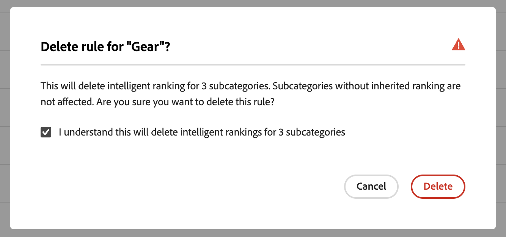

# Categorieverhandeling

De categorie het Merchandising staat opslageigenaars toe om [!DNL Live Search] Intelligente het rangschikken [ regels ](rules.md) op productcategorieën en subcategorieën toe te passen.

Deze video is een inleiding op Categorie Merchandising.

>[!VIDEO](https://video.tv.adobe.com/v/3448857?captions=dut)

De eigenschap wordt betreden in Admin bij **Marketing** > SEO &amp; Onderzoek > **[!DNL Live Search]** > **Categorie die** verhandelen.

>[!NOTE]
>
>De categorie die is het verwisselen beschikbaar met [!DNL Live Search] [ 3.0.0 of hoger ](release-notes.md). Werk de module [!DNL Live Search] bij als u de werkruimte Categorie-omzetting ziet, maar deze niet met gegevens wordt gevuld.

De mening van de Verkoop van de Categorie toont bepaalde categorieregels, met kolommen voor:

* Categorie
* Rangschikkingsstrategie
* Overgenomen classificatie
* Laatst bijgewerkt
* Handeling

U kunt een categorie of subcategorie zoeken in het veld Zoeken op categorie.

## Rangorde van strategieën

Het Merchandising van de categorie gebruikt de zelfde rangschikkende types zoals met [ individuele producten ](rules-workspace.md).
Er zijn twee soorten rangschikkingen: Intelligent en Handmatig.

**Intelligente het rangschikken** hefboomwerkingen storefront gedragsgegevensanalyse door [ Adobe Sensei ](https://www.adobe.com/sensei.html) om alle producten binnen gekozen categorieën door een bepaald algoritme te sorteren. Zodra een intelligente rangschikking wordt gekozen, zal de specifieke volgorde van de producten naar verwachting in de loop der tijd veranderen naarmate de onderliggende gegevens doorlopend opnieuw door Adobe Sensei worden geanalyseerd. De bovenste trendproducten veranderen bijvoorbeeld automatisch in de loop van de tijd wanneer de winkelvoorkeuren veranderen.
Intelligente classificatiemethoden zijn:

* De meeste aankopen: producten worden gerangschikt op basis van de frequentie waarmee ze in de afgelopen zeven dagen door kopers zijn gekocht.
* Meestal toegevoegd aan winkelwagentje: rankt producten op basis van hoe vaak ze de afgelopen zeven dagen door kopers aan het winkelwagentje werden toegevoegd.
* Het meest bekeken: producten worden gerangschikt op basis van hoe vaak ze de afgelopen zeven dagen door kopers werden bekeken.
* Aanbevolen voor u: op basis van het vorige en huidige on-site gedrag van elke winkelier wordt de mate van interactie tussen de winkelier en elke klant bepaald.
* Trending: rangschikt producten op basis van weergaven op basis van recente opwaartse bewegingen in populariteit.
* Geen: producten worden in de standaardvolgorde gerangschikt.

**het Handmatig rangschikken** staat gebruikers toe om de automatische orde van de productsoort met voeten te treden door handspeld te bepalen, stoot, begraving, en verberg regels.

## Overgenomen classificatie

Als handelaar zou u alle slijtcategorieën van vrouwen kunnen selecteren die door &quot;trending&quot; worden gesorteerd. Hieronder vallen de subcategorieën &quot;Vrouwenbroek&quot;, &quot;Vrouwenhemden&quot; en &quot;Vrouwenaccessoires&quot;. Dit mag geen invloed hebben op de categorieën mannen. Hiervoor kunt u overerfde classificaties gebruiken.

Wanneer het selecteren van een Intelligente het rangschikken methode voor een categorie of een subcategorie die subcategorieën heeft, kunt u **gebruiken pas intelligente classificaties op subcategorieën** optie toe. Hiermee past u de waarderingsmethode toe op alle subcategorieën.

Deze subcategorieën erven nu die regel van de oudercategorie (&quot;ja&quot;in de Geërfde kolom van de Rangschikking). In de kolom van de Actie, zijn de enige beschikbare opties **uitgeven Regel**, en **Details van de Mening**. De **schrapping** optie wordt onbruikbaar gemaakt voor geërfte regels op subcategorieën. Als u overerving van subcategorieën verwijdert, moet overerving van de bovenliggende categorie ongedaan worden gemaakt.

Voor elke categorie of subcategorie kan slechts één intelligente classificatie tegelijk worden toegepast. Ze kunnen ook extra handmatige classificaties hebben toegepast.

Als u een Intelligente rangschikking op een categorie toepast en **aanzet pas intelligente rangschikking op subcategorieën** optie toe, wordt om het even welke Intelligente die rangschikking reeds op subcategorieën wordt toegepast beschreven.

{width="700"}

Als u **Mening allen** klikt, opent een dialoog met details van de voorgestelde veranderingen.

Wanneer u een Intelligent ranking rechtstreeks toevoegt aan een categorie met een overgeërfde Intelligent ranking, wordt de overerving overschreven door de nieuwe Intelligent ranking.

Wanneer u de classificatie Intelligent uit de categorie verwijdert, wordt de overerving opnieuw ingesteld.
In beide scenario&#39;s worden handmatige classificaties gehandhaafd.

Als u een Intelligente rangschikking uit een categorie verwijdert en de subcategorieovererving is geselecteerd, worden alleen de overgeërfde Intelligente classificaties uit de subcategorieën verwijderd. Handmatige classificaties zijn niet onderhevig aan overerving en zullen blijven bestaan.

Er wordt een dialoogvenster weergegeven waarin wordt uitgelegd welke overgeërfde subcategorieën worden beïnvloed door wijzigingen die u aanbrengt in een categorie op een hoger niveau.

{width="1200"}

## Een categorieregel maken

Een categorieregel maken:

1. Klik **toevoegen de knoop van de Regel**.
1. In de _Uitgezochte mening van de Categorie_, klik door de categorieën en subcategorieën.
1. Schakel het selectievakje in om de categorie te selecteren die u wilt rangschikken.
1. Klik **toepassen**.

   

1. In _voeg de regel van de Categorie_ mening toe, selecteer de Intelligente het rangschikken methode u wenst om op de categorie van toepassing te zijn.
Op de pagina Voorvertoning categorie worden de werkelijke resultaten van de geselecteerde positie weergegeven met behulp van uw Live zoeken-gegevens.
1. Klik **sparen en publiceer** om de regel te bewaren.

De service [!DNL Live Search] verwerkt de regel en activeert deze in de winkel wanneer u klaar bent.

## Categorieregels wijzigen

Een bestaande regel wijzigen:

1. Klik **...** in de kolom van de Actie en kies **uitgeven**.
1. In de Edit mening van de Categorie, breng om het even welke vereiste veranderingen aan en klik **sparen en publiceer**.

De wijzigingen worden weerspiegeld in de winkel wanneer [!DNL Live Search] de wijziging heeft verwerkt.

## Categorieregels verwijderen

Een categorieregel verwijderen:

1. Klik **...** in de kolom van de Actie en kies **Schrapping**.
1. In _schrap regel_ modaal, uitgezochte **Schrapping** om de regel te verwijderen of **annuleert** om de actie te annuleren.

## Handmatige classificatie

Met de functie voor handmatig plaatsen kunt u de productvolgorde overschrijven die is bepaald door de eventuele intelligente rangschikkingsregels en kunt u handmatig bepalen waar de producten binnen de resultaten verschijnen.

Gebeurtenissen zijn acties die de zoekresultaten wijzigen als aan bepaalde voorwaarden wordt voldaan. Een handmatige classificatie kan tot 25 gebeurtenissen hebben.

* Verhogen: verplaatst een product hoger in de zoekresultaten.
* Branden: hiermee verplaatst u een product lager in de zoekresultaten.
* Een product vastzetten: een product naar een specifieke positie in de resultaten verplaatsen.
* Een product verbergen: sluit een product uit van de zoekresultaten.

Een handmatige classificatie maken:

1. Stel een intelligente rangschikkingsregel in voor een categorie zoals hierboven beschreven. De resultaten van de query worden weergegeven in de weergave Voorvertoning van categoriepagina. Hierbij worden de werkelijke live zoekgegevens gebruikt om de resultaten te bekijken.

1. Klik op een product en sleep het in de weergave Voorvertoning van categorie. Sleep de aanwijzer naar de gewenste positie. De velden Product en Positie worden automatisch ingevuld in het deelvenster Gebeurtenissen.

U kunt ook op het speldpictogram klikken om een product op de huidige locatie vast te zetten. Gebruik het contextmenu voor ovalen om &#39;Aan de bovenkant vastzetten&#39; of &#39;Aan de onderkant vastzetten&#39;.

Een gebeurtenis handmatig toevoegen:

1. Onder het Handmatig Rangschikken, klik **Uitgezocht een gebeurtenis** menu en kies een gebeurtenis om te plaatsvinden wanneer de bijbehorende voorwaarden worden voldaan aan.
1. Voer de naam in van het product waarop u de bewerking wilt toepassen. Producten worden voorgesteld terwijl u typt.
1. Voor meerdere gebeurtenissen kiest u andere gebeurtenissen die u wilt activeren als aan de voorwaarden is voldaan.

>[!NOTE]
>
>Regels worden toegepast wanneer een specifieke categorie op de winkel wordt geopend en er voor die categorie een regel bestaat. Voor de Regels van de Verkoop van de Categorie, is de standaardsoortorde &quot;Soort door: Positie&quot;. Als een winkelier de sorteervolgorde wijzigt, worden alle verborgen, vastgezette en begraven producten niet meer gesorteerd.
