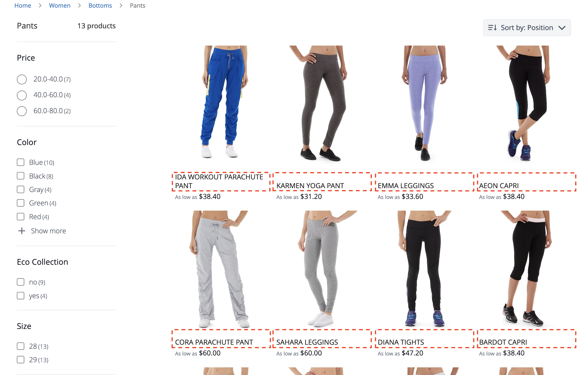
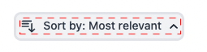
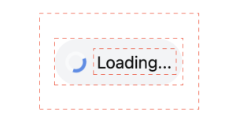

# Widget pagina met productaanbiedingen

De PLP ( [!DNL Live Search Product Listing Page Widget] ) gebruikt het Commerce Services-platform om een pagina met producten met een uitvoerbare, doorzoekbare en facetbare lijst te maken. In dit onderwerp wordt beschreven hoe u de PLP-widget kunt inschakelen en opmaken.

## De PLP-widget inschakelen

Wanneer de service [!DNL Live Search] is geïnstalleerd, wordt de standaardzoekfunctionaliteit automatisch omgezet in [!DNL Live Search] .

De [!DNL Live Search] PLP-widget is standaard ingeschakeld voor nieuwe installaties. Als u [!DNL Live Search] bijwerkt en de PLP-widget al is uitgeschakeld, blijft deze ook actief.

>[!IMPORTANT]
>
>Wanneer [!DNL Live Search Product Listing Page Widget] is ingeschakeld, kan de richting van de sorteervolgorde op een pagina met productlijsten niet worden gewijzigd.

## Widget-functies

De PLP-widget beschikt over de volgende functies die niet in de box kunnen worden gebruikt:

- Toevoegen aan winkelwagentjes - Alleen beschikbaar voor eenvoudige producten.
- Meerdere afbeeldingen per product - de afbeelding kan veranderen wanneer een andere kleur wordt gekozen voor een configureerbaar product.
- Ondersteuning voor kleurstalen - Het kleurkenmerk moet zijn gespeld `color` om de code correct te laten valideren.

### De widget aanpassen

Naast de functies in de box van de PLP-widget kunt u de widget verder aanpassen en de volgende functies toevoegen:

- Filteren op kenmerken
- Ondersteuning voor meerdere talen
- Prijsschuifregelaars

Voor informatie over hoe te om de widget PLOP aan te passen om de bovengenoemde eigenschappen te behandelen, zie `storefront-product-listing-page` leest in de volgende [ bewaarplaats ](https://github.com/adobe/storefront-product-listing-page/). Het Lees mij-bestand in deze opslagplaats biedt een voorbeeld voor het aanpassen van de PLP-widget en het implementeren van deze aanpassingen op uw site.

>[!WARNING]
>
>Als u de PLP-widget aanpast met behulp van de code in het antwoord, bent u verantwoordelijk voor het onderhoud en eventuele benodigde updates. Eventuele nieuwe PLP-widgetfuncties die door Adobe worden vrijgegeven, zijn mogelijk niet compatibel met uw aangepaste implementatie.

## Voorbeeld van stijlen

U kunt de blik en het gevoel van PLP widget aanpassen om uw plaats aan te passen gebruikend [ CSS ](https://developer.adobe.com/commerce/frontend-core/guide/css/).

>[!NOTE]
>
>Elementen met aangepaste klassen binnen een Adobe Commerce-thema worden niet overgeërfd. Deze elementen moeten door hun specifieke klasse worden gericht om de douaneklassen aan te passen; de primaire actieklassen zullen niet aan een widgetknoop werken. Algemene doelelementen in de CSS worden overgeërfd; `button` is van toepassing op widgetknoppen.

De gemarkeerde div-elementen bevatten de doelklasse `ds-sdk-product-item__product-name` .


Pas de productnaam aan door een regel toe te voegen die in hoofdletters wordt geschreven.

```css
.ds-sdk-product-item__product-name {
 text-transform: uppercase;
}
```



## CSS-klassen

### Productlijst

- `.ds-sdk-product-list`: div buiten
- `.ds-sdk-product-list__grid`: div binnen


#### Paginering van de productlijst

- `.ds-plp-pagination`


- `.ds-plp-pagination_item`


- `.ds-plp-pagination_item--current`


### Widgets

- `.ds-widgets`: div buiten
- `.ds-widgets__actions`: binnenste div links
- `.ds-widgets__results`: Div aan rechterkant binnenste div


### Vervolgkeuzelijst sorteren

- `.ds-sdk-sort-dropdown`


- `.ds-sdk-sort-dropdown__button`



- `.ds-sdk-sort-dropdown__items`


- `.ds-sdk-sort-dropdown__items--item`


- `.ds-sdk-sort-dropdown__items--item-selected`


- `.ds-sdk-sort-dropdown__items--item-active`


### Facetten

- `.ds-plp-facets`
- `.ds-plp-facets__header`
- `.ds-plp-facets__header_title`
- `.ds-plp-facets__header__clear-all`

{width="350"}

- `.ds-plp-facets__pills`
- `.ds-sdk-pill`

{width="350"} pillen van 0&rbrace; Facet

- `.ds-sdk-pill__label`
- `.ds-sdk-pill__cta`

{width="350"}

- `.ds-plp-facets__list`

{width="350"}

- `.ds-sdk-input`
- `.ds-sdk-input__label`
- `.ds-sdk-product-item__product-swatch-group`
- `ds-sdk-product-item__product-swatch-item`
- `.ds-sdk-input_fieldset_show-more`


- `.ds-sdk-labelled-input`


- `.ds-sdk-labelled-input__input`
- `.ds-sdk-labelled-input__label`


### Product-item

- `.ds-sdk-product-item`
- `.ds-sdk-product-item__image`
- `.ds-sdk-product-item__product-name`
- `.ds-sdk-product-item__product-options`
- `.ds-sdk-product-price`
   - `.ds-sdk-product-price--no-discount`
   - `.ds-sdk-product-price--grouped`
   - `.ds-sdk-product-price--bundle`
   - `.ds-sdk-product-price--discount`


### Laden

- `.ds-sdk-loading`
- `.ds-sdk-loading__spinner`
- `.ds-sdk-loading__spinner-label`



## De PLP-widget uitschakelen

De PLP-widget uitschakelen:

1. Ga naar **Opslag** > Montages > **Configuratie** > **[!DNL Live Search]** > **Eigenschappen Storefront** en de reeks **laat het Lijst van het Product toe Widgets** aan &quot;Nr&quot;.
1. Selecteer **sparen Config** om het plaatsen te bewaren.
