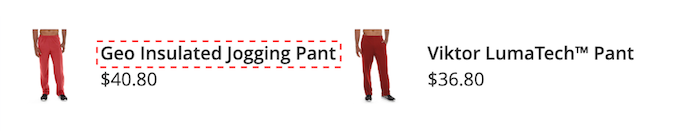

# [!DNL Storefront Popover]

Wanneer [!DNL Live Search] wordt geïnstalleerd [&#x200B; &#x200B;](install.md), verschijnt a [!DNL popover] in de storefront wanneer de kopers in het [&#x200B; Onderzoek &#x200B;](https://experienceleague.adobe.com/docs/commerce-admin/catalog/catalog/search/search.html?lang=nl-NL#quick-search) vakje typen. Wanneer elk teken wordt getypt, wordt [!DNL popover] bijgewerkt met voorgestelde producten en miniatuurafbeeldingen van de bovenste zoekresultaten.

[!DNL Live Search] geeft resultaten voor een query van twee of meer tekens. Voor een gedeeltelijke overeenkomst, is het maximumaantal karakters per woord 20. Het aantal karakters in een &quot;onderzoek aangezien u&quot;vraag typt is niet configureerbaar.

![[!DNL Live Search popover]](assets/storefront-search-as-you-type.png)

>[!TIP]
>
>Leer hoe te om productattributen als zoekbaar in het [&#x200B; Vestiging Levende artikel van het Onderzoek &#x200B;](workspace.md) te plaatsen.

## [!DNL Popover] paginaformaat

De paginagrootte van [!DNL popover] bepaalt hoeveel regels automatisch ingevulde producten kunnen worden geretourneerd. Tijdens de Levende installatie van het Onderzoek, verandert de `page_size` waarde in de huidige waarde van het [&#x200B; Onderzoek van de Catalogus &#x200B;](https://experienceleague.adobe.com/docs/commerce-admin/config/catalog/catalog.html?lang=nl-NL) - `Autocomplete Limit` het plaatsen.

Standaard is de waarde voor Zoeken in catalogus - automatisch aanvullen van limiet ingesteld op acht regels (of rijen). Ga als volgt te werk om het paginaformaat van de [!DNL popover] te wijzigen:

1. Op *Admin* sidebar, ga naar **Opslag** > Montages > **Configuratie**.
1. In het linkerpaneel, breid **Catalogus** uit en kies **Catalogus** van de lijst van montages.
1. Vouw de *sectie van het Onderzoek van de Catalogus 0&rbrace; &lbrace;uit.*
1. Plaats de **Autocomplete Grens** aan het aantal lijnen die u in [!DNL popover] wilt toestaan.
1. Wanneer volledig, klik **sparen Config**.

## Stijlen [!DNL Popover] voorbeeld

U kunt de vormgeving van de [!DNL Popover] -widget aanpassen aan de stijl en merkenrichtlijnen van uw bedrijf.

In [!DNL storefront popover] worden altijd het product `name` en `price` weergegeven en kan de selectie van velden niet worden geconfigureerd. Nochtans, [!DNL popover] elementen kunnen worden gestileerd gebruikend [&#x200B; CSS &#x200B;](https://developer.adobe.com/commerce/frontend-core/guide/css/) klassen. Met de volgende declaraties wijzigt u bijvoorbeeld de achtergrondkleur van de container en de voettekst van [!DNL popover] .

```css
.livesearch.popover-container {
    background-color: lavender;
}

.livesearch.view-all-footer {
    background-color: magenta;
}
```

## Zichtbaarheid container

De bovenliggende component van de `.livesearch.popover-container` is `.search-autocomplete` .  De klasse `.active` geeft de zichtbaarheid van de container aan. De klasse `.active` wordt voorwaardelijk toegevoegd wanneer [!DNL popover] open is.

```css
.search-autocomplete.active   /* visible */
.search-autocomplete          /* not visible */
```

Voor meer informatie over het stileren van storefront elementen, verwijs naar [&#x200B; Draperende stijlbladen (CSS) &#x200B;](https://developer.adobe.com/commerce/frontend-core/guide/css/) in de [&#x200B; Voorste Gids van de Ontwikkelaar &#x200B;](https://developer.adobe.com/commerce/frontend-core/guide/).

## Klasse-kiezers

U kunt de volgende klassenkiezers gebruiken om de container- en productelementen in de [!DNL popover] op te maken.

- `.livesearch.popover-container`
- `.livesearch.view-all-footer`
- `.livesearch.products-container`
- `.livesearch.product-result`
- `.livesearch.product-name`
- `.livesearch.product-price`

### Containerklassekiezers

#### .livessearch.popover-container

![[!DNL Popover] container &#x200B;](assets/livesearch-popover-container.png)

#### .livessearch.view-all-footer


### Kiezers voor productklassen

#### .livessearch.products-container


#### .livessearch.product-result


#### .livessearch.product-name



#### .livessearch.product-price


#### .livessearch product-link


## Werken met een gewijzigd thema {#working-with-modified-theme}

U kunt [!DNL storefront popover] met een aangepast [&#x200B; thema &#x200B;](https://developer.adobe.com/commerce/frontend-core/guide/themes/) gebruiken dat de vereiste dossiers van *Luma* erft. Het `top.search` -blok in `header-wrapper` van de `Magento_Search` -module mag niet worden gewijzigd.

```html
<referenceContainer name="header-wrapper">
   <block class="Magento\Framework\View\Element\Template" name="top.search" as="topSearch" template="Magento_Search::form.mini.phtml">
      <arguments>
         <argument name="configProvider" xsi:type="object">Magento\Search\ViewModel\ConfigProvider</argument>
      </arguments>
   </block>
</referenceContainer>
```

## De [!DNL popover] uitschakelen

Om [!DNL popover] onbruikbaar te maken en de standaard [&#x200B; Snelle functionaliteit van het Onderzoek &#x200B;](https://experienceleague.adobe.com/docs/commerce-admin/catalog/catalog/search/search.html?lang=nl-NL#quick-search) te herstellen, ga het volgende bevel in:

```bash
bin/magento module:disable Magento_LiveSearchStorefrontPopover
```

## Implementaties zonder kop

Voor die met hoofdloze implementaties, kunt u [!DNL Live Search popover] installeren gebruikend een [&#x200B; npm pakket &#x200B;](https://www.npmjs.com/package/@magento/ds-livesearch-storefront-utils).
