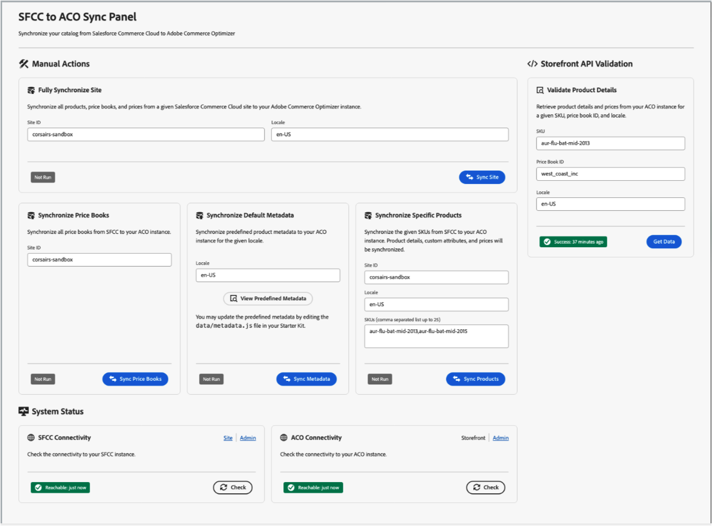

# Salesforce Commerce Connector voor Adobe Commerce Optimizer

De [!DNL Commerce Optimizer Salesforce Commerce Connector] is gebaseerd op Adobe App Builder-technologie en maakt naadloze overdracht en beheer van catalogusgegevens mogelijk van Salesforce Commerce Cloud B2C naar [!DNL Adobe Commerce Optimizer] . De software biedt een brug tussen beide platforms en zorgt ervoor dat productinformatie, prijzen en updates synchroon blijven zonder dat ze opnieuw hoeven te worden geplatformen.

De aansluiting beschikt over betrouwbare mogelijkheden voor gegevenssynchronisatie en de flexibiliteit om workflows aan te passen aan uw bedrijfsbehoeften.

Voor een videoles van begin tot eind, zie [&#x200B; Leren over de de wolkenstarterkit van Salesforce Commerce &#x200B;](https://experienceleague.adobe.com/en/docs/commerce-learn/tutorials/adobe-commerce-optimizer/sfcc-starter-kit/overview).

## Belangrijkste mogelijkheden

* **de Synchronisatie van Gegevens van de Catalogus:** duw productgegevens-met inbegrip van varianten, prijsboeken, en structuur-van Salesforce Commerce B2C in Adobe Commerce Optimizer om winkeliers en ervaring-gedreven toepassingen bijgewerkt te houden.
* **de Synchronisatie van de Prijs:** voer en beheer rechtstreeks prijsgegevens van Salesforce Commerce B2C in.
* **steunt veelvoudige gegevenstypes:** synchroniseer producten, tarifering, en catalogusstructuren om op complexe handels het wijzen configuraties te wijzen.

* **de Flexibele Werkschema&#39;s van de Synchronisatie**
   * **Geplande Syncs:** Automatiseer updates gebruikend baan het plannen, geen vereiste handinspanning.
   * **Updates op bestelling:** brengt onmiddellijk updates op SKU-niveau voor urgente veranderingen, correcties, of productlanceringen teweeg.

* **Gebouwd voor Uitbreidbaarheid**
   * Gebruikt douane [&#x200B; Salesforce Commerce B2C API &#x200B;](https://developer.salesforce.com/docs/commerce/commerce-api/guide/get-started.html) (SCAPI) eindpunten voor verenigbaarheid en gemakkelijke aanpassing aan unieke of geavanceerde gebruiksgevallen.
   * Schaalt met uw bedrijfs-begin met catalogus en prijssynchronisatie, dan breidt de werkschema&#39;s uit om extra integratie of bedrijfslogica te steunen.
   * Vorm en evolueer werkschema&#39;s zonder kernintegratie te herbouwen.

>[!NOTE]
>
>De connector is speciaal ontworpen voor Salesforce Commerce Cloud B2C. Het biedt geen ondersteuning voor Salesforce B2B- of D2C-producten, die op verschillende technologiestapels zijn gebaseerd.

## Wie profiteert van de Salesforce-connector?

[!DNL Salesforce Commerce Connector] is ideaal voor:

* **Bestaande klanten van Salesforce Commerce Cloud B2C** verbeterend storefront mogelijkheden
* **Multibrand organisaties** die geavanceerde handels en verpersoonlijkingseigenschappen over veelvoudige winkelcentra vereisen
* **Bedrijven die prestatiesverbeteringen** door Adobe Edge Delivery Services voor snellere storefronervaringen zoeken
* **Bedrijven met complexe tariferingsstructuren** synchroniserend verfijnde prijsboeken en locale-specifieke tarifering
* **de klanten van AEM** het beheren van productcatalogi van Salesforce Commerce B2C terwijl het gebruiken van Adobe Commerce opslag met Edge Delivery Services
* **Detailhandelaars met multi-locale vereisten** synchroniserend gelokaliseerde productinformatie over markten en talen

## Gevallen gebruiken

De aansluiting ondersteunt verschillende hoofdgebruikscenario&#39;s:

### Catalogusgegevensinvoer en storefrontweergave

Dit primaire gebruiksgeval demonstreert de volledige gegevensstroom van Salesforce Commerce B2C naar de Adobe Commerce storefront:

1. **Aanvankelijke catalogusopname:** Bulk laadt uw volledige handelscatalogus van Salesforce, met inbegrip van eenvoudige producten met varianten, prijsboeken, en het tarief informatie.
1. **Geautomatiseerde delta updates:** synchroniseer automatisch productupdates van Salesforce Commerce catalogusbeheer UI aan [!DNL Commerce Optimizer].
1. **integratie Storefront:** de vertoning synchroniseerde catalogusgegevens over uw opslag van de Dienst van Adobe Commerce Edge Delivery gebruikend [!DNL Commerce Optimizer] opslag APIs.
1. **updates in real time:** Mening bijgewerkte productinformatie (namen, prijzen, beschrijvingen) onmiddellijk op uw opslag na het aanbrengen van veranderingen in Salesforce.

### Productbeheer voor meerdere landinstellingen

Gebruik Salesforce Commerce B2C-lokalisatiefuncties:

* Synchroniseer gelokaliseerde versies van producttekstvelden (namen, beschrijvingen) vanuit Salesforce Commerce B2C voor verschillende landinstellingen.
* Concepten van landinstellingen van Salesforce toewijzen aan :1 landinstellingen. [!DNL Commerce Optimizer]
* Ondersteuning voor meerdere innamecycli voor verschillende lokalisaties.
* Consistentie behouden in algemene productcatalogi.

## Architectuur en onderdelen

[!DNL SFCC Connector] biedt een robuuste integratielaag tussen een Salesforce Commerce B2C-instantie en [!DNL Commerce Optimizer] . De connector werkt via een reeks synchronisatiehandelingen die uw catalogusgegevens, prijzenboeken en productinformatie overbrengen.

1. **Extractie van Gegevens** - voor authentiek verklaart met uw Salesforce Commerce B2C instantie en haalt catalogusgegevens gebruikend douaneSCAPIs.
1. **de Transformatie van Gegevens** - Transformeer productgegevens om de [!DNL Commerce Optimizer] vereisten van het gegevensmodel en schema aan te passen.
1. **de Ingestie van Gegevens** - verzendt veilig getransformeerde gegevens aan [!DNL Commerce Optimizer] gebruikend ACO TypeScript SDK.
1. **Integratie van de Storefront** - de gesynchroniseerde gegevens worden beschikbaar door [!DNL Commerce Optimizer] APIs voor storefront ervaringen.

Het volgende diagram illustreert de gegevensstroom op hoog niveau voor de integratie:

{zoomable="yes"}

### Belangrijkste onderdelen

De [!DNL Commerce Optimizer SFCC Connector] bestaat uit verschillende sleutelcomponenten:

* **ACO SFCC Starter Kit App Builder toepassing** - verstrekt serverloze functies die gegevenssynchronisatie tussen SFCC en Adobe Commerce Optimizer behandelen.
* **de Cartridge van SFCC van de Douane** - Vereiste patroon die uw instantie van Salesforce Commerce Cloud met APIs uitbreidt nodig voor gegevensextractie.
* **Beheer UI** - de interface van het Web voor het controleren van synchronisatiestatus en het beheren van schakelaarverrichtingen.

### Synchronisatieproces

De connector ondersteunt meerdere synchronisatiemodi.

| Synchronisatiemodus | Beschrijving |
|-----------|-------------|
| **Volledige Synchronisatie van de Plaats** | Voert een uitgebreide synchronisatie uit van alle producten, prijsboeken en prijzen voor uw geconfigureerde Salesforce Commerce Cloud-site en -landinstellingen. Dit omvat <ul><li>metagegevens en kenmerken van producten</li><li>catalogusstructuur en -categorieën</li><li>prijzenboeken</li><li>prijsinformatie</li><li>multilocale productgegevens</li></ul> |
| **de Synchronisatie van Delta** | Hiermee worden alleen wijzigingen opgehaald en gesynchroniseerd die sinds de laatste synchronisatie in Salesforce-product- en prijsgegevens zijn aangebracht, waardoor efficiënte en tijdige updates mogelijk zijn.  de synchrone looppas van Delta automatisch op een geplande basis (gebrek: uur) om gegevensversheid te handhaven. |
| **gerichte Opties van de Synchronisatie** | Biedt korrelige synchronisatiemogelijkheden: <ul><li>**synchroniseert de Synchronisatie van het Boek van 0&rbrace; Prijs slechts de informatie van het prijsboek**</li><li>**werkt de Synchronisatie van Metagegevens van 0&rbrace; meta-gegevens van het product en attributendefinities bij**</li><li>**Specifieke Synchronisatie van het Product** synchroniseert individuele producten door SKU</li></ul> |

## Belangrijke overwegingen

Houd rekening met de volgende factoren wanneer u uw implementatie plant:

### Gegevenstoewijzing en kenmerken

* **Doorzoekbare attributen:** Salesforce Commerce B2C plaatst doorzoekbare attributen door UI, die API niet blootstelt. Gebruik [[!DNL Catalog Data Ingestion metadata APIs] &#x200B;](https://developer.adobe.com/commerce/services/optimizer/data-ingestion/#metadata) om deze doorzoekbare attributen in Adobe Commerce Optimizer manueel te vormen.
* **afbeelding van Attributen:** Plan de afbeelding van het productattributen van Salesforce Commerce B2C aan [!DNL Commerce Optimizer] meta-gegevens die op uw bedrijfsvereisten worden gebaseerd.
* **Standaard doorzoekbare gebieden:** de schakelaar maakt automatisch kernattributen (`name`, `description`, `ID`) doorzoekbaar door gebrek.

### Bereik synchroniseren

* **selectie van de Plaats:** Salesforce Commerce B2C heeft een concept plaatsen die catalogi aan vastmaken. Selecteer tijdens volledige synchronisatie welke Salesforce-site u wilt synchroniseren.
* **het beheer van de Plaats:** elke Salesforce Commerce scène resulteert in een afzonderlijke cyclus van de productopname in [!DNL Commerce Optimizer].
* **het volume van Gegevens:** overweeg catalogusgrootte en synchronisatiefrequentie wanneer het plannen van implementatie.

## Toezicht en beheer

Als de [!DNL Commerce Optimizer SFCC Connector] is geïnstalleerd en geconfigureerd, biedt de [!DNL SFCC to ACO Sync Panel] uitgebreide controle- en beheermogelijkheden:

{width="700" zoomable="yes"}

De URL voor deze interface wordt opgegeven nadat u de [!DNL Commerce Optimizer SFCC Connector Starter Kit] voor het App Builder-project hebt geïmplementeerd.

Belangrijkste kenmerken zijn:

* **het Volgen van de Status van de Synchronisatie:** controleert de status en timestamps van alle synchronisatieverrichtingen.
* **Bevestiging van de Connectiviteit:** de verbindingen van de Test aan zowel Salesforce Commerce Cloud als Adobe Commerce Optimizer.
* **Bevestiging van de Gegevens van het Product:** verifieer dat de gesynchroniseerde productgegevens correct in de storefront verschijnen.
* **Logging van de Fout en het Oplossen van problemen:** de logboeken van de Fout voor het oplossen van problemen kunnen toegang door App Builder CLI zijn.
* **Beheer van de Staat:** de synchronisatievooruitgang van het spoor en verhindert conflicten met ingebouwd staatsbeheer.

## Source-code en ontwikkelingsbronnen

[!DNL Commerce Optimizer SFCC Connector] is een open bron en is beschikbaar voor aanpassing. Belangrijke opslagplaatsen zijn:

* **[ACO SFCC de Uitrusting van de Aanzet &#x200B;](https://github.com/adobe-commerce/aco-sfcc-starter-kit)** - Hoofdschakelaartoepassing en documentatie.
* **[ACO SFCC Cartridges &#x200B;](https://github.com/adobe-commerce/aco-sfcc-cartridges)** - Vereiste patronen SFCC voor API integratie.
* **[ACO TypeScript SDK &#x200B;](https://github.com/adobe-commerce/aco-ts-sdk)** - SDK voor de integratie van Adobe Commerce Optimizer.

Deze opslagplaatsen verstrekken volledige broncode, gedetailleerde documentatie, en voorbeelden om de schakelaar uit te voeren en aan te passen.

## Volgende stappen

Klaar om uw Salesforce Commerce Cloud-gegevens te integreren met Adobe Commerce Optimizer? Begin door de gedetailleerde implementatiegids in de [&#x200B; opslagplaats van de Uitrusting van de Aanzet ACO SFCC &#x200B;](https://github.com/adobe-commerce/aco-sfcc-starter-kit) te herzien en ervoor te zorgen u de noodzakelijke eerste vereisten op zijn plaats hebt.
