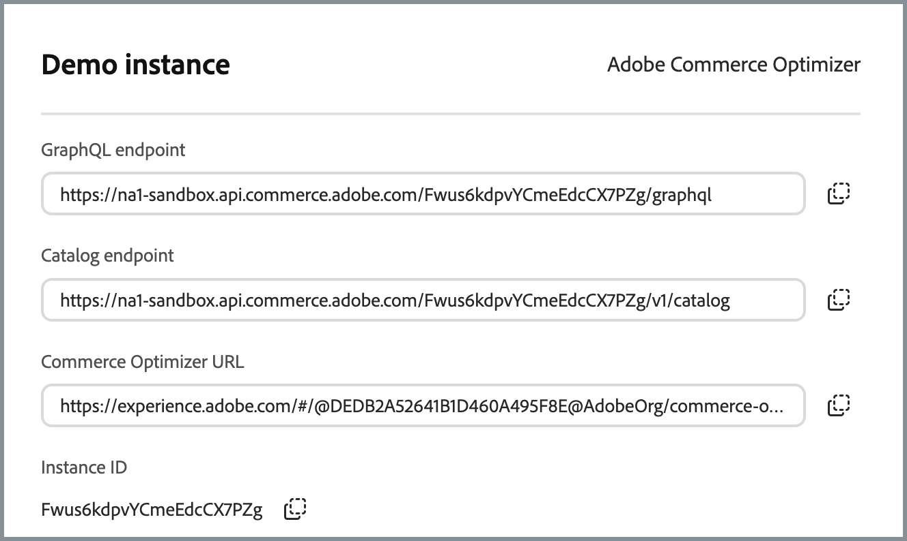

# Aan de slag

Deze handleiding begeleidt u bij het instellen van [!DNL Adobe Commerce Optimizer] van het begin tot het einde. Terwijl deze gids alle rollen behandelt, zie de [ documentatie van de ontwikkelaar ](https://developer.adobe.com/commerce/services/optimizer/) voor gedetailleerde ontwikkelaar-specifieke inhoud.

## Vereisten

Voordat u begint, moet u controleren of:

- **de rekening van Adobe Experience Cloud** met [!DNL Adobe Commerce Optimizer] rechten
- **beheerdertoegang van de Organisatie** om instanties tot stand te brengen en gebruikers te beheren
- **GitHub rekening** voor het laden van steekproefgegevens en storefront ontwikkeling
- **Basis begrip** van e-commerceconcepten

## Handleiding Snel starten

Voer de volgende essentiële stappen uit om uw [!DNL Adobe Commerce Optimizer] -omgeving actief te maken:

### Stap 1. Een instantie maken

1. Login aan [ Adobe Experience Cloud ](https://experience.adobe.com/).
1. Navigeer aan **Commerce** > **Manager van Commerce Cloud**.
1. Klik **toevoegen Instantie** > **Commerce Optimizer**.

   {width="60%" zoomable="yes"}

1. Instantie-instellingen configureren:
   - **Naam**: Beschrijvende naam (bijvoorbeeld, &quot;Mijn Sandbox van het Bedrijf&quot;)
   - **Beschrijving**: Korte beschrijving van doel
   - **Gebied**: Selecteer uw aangewezen gebied
   - **Type van Milieu**: Begin met a **zandbak** milieu voor het testen

1. Klik **toevoegen Instantie**.

   De Cloud Manager wordt bijgewerkt en bevat nu uw nieuwe exemplaar. Voor details bij de toegang tot van en het beheren van het, zie [ een instantie ](#manage-an-instance) leiden.

>[!NOTE]
>
>Sandbox-exemplaren zijn beperkt tot Noord-Amerika. U kunt het gebied na het maken niet wijzigen.

### Stap 2. Uw omgeving instellen

Nadat u de instantie hebt gemaakt:

1. [ beheer uw instantie ](#manage-an-instance) van de Manager van Commerce Cloud.
1. Vorm gebruikerstoegang gebruikend de [ gids van het Beheer van de Gebruiker ](./user-management.md).

### Stap 3. Voorbeeldgegevens toevoegen (optioneel)

Voor het testen en het leren, volg de [ instructies van de Gegevens van de Steekproef van de Lading ](#add-sample-data).

## Op rollen gebaseerde workflows

[!DNL Adobe Commerce Optimizer] de opstelling en het beheer baseren zich op drie zeer belangrijke rollen. Elke rol heeft specifieke taken en verantwoordelijkheden:

{zoomable="yes"}

### Beheertaken

Beheerders beheren instanties, gebruikers en organisatorische instellingen.

| Taak | Beschrijving | Koppeling |
|---|---|---|
| **beheert Gebruikers** | Gebruikers, ontwikkelaars en beheerders toevoegen | [ Gebruikersbeheer ](./user-management.md) |
| **creeer Instanties** | Sandbox- en productieomgevingen instellen | [ creeer instantie ](#create-an-instance) |
| **beheert Instanties** | De status controleren, instantienaam en beschrijving bijwerken en sleutel-URL&#39;s ophalen voor toepassing en API-toegang | [ beheert Instanties ](#manage-instances) |
| **vorm Toegang** | Catalogusweergaven en -beleid instellen | [ de Weergaven van de Catalogus ](./setup/catalog-view.md) |

### Ontwikkelingstaken

De ontwikkelaars behandelen technische implementatie en gegevensintegratie, met inbegrip van de taken van de platformarchitectuur.

| Taak | Beschrijving | Koppeling |
|---|---|---|
| **Toegang Developer Console** | Projecten maken en referenties genereren | [ Developer Console ](https://developer.adobe.com/developer-console/docs/guides/getting-started) |
| **Ingest Gegevens van de Catalogus** | Productgegevens van bestaande systemen importeren | [ Ingestie API van Gegevens ](https://developer.adobe.com/commerce/services/optimizer/data-ingestion/) |
| **Opstelling Storefront** | Edge Delivery Services-storefront configureren | [ Opstelling Storefront ](./storefront.md) |

### Merchandisertaken

Handelaars optimaliseren en personaliseren de boodschapervaring door productontdekking en aanbevelingen. Zij gebruiken ook verkoopgegevens en analyses om strategische besluiten over productplaatsing, tarifering, en promoties op de winkel te nemen.

| Taak | Beschrijving | Koppeling |
|---|---|---|
| **Ontdekking van het Product** | Zoeken en filteren configureren | [ het Merchandising Overzicht ](./merchandising/overview.md) |
| **Aanbevelingen** | Aanbevelingen voor producten met een AI-processor instellen | [ Aanbevelingen van het Product ](./merchandising/recommendations/overview.md) |
| **Prestaties die** volgen | Meting van succes controleren | [ Metriek van het Succes ](./manage-results/success-metrics.md) |

## Instanties beheren

Exemplaren beheren vanuit Commerce Cloud Manager.

>[!NOTE]
>
>Niet alle Adobe Commerce Optimizer-gebruikers hebben toegang tot Cloud Manager. De toegang hangt van de rol en de toestemmingen af die aan de gebruikersrekening worden toegewezen.

1. Login aan [ Adobe Experience Cloud ](https://experience.adobe.com/).

1. Commerce Cloud Manager openen:

   - Onder **Snelle toegang**, klik **Commerce**.
   - Bekijk de beschikbare varianten.

### Zoeken en filteren

Nadat u zich hebt aangemeld, worden op het dashboard alle Commerce-productinstanties weergegeven die in de organisatie beschikbaar zijn.
De kolom Product geeft aan voor welke Commerce-toepassing de instantie is ingericht.

Gebruik de opties Filter en Zoeken om snel naar specifieke varianten te zoeken. U kunt zoeken op gegevens die zijn gemaakt, regio&#39;s die zijn gemaakt op basis van producttype, omgeving en status.

### De toepassing [!DNL Adobe Commerce Optimizer] openen

Zodra de app is geopend, kunt u eenvoudig schakelen tussen omgevingen als sandbox en productie om gegevens en instellingen voor elke omgeving weer te geven zonder terug te keren naar Commerce Cloud Manager.

1. Klik in Commerce Cloud Manager op de instantienaam om de toepassing [!DNL Adobe Commerce Optimizer] te openen.

1. Schakel tussen [!DNL Adobe Commerce Optimizer] -instanties zonder de toepassing te verlaten.

   De instantie drop-down maakt een lijst van alle Optimizer instanties beschikbaar in de organisatie. Selecteer de instantie die u wilt weergeven.

   {zoomable="yes"}

### Instantiedetails ophalen

Bekijk de instantiedetails door op het informatiepictogram naast uw instantienaam te klikken.

{width="60%" zoomable="yes"}

Let op de volgende belangrijke informatie:

- **het eindpunt van GraphQL** om de catalogusgegevens van Commerce terug te winnen gebruikend Verkoop API
- **eindpunt van de Dienst van de Catalogus** voor gegevensopname die REST API gebruiken
- **Commerce Optimizer URL** om tot de [!DNL Adobe Commerce Optimizer] toepassing toegang te hebben
- **identiteitskaart van de Instantie** unieke huurder identiteitskaart die de instantie identificeert

Het eindpunt en de details van instanceID worden vereist voor het vormen API toegang en het integreren met frontend toepassingen en backendsystemen.
Als u geen toegang tot de instantiedetails hebt, contacteer uw organisatiebeheerder om de waarden te krijgen.

### Instantienaam en -beschrijving bewerken

Werk indien nodig de instantienaam en beschrijving bij.

1. Klik **uitgeven** pictogram naast een instantienaam.
1. Werk de **naam van de Instantie** en **Beschrijving** zoals nodig bij.
1. Klik **sparen**.

## Voorbeeldgegevens toevoegen

Adobe biedt een GitHub-opslagplaats met voorbeeldgegevens en -gereedschappen waarmee u functies van [!DNL Adobe Commerce Optimizer] kunt leren en testen.
De steekproefgegevens zijn gebaseerd op het [ bedrijfscase van het Carvelo ](./use-case/admin-use-case.md) en omvat:

- Productcatalogus met auto-onderdelen
- Meerdere prijzenboeken en prijsscenario&#39;s
- Catalogusweergaven en -beleid voor verschillende dealers
- Volledige voorbeelden van end-to-end workflows

**Laad de steekproefgegevens:**

1. Heb toegang tot de [ Ingestie van de Gegevens van de Catalogus van de Steekproef ](https://github.com/adobe-commerce/aco-sample-catalog-data-ingestion) bewaarplaats GitHub.

1. Volg de installatie-instructies in het README-bestand van de gegevensopslagruimte om de volgende taken uit te voeren:

   - Uw omgeving instellen
   - Voltooi het proces voor gegevensinvoer
   - Catalogusweergaven en -beleid maken met behulp van voorbeeldgegevens
   - Verifieer de gegevensopname door de gegevens van de Dienst van de Catalogus over de [ pagina van de Synchronisatie van 0&rbrace; Gegevens te controleren &lbrace;](./setup/data-sync.md)

## Volgende stappen

Na voltooiing van de installatie:

1. Opzetten van uw winkelcentrum:
   - Vorm [ Edge Delivery Services storefront ](./storefront.md)
   - Verbinding maken met uw catalogusgegevens

1. Ontdek de draagtas van Carvelo:
   - Volg het [ werkschema van begin tot eind ](./use-case/admin-use-case.md)
   - Praktijken met echte scenario&#39;s

1. Handelsversie configureren:
   - Opstelling [ productontdekking ](./merchandising/overview.md)
   - Creeer [ aanbevelingen ](./merchandising/recommendations/overview.md)

1. Monitorprestaties:
   - De metriek van het spoor [ succes ](./manage-results/success-metrics.md)
   - Analyseer [ onderzoeksprestaties ](./manage-results/search-performance.md)

## Problemen oplossen

### Algemene kwesties

| Probleem | Oplossing |
|---|---|
| **kan geen instantie tot stand brengen** | Controleer of u [!DNL Adobe Commerce Optimizer] rechten en beheerdersmachtigingen hebt. |
| **Instantie verschijnt niet** | Controleer uw Adobe IMS-organisatie en vernieuw de pagina. |
| **heeft geen toegang tot instantie** | Zorg ervoor dat u als gebruiker in de Admin Console wordt toegevoegd. |
| **gegevens van de Steekproef laden niet** | Verifieer uw instantiereferenties en API eindpunten. |

### Hulp vragen

- **Middelen van de Ontwikkelaar**: [ documentatie van de Ontwikkelaar ](https://developer.adobe.com/commerce/services/optimizer/)
- **Bronnen van de Storefront**: [ Commerce storefront documentatie ](https://experienceleague.adobe.com/developer/commerce/storefront/)
- **Leerprogramma&#39;s**: [ zelfstudies van Commerce Optimizer ](https://experienceleague.adobe.com/en/docs/commerce-learn/tutorials/adobe-commerce-optimizer/overview)
- **Steun**: [ de middelen van de Steun van Adobe Commerce ](https://experienceleague.adobe.com/en/docs/commerce-knowledge-base/kb/overview)
