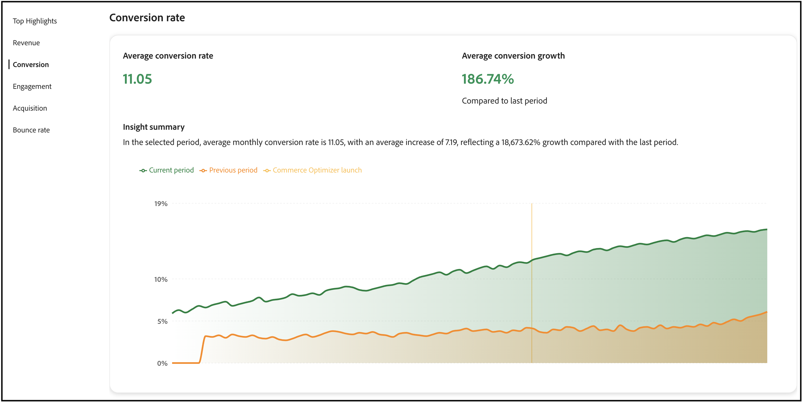

# Succeswaarden

Deze pagina bevat een overzicht van de belangrijkste prestatiegegevens voor uw [!DNL Adobe Commerce Optimizer] -winkel. Het doel is om snel inzicht te krijgen in de resultaten van de implementatie van [!DNL Adobe Commerce Optimizer] , zodat u en uw team de mogelijkheden voor groei kunnen identificeren en gebieden voor optimalisatie kunnen markeren.

De metriek in het rapport wordt getrokken uit storefront gebeurtenisgegevens. [&#x200B; Leer meer &#x200B;](../setup/events/overview.md) over de verzamelde gebeurtenisgegevens.

## Uw metriek begrijpen

Het rapport over succesmetriek biedt actioneerbare inzichten in vijf belangrijke prestatiesgebieden die direct van invloed zijn op uw bedrijfsresultaten. Elke metrische openbaart patronen in klantengedrag en opslagprestaties die u helpen kansen ontdekken en uitdagingen richten. Gebruik deze inzichten om slimmere beslissingen te nemen en uw handelservaring te optimaliseren.

**Hoogste Hoogtepunten** vat zeer belangrijke metriek van elk prestatiesgebied samen. Gebruik deze sectie om snel uw grootste mogelijkheden voor verbetering te identificeren.

De belangrijkste prestatie-indicatoren zijn:

- **Inkomsten** - Uw primaire financiële metrisch het tonen van totale verkoopprestaties.
- **Omzetting** - het percentage bezoekers die aankopen voltooien.
- **Betrokkenheid** - hoe actief de gebruikers met uw plaats in wisselwerking staan.
- **Verwerving** - de doeltreffendheid van uw inspanningen van de klantenverwerving.
- **Stuitpercentage** - het percentage bezoekers die na het bekijken van slechts één pagina verlaten.

## Een rapport genereren

1. Van het linkerspoor, uitgezochte **Metriek van het Succes**.
1. Onder **de Configuratie van het Rapport** specificeert de **waaier van de Datum**, **bron van de Catalogus**, die op uw landinstelling wordt gebaseerd, en **Valuta**.
1. Klik op **[!UICONTROL Apply]**.

   De **Hoogtepunten**, **Opbrengst**, **Omzetting**, **Betrokkenheid**, **Opname**, en **Stuitsnelheid** allen die update op uw rapportconfiguratie wordt gebaseerd.

1. Klik op **[!UICONTROL Export]** om het rapport op te slaan als een PDF.

## Volgende stappen en optimalisatiestrategieën

Gebruik uw gegevens van succesmetriek om mogelijkheden voor verbetering te identificeren en gerichte optimaliseringsstrategieën uit te voeren. De volgende secties verstrekken specifieke, handelende begeleiding voor elk metrisch gebied.

### Opbrengstoptimalisatie

Voor opbrengst, is uw doel totale verkoop en gemiddelde ordewaarde te verhogen.

#### Strategieën

- **voer AI-Verwerkende aanbevelingen** uit: Gebruik de de aanbeveling van optimizer motor aan oppervlakte relevante producten die hogere omzettingspercentages drijven. Stel *Klanten op die dit ook bekeken* en *hebben dit gekocht, die* aanbevelingen types om cross-selling kansen te verhogen.

- **creeer merchandising regels**: De producten van de hoog-marge van de verhoging in onderzoeksresultaten gebruikend [&#x200B; merchandising regels &#x200B;](../merchandising/rules/overview.md). Vastzetten best-verkopende punten aan de bovenkant van onderzoeksresultaten voor hoog-verkeersvragen.

- **optimaliseer productontdekking**: Gebruik [&#x200B; intelligente facetten &#x200B;](../merchandising/facets/overview.md) om klanten te helpen producten efficiënter vinden, leidend tot hogere omzettingspercentages en verhoogde opbrengst.

- **de seizoensmogelijkheden van de Hefboomwerking**: Creeer op tijd-gebaseerde koopregels om seizoensgebonden of promotionele punten tijdens piekwinkelperiodes te bevorderen.

### Verbetering conversiesnelheid

Als u de conversiekoers wilt verbeteren, wilt u meer bezoekers converteren naar klanten.

#### Strategieën

- **optimaliseer onderzoeksrelevantie**: Voer [&#x200B; synoniemen &#x200B;](../merchandising/synonyms/overview.md) uit om ervoor te zorgen dat de klanten vinden wat zij, zelfs met verschillende onderzoekstermijnen zoeken. Gebruik dynamische facetten om relevante filteropties te bieden.

- **Strategische aanbeveling plaatsing**: stel aanbevelingen eenheden op hoog-verkeerspagina&#39;s zoals productdetailpagina&#39;s en categoriepagina&#39;s op. Het gebruik *het meest bekeken* en *het meest gekochte* aanbevelingen om vertrouwen en urgentie te bouwen.

- **verbeter productzicht**: De het merchandising van het gebruik regels om best-het verkopen en high-converting producten te verzekeren verschijnen prominent in onderzoeksresultaten.

- **de types van testaanbeveling van A/B**: Experimenteer met verschillende aanbevelingstypes en plaatsen om te vinden wat het beste voor uw publiek werkt.

### Betrokkenheid verbeteren

Om uw betrokkenheid te verbeteren, is uw doel de interactie van de klant en tijd op plaats te verhogen.

#### Strategieën

- **Diversify aanbevelingen types**: Vermijd het tonen van de zelfde aanbevelingen herhaaldelijk. Gebruik een mengeling van *geadviseerd voor u*, *Trending*, en *onlangs bekeken* om inhoud vers en het in dienst nemen te houden.

- **voer intelligent onderzoek** uit: De gedreven AI van het gebruik dynamische facetatie en resultaat re-rangschikking om onderzoeksresultaten in real time aan te passen die op verkoopgedrag wordt gebaseerd.

- **creeer gepersonaliseerde ervaringen**: Stel &quot;Aanbevolen voor u&quot;eenheden op de homepage en door de klantenreis op om gepersonaliseerde productsuggesties te verstrekken.

- **optimaliseer onderzoekservaring**: De synoniemen van het gebruik om onderzoeksrelevantie te verbeteren en klanten te verzekeren vinden wat zij zoeken snel.

### Toename van acquisitie

Om meer groei te verwerven, is uw doel meer nieuwe klanten aan te trekken en aanschafefficiëntie te verbeteren.

#### Strategieën

- **gegevens van de het onderzoeksprestaties van de Hefboomhefboomwerking**: Gebruik het [&#x200B; onderzoek prestaties &#x200B;](../manage-results/search-performance.md) rapport om trending producten en populaire onderzoekstermijnen te identificeren. Maak handelsregels om deze items te markeren.

- **optimaliseer aanbevelingsprestaties**: De prestaties van de aanbeveling van de monitor [&#128279;](../manage-results/recommendation-performance.md) metriek om te identificeren welke aanbevelingstypes het meeste verkeer en omzettingen drijven.

- **benadruk nieuwe en promotionele punten**: De regels van het gebruik van de koophandel om nieuwe producten of promotiepunten in onderzoeksresultaten op te voeren om aandacht van nieuwe bezoekers aan te trekken.

- **het verkeersbronnen van het Spoor**: De gebeurtenisgegevens van het gebruik om te begrijpen welke kanalen het waardevolste verkeer brengen en uw marketing inspanningen dienovereenkomstig optimaliseren.

### Stuitingskorting

Om het stuitpercentage te verminderen, hebt u als doel bezoekers betrokken te houden en bezoeken van één pagina te beperken.

#### Strategieën

- **verbeter onderzoeksrelevantie**: De synoniemen van het gebruik en intelligente facettering om klanten te verzekeren vinden relevante producten snel. Slechte zoekresultaten zijn een belangrijke oorzaak van hoge stuitpercentages.

- **voer aanbevelingen eenheden** uit: Stel aanbevelingen op categorie en de pagina&#39;s van onderzoeksresultaten op om extra productopties te verstrekken en bezoekers betrokken te houden.

- **optimaliseer productontdekking**: De het merchandising van het gebruik regels om de meest relevante en populaire producten te verzekeren verschijnen eerst in onderzoeksresultaten.

- **creeer het in dienst nemen homepage ervaringen**: Gebruik &quot;voor u&quot;en &quot;het Trending&quot;aanbevelingen types op uw homepage om bezoekers met relevante inhoud onmiddellijk in dienst te nemen.

## Problemen oplossen en optimaliseren

### Wanneer de metriek daalt

**Verminderde omzet**:

- Controleren of de aanbevelingen nog steeds actief zijn en goed presteren
- Handelsvoorschriften herzien om te waarborgen dat producten met een hoge marge worden bevorderd
- Analyseer zoekprestaties om te bepalen of populaire producten nog steeds een goede positie innemen

**het laten vallen van het tarief van de Omzetting**:

- Controleren of de zoekrelevantie behouden blijft (synoniemen en facetten controleren)
- Zorg ervoor dat de aanbevolen eenheden correct worden weergegeven
- Handelsregels voor eventuele conflicten of problemen controleren

**Hoge stuittarieven**:

- De relevantie van zoekresultaten controleren en synoniemen implementeren indien nodig
- Zorg ervoor dat de aanbevolen eenheden correct worden geladen
- Kwaliteit en beschikbaarheid van productgegevens controleren

**Lage overeenkomst**:

- Diversifieer aanbevelingen types om klantenmoeheid te verhinderen
- Meer gepersonaliseerde aanbevelingsstrategieën implementeren
- Zoekervaring optimaliseren met betere facetten en synoniemen

## Veldomschrijvingen

### Rapportconfiguratie

| Veld | Beschrijving |
|---|---|
| Datumbereik | De opties omvatten **Afgelopen 3 maanden**, **Afgelopen 7 dagen**, **Afgelopen 30 dagen**, **Afgelopen 6 maanden**, **Afgelopen 12 maanden**, en **Jaar aan datum**. Gebruik kortere bereiken voor onmiddellijke optimalisatieinzichten en langere waaiers voor trendanalyse. |
| Land | Gebaseerd op de catalogusbron die voor uw [&#x200B; wordt gespecificeerd catalogusmening &#x200B;](../setup/catalog-view.md). Selecteer de juiste markt voor een nauwkeurige prestatieanalyse. |
| Valuta | De valuta die voor de catalogusweergave is opgegeven. Zorg ervoor dat dit overeenkomt met uw doelmarkt voor nauwkeurige rapportage van opbrengsten. |
| Exporteren | Slaat het rapport op als een PDF voor het delen met belanghebbenden of offline analyse. |

## Meer als dit

- [&#x200B; Prestaties van het Onderzoek &#x200B;](../manage-results/search-performance.md) - analyseer onderzoekstermijnen en optimaliseer onderzoeksrelevantie
- [&#x200B; Prestaties van de Aanbeveling &#x200B;](../manage-results/recommendation-performance.md) - de doeltreffendheid van de aanbeveling controleren en optimaliseren
- [&#x200B; het Overzicht van Aanbevelingen &#x200B;](../merchandising/recommendations/overview.md) - Leer over AI-Aangedreven productaanbevelingen
- [&#x200B; het Merchandising Regels &#x200B;](../merchandising/rules/overview.md) - de Verhoging, barst, speld, of verbergt producten in onderzoeksresultaten
- [&#x200B; Facets &#x200B;](../merchandising/facets/overview.md) - verbeter onderzoek met intelligente het filtreren
- [&#x200B; Synoniemen &#x200B;](../merchandising/synonyms/overview.md) - verbeter onderzoeksrelevantie en klantenervaring
- [&#x200B; Overzicht van Gebeurtenissen &#x200B;](../setup/events/overview.md) - begrijp de gegevens die uw metriek bevoegdheden
