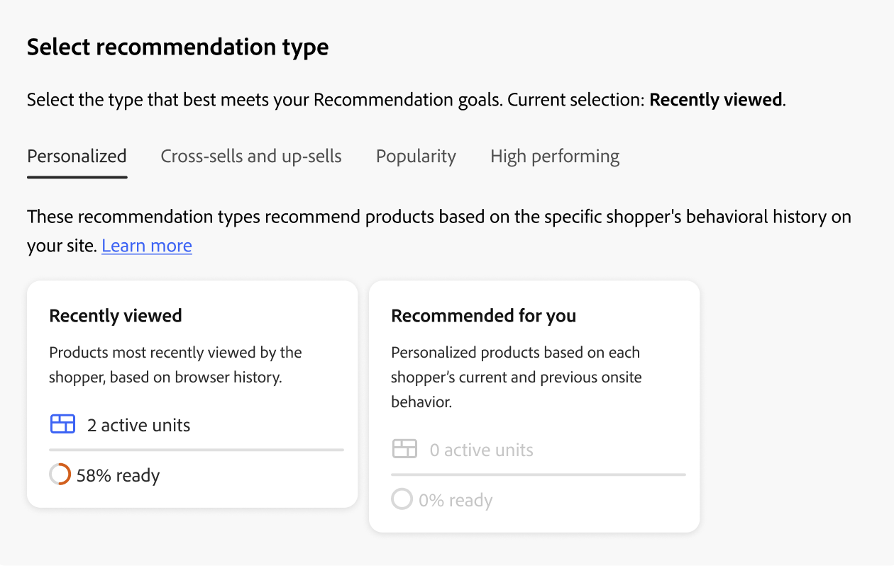

# Aanbevelingen maken en beheren

Wanneer u een aanbeveling creeert, creeert u de eenheid van de a _aanbeveling_, of widget, die de geadviseerde product _punten_ bevat.

_eenheid van de Aanbeveling_

Wanneer u de aanbevelingseenheid activeert, begint Adobe Commerce [ gegevens ](../../manage-results/recommendation-performance.md) te verzamelen om beelden, meningen, klikken, etc. te meten. De lijst van Aanbevelingen toont de metriek voor elke aanbeveling eenheid om u te helpen geïnformeerde bedrijfsbesluiten nemen.

1. Op _Adobe Commerce Optimizer_ sidebar, ga _het Merchandising_ > **Aanbevelingen** om de _7} werkruimte van Aanbevelingen {te tonen._

1. Klik **creëren aanbeveling**.

1. In de _Naam uw sectie van de Aanbeveling_, ga een beschrijvende naam voor interne verwijzing, zoals `Home page most popular` in.

1. In de _Uitgezochte het type van Aanbeveling_ sectie, specificeer het [ type van aanbeveling ](types.md) u op uw strategie gebaseerd wilt.

1. In de _sectie van het vertoningsetiket van de Storefront_, ga het [ etiket ](best-practice.md#recommendation-labels) in dat aan uw kopers zichtbaar is, zoals &quot;Hoogste verkopers&quot;.

1. In _kies aantal producten_ sectie, gebruik de schuif om te specificeren hoeveel producten u in de aanbeveling eenheid wilt verschijnen.

   De standaardwaarde is `5` , met een maximum van `20` .

1. (Facultatief) in de _sectie van Filters_, [ past filters ](filters.md) toe om te controleren welke producten in de aanbeveling eenheid verschijnen.

1. Klik op een van de volgende opties als u klaar bent:

   - **sparen als ontwerp** om de aanbeveling eenheid later uit te geven. U kunt het type aanbevelingen voor een aanbevolen eenheid in een ontwerpstaat niet wijzigen.

   - **activeer** om de aanbeveling eenheid op uw storefront toe te laten.

1. Kopieer de aanbeveling-id wanneer daarom wordt gevraagd. Gebruik deze id om u te helpen bepalen welke aanbevolen eenheid wordt gebruikt in de vervolgkeuzelijst met aanbevelingen in uw Edge Delivery Services-winkel.

>[!NOTE]
>
> U kunt maximaal 50 actieve aanbevelingen maken.

>[!IMPORTANT]
>
>Bepaalde browsers blokkeren mogelijk essentiële scripts die verhinderen dat Aanbevelingen naar behoren werken.

## Bestaande aanbevelingen beheren

U kunt een bestaande aanbeveling bewerken, deactiveren of verwijderen.

1. Op _Adobe Commerce Optimizer_ sidebar, ga _het Merchandising_ > **Aanbevelingen**.

1. Selecteer de aanbeveling die u wilt wijzigen.

1. Klik () meer selecteur.

1. In het menu, kunt u **deactiveren** Schrapping **, of** uitgeven **de aanbeveling.** Als u **uitgezocht geef** uit, kunt u de volgende montages aanpassen zoals nodig:

   - Naam van aanbeveling
   - Label voor Storefront
   - Aantal producten
   - Filterproducten

   U kunt het type aanbeveling niet wijzigen.

1. Wanneer volledig, klik **sparen Veranderingen**.

## Gereedheidsindicatoren

Gereedheidsindicatoren laten zien welke aanbevolen typen het beste kunnen worden uitgevoerd op basis van de beschikbare catalogus- en gedragsgegevens. U kunt gereedheidsindicatoren ook gebruiken om te bepalen als u kwesties met [ gebeurtenisinzameling ](../../setup/events/overview.md) hebt of als u niet genoeg verkeer hebt om het aanbevelingstype te bevolken.

De indicatoren van de bereidheid worden gecategoriseerd in of [ op statisch-gebaseerd ](#static-based) of [ op dynamisch-gebaseerd ](#dynamic-based). Alleen catalogusgegevens op basis van statische gegevens gebruiken; terwijl bij dynamisch gebaseerd gebruik gedragsgegevens van uw kopers worden gebruikt. Dat gedragsgegevens worden gebruikt aan [ machine het leren modellen ](../../setup/events/overview.md) om gepersonaliseerde aanbevelingen te bouwen en hun bereidheid te berekenen score.

### Hoe gereedheidsindicatoren worden berekend

De gereedheidsindicatoren geven aan hoeveel het model is opgeleid. De indicatoren zijn afhankelijk van de aard van de verzamelde gebeurtenissen, de omvang van de producten waarmee interactie is opgetreden en de omvang van de catalogus.

Het percentage van de gereedheidsindicator wordt afgeleid van een berekening die aangeeft hoeveel producten afhankelijk van het type aanbeveling kunnen worden aanbevolen. De statistieken worden toegepast op producten die op de algemene grootte van de catalogus, het volume van interactie (zoals meningen, klikken, toe:voegen-aan-wortels), en het percentage SKUs worden gebaseerd die die gebeurtenissen binnen een bepaald tijdvenster registreren. Zo kunnen de gereedheidsindicatoren tijdens piekvakantieseizoensverkeer hogere waarden laten zien dan in tijden van normaal volume.

Als gevolg van deze variabelen kan het percentage van de gereedheidsindicator fluctueren. Dit verklaart waarom u zou kunnen zien dat de aanbevelingstypes binnen en uit zijn &quot;bereid zijn op te stellen&quot;komen.

Gereedheidsindicatoren worden berekend op basis van een aantal factoren:

- Voldoende resultaat vastgestelde grootte: Zijn er genoeg resultaten die in de meeste scenario&#39;s worden teruggekeerd om te vermijden gebruikend [ reserveaanbevelingen ](../../setup/events/overview.md#backuprecs)?
- Voldoende variëteit van resultaatsets: vertegenwoordigen de producten die worden geretourneerd een verscheidenheid aan producten uit uw catalogus? Het doel van deze factor is te voorkomen dat een minderheid van producten de enige producten is die op de hele site worden aanbevolen.

Op basis van de bovenstaande factoren wordt de gereedheidswaarde als volgt berekend en weergegeven:

- 75% of hoger betekent dat de aanbevelingen voor dat soort aanbevelingen zeer relevant zullen zijn.
- Ten minste 50% betekent dat de aanbevelingen die voor dat soort aanbevelingen worden voorgesteld minder relevant zullen zijn.
- Minder dan 50% betekent dat de aanbevelingen voor dat soort aanbevelingen wellicht niet relevant zijn. In dit geval, [ reserveaanbevelingen ](../../setup/events/overview.md#backuprecs) worden gebruikt.

Leer meer over [ waarom de gereedheidsindicatoren laag ](#what-to-do-if-the-readiness-indicator-percent-is-low) zouden kunnen zijn.

### Op statisch basis

De volgende aanbevelingen zijn op statisch gebaseerd omdat ze alleen catalogusgegevens vereisen. Er worden geen gedragsgegevens gebruikt.

- _meer als dit_

### Dynamisch gebaseerd

De volgende aanbevelingen zijn dynamisch-gebaseerd omdat zij storefront gedragsgegevens gebruiken.

Laatste zes maanden van storefront gedragsgegevens:

- _Bekeken dit, bekeken dat_
- _Bekeken dit, kocht dat_
- _kocht dit, kocht dat_
- _geadviseerd voor u_

Laatste zeven dagen van gedragsgegevens van de storefront:

- _Meest bekeken_
- _het meest gekochte_
- _Meest toegevoegd aan Kar_
- _Trending_
- _Mening aan de Omzetting van de Aankoop_
- _Mening aan de Omzetting van de Kar_

Meest recente gedragsgegevens van winkels (alleen weergaven):

- _onlangs Bekeken_

### Voortgang visualiseren

Om u te helpen de opleidingsvooruitgang van elk aanbevelingstype visualiseren, _Uitgezochte het type van Aanbeveling_ sectie toont een maatregel van bereidheid voor elk type.

_Type van Aanbeveling_

>[!NOTE]
>
>Indicatoren mogen nooit 100% bereiken.

Het percentage van de gereedheidsindicator voor aanbevolen typen die afhankelijk zijn van catalogusgegevens verandert niet veel omdat de catalogus van de handelaar niet vaak verandert. Maar het percentage van de gereedheidsindicator voor aanbevelingen dat is gebaseerd op gedragsgegevens van winkels kan vaak veranderen, afhankelijk van de dagelijkse verkoopactiviteit.

#### Wat moet u doen als het percentage gereedheidsindicator laag is

Een laag gereedheidspercentage geeft aan dat er niet veel producten uit uw catalogus zijn die in aanmerking komen om te worden opgenomen in de aanbevelingen voor dit soort aanbevelingen. Dit betekent dat er een hoge waarschijnlijkheid is dat [ reserveaanbevelingen ](../../setup/events/overview.md#backuprecs) zijn teruggekeerd als u dit aanbevelingstype hoe dan ook opstelt.

>[!IMPORTANT]
>
>_Bundel_, _gegroepeerde_, en de types van douaneproduct worden niet gesteund. Als uw catalogus een groot aantal van deze producttypen bevat, kunt u een lage gereedheidsscore verwachten. Bovendien, om het even welke SKUs met ruimten kan aanbeveling relevantie verminderen en zou moeten worden vermeden.

In het volgende voorbeeld worden mogelijke redenen en oplossingen voor algemene lage gereedheidsscores weergegeven:

- **op statisch-gebaseerde** - de lage percentages voor deze indicatoren kunnen door ontbrekende catalogusgegevens voor de getoonde producten worden veroorzaakt. Als deze lager zijn dan u had verwacht, kan dit probleem met een volledige synchronisatie worden verholpen.
- **op dynamisch-Gebaseerd** - de Lage percentages voor op dynamisch-gebaseerde indicatoren kunnen door worden veroorzaakt:

   - Ontbrekende gebieden in de vereiste [ storefront gebeurtenissen ](../../setup/events/overview.md) voor de respectieve aanbevelingen types (requestId, productcontext, etc.)
   - Het lage verkeer op de opslag zodat is het volume van gedragsgebeurtenissen wij ontvangen laag.
   - De verscheidenheid aan storefront gedragsgebeurtenissen over verschillende producten in uw opslag is laag. Als bijvoorbeeld slechts tien procent van uw producten meestal wordt bekeken of gekocht, zijn de respectievelijke gereedheidsindicatoren laag.

## Aanbevelingen voor voorvertoning

Het _Aanbevolen paneel van de productvoorproef_ is altijd beschikbaar met een steekproefselectie van producten die in de aanbeveling eenheid zouden kunnen verschijnen wanneer het aan de opslag wordt opgesteld.

Als u een aanbeveling wilt testen terwijl u in een niet-productieomgeving werkt, kunt u aanbevelingsgegevens ophalen van een andere bron. Dit staat verkopers toe om met regels te experimenteren en de aanbevelingen voor te vertonen alvorens aan productie op te stellen.

| Veld | Beschrijving |
|---|---|
| Naam | De naam van het product. |
| SKU | De voorraadbewaareenheid die aan het product is toegewezen |
| Prijs | De prijs van het product. |
| Resultaattype | Primair - geeft aan dat er voldoende trainingsgegevens zijn verzameld om een aanbeveling weer te geven.  Steun - wijst erop dat er niet genoeg opleidingsgegevens worden verzameld zodat wordt een reserveaanbeveling gebruikt om de groef te vullen. Ga naar [ Gegevens van het Gedrag ](../../setup/events/overview.md) om meer over machine het leren modellen en reserveaanbevelingen te leren. |

Als u een aanbevolen eenheid maakt, experimenteert u met het soort aanbeveling en de filters om direct real-time feedback te krijgen over de producten die worden opgenomen. Aangezien u begint te begrijpen welke producten verschijnen, kunt u de aanbeveling eenheid vormen om aan uw bedrijfsbehoeften te voldoen.

[!DNL Adobe Commerce Optimizer] [ filters ](filters.md) aanbevelingen om het tonen van dubbele producten te vermijden wanneer de veelvoudige aanbeveling eenheden op één enkele pagina worden opgesteld. Hierdoor kunnen de producten die in het voorvertoningsvenster worden weergegeven afwijken van de producten die in het voorvertoningsvenster worden weergegeven.
