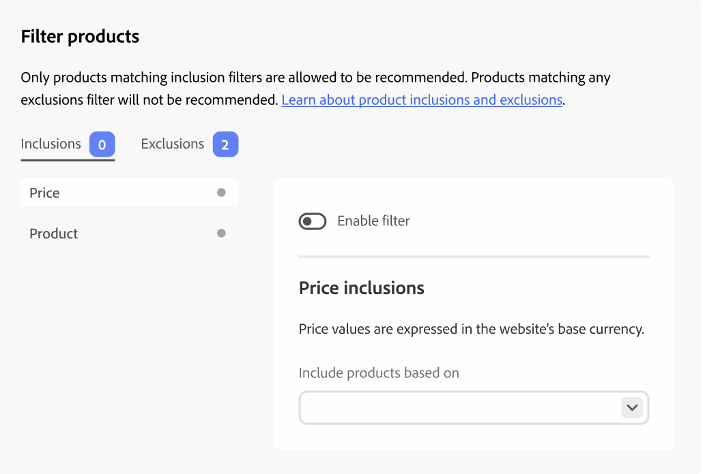

# Filterproducten

[!DNL Adobe Commerce Optimizer] past automatisch niet-configureerbare standaardfilters op aanbeveling-eenheden toe. Als u meerdere aanbevelingen-eenheden op een pagina hebt geïmplementeerd, filtert [!DNL Adobe Commerce Optimizer] alle producten uit die in de eenheden worden herhaald. Alleen de eerste verwijzing naar een herhaald product wordt gebruikt om ruimte te maken voor andere producten die kunnen worden aanbevolen. [!DNL Adobe Commerce Optimizer] filtert ook eerder aangeschafte producten en producten in de kar uit.

Wanneer u  creeert een aanbeveling eenheid, kunt u filters bepalen die controleren welke producten in aanbevelingen kunnen worden getoond. Deze filters zijn gebaseerd op een reeks opname- of uitsluitingsvoorwaarden die u definieert. In aanbevelingen worden alleen producten weergegeven die aan alle inclusiemogelijkheden voldoen. Producten die aan een van de uitsluitingsvoorwaarden voldoen, worden niet aanbevolen.

U kunt veelvoudige filters vormen en slechts die toelaten u wilt door de knevel op elke filterpagina te selecteren. Op deze manier kunt u concepten van filters maken voor toekomstig gebruik. Het aantal ingeschakelde filters wordt weergegeven op elk tabblad.

## Voorwaarden

De voorwaarden kunnen statisch of dynamisch zijn.

- Een statische voorwaarde gebruikt bestaande productkenmerken om te bepalen welke producten in de eenheid kunnen verschijnen. U kunt bijvoorbeeld opgeven dat alleen producten in voorraad met een prijs hoger dan € 25 in de eenheid worden weergegeven.

- Een dynamische voorwaardensleutel van de huidige context van een winkelier, zoals de momenteel bekeken categorie of het product. Wanneer u bijvoorbeeld een productaanbeveling maakt die moet worden geïmplementeerd op pagina&#39;s met productdetails, kunt u een voorwaarde maken om alleen producten aan te bevelen die binnen een relatief prijsbereik van het momenteel weergegeven product vallen.

### Logische operatoren

De logische operatoren `AND` en `OR` worden gebruikt om meerdere voorwaarden samen te voegen. Als zowel insluitings- als uitsluitingsfilters worden gebruikt, worden de insluitingen eerst geëvalueerd om te bepalen welke producten kunnen worden aanbevolen, waarna producten die overeenkomen met eventuele uitsluitingsfilters uit de lijst worden verwijderd.

- `AND` - Sluit aan bij twee insluitingsfiltervoorwaarden
- `OR` - Voegt twee uitsluitingsfiltervoorwaarden samen

## Filtertypen

### Product

Productfilters geven aan welke specifieke producten in aanmerking komen of niet in aanmerking komen om in aanbevelingen te worden weergegeven. U kunt geen producten selecteren die gehandicapt of niet individueel zichtbaar zijn omdat die producten nooit in aanbevelingen kunnen verschijnen.

>[!NOTE]
>
>De producten van het kind van een configureerbaar product worden niet getoond in een aanbeveling eenheid omdat die kindproducten het zicht van _hebben individueel niet Zichtbaar_.

### Prijs

Een filter op basis van de productprijs gebruikt de uiteindelijke prijs om de vergelijking uit te voeren. De uiteindelijke prijs omvat alle kortingen of speciale prijzen die beschikbaar zijn voor anonieme kopers.

<!--### Attribute

You can filter products based on attribute criteria, including attribute values. Selected values use OR logic to either include or exclude products when any of the specified values are found.-->
