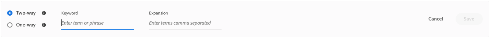
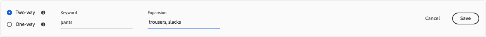

# Synoniemen maken

Verhoog de betrokkenheid van klanten door uw eigen gekrulde lijst met [!DNL Adobe Commerce Optimizer] synoniemen toe te voegen. U kunt maximaal 200 synoniemen per winkel toevoegen.

## Stap 1: Een synoniem toevoegen

1. Van het linkerspoor, ga _Merchandising_ > **Synoniemen**.
1. Klik op **[!UICONTROL Add synonyms]** .

## Stap 2: De synoniem door type bepalen

Volg de instructies voor het [ type van synoniem ](type.md) dat u wilt tot stand brengen.

### Synoniem in twee richtingen

1. Accepteer de standaard **2-weg** optie.

    toe

1. Ga de **termijn of de uitdrukking 0} van het Sleutelwoord {in te passen.**
1. Ga de **termijn(en) in van de uitbreiding 0} {die u als synoniemen voor het sleutelwoord wilt toevoegen.** Scheid meerdere termen met een komma.
In dit voorbeeld is het trefwoord dat moet overeenkomen &#39;broek&#39; en zijn de uitbreidingstermijnen &#39;brousers, slacks&#39;.

   

1. Wanneer volledig, klik **sparen**.

   De reeks synoniemen verschijnt in de lijst met een tweerichtingspijl tussen elke termijn die betekent de termijnen onderling verwisselbaar zijn.

   

### Eenvoudige synoniem

1. Klik het **unidirectionele** synoniem type.

    toe

1. Ga het **Sleutelwoord** in en **de voorwaarden van de Uitbreiding**. Scheid meerdere termen met een komma.

   

   In dit voorbeeld is het trefwoord &#39;broek&#39; en zijn de eenmalige uitbreidingstermen &#39;capris, peddle-push&#39; elk een subset van &#39;broek&#39;, maar met een specifieke betekenis.

1. Wanneer volledig, klik **sparen**.

   De reeks synoniemen verschijnt in de lijst met een eenrichtingspijl die van de uitbreidingstermijnen aan het sleutelwoord richt om erop te wijzen de termijnen subsets van het sleutelwoord zijn. Een plusteken scheidt elke uitbreidingstermijn.

   

## Stap 3: Wijzigingen publiceren

1. Wanneer uw synoniemen volledig zijn, publiceer ****.
1. Wacht maximaal twee uur totdat uw updates beschikbaar zijn in de winkel.

## Veldbeschrijvingen

| Veld | Beschrijving |
|--- |--- |
| [ Type ](type.md) | Hiermee wordt bepaald of synoniemen dezelfde betekenis hebben als het trefwoord of een subset van het trefwoord zijn. Opties:  2-weg (gebrek) - Termen die de zelfde betekenis zoals het sleutelwoord hebben en de zelfde onderzoeksresultaten   in één richting terugkeren - Termen die een ondergroep van het sleutelwoord zijn. Eenwegssynoniemen retourneren een uitgebreidere lijst met specifieke producten. |
| Trefwoord | Een woord dat vaak wordt gekoppeld aan een selectie producten in uw catalogus. |
| Uitbreiding | Aanvullende termen met dezelfde of een vergelijkbare betekenis als het trefwoord. |

## Synoniemen beheren

Volg deze instructies om bestaande [!DNL Adobe Commerce Optimizer] [ synoniemen ](overview.md) te beheren.

## Synoniem zoeken

Om het gemakkelijk te maken om een synoniem te vinden, kunt u de lijst door type filtreren en onderzoek door sleutelwoord of uitbreidingstermijn. Deze methoden kunnen afzonderlijk of samen worden gebruikt.

1. Om de lijst te filtreren, plaats **Type** aan één van het volgende:

   - Alles
   - Eenweg
   - 2-wegs

1. Als u naar een trefwoord of uitbreidingsterm wilt zoeken, voert u ten minste drie tekens in het vak **[!UICONTROL Search]** in.

## Synoniem bewerken

1. Vind het synoniem dat u wilt uitgeven en **Meer** (...) opties klikken.

1. Klik **uitgeven**.
Het trefwoord is de eerste term in de lijst en elke term wordt gescheiden door een komma. Het sleutelwoord en de uitbreidingstermijnen kunnen worden bijgewerkt, maar het type van synoniem kan niet worden veranderd.
1. Klik op het item dat u wilt bewerken. Werk vervolgens de tekst naar wens bij.

1. Wanneer volledig, klik **sparen**.

## Synoniem verwijderen

1. Vind het synoniem dat u in de lijst wilt schrappen en **Meer** (...) opties klikken.
1. Klik **Schrapping**.
1. Wanneer ertoe aangezet, klik **synoniem van de Schrapping** om te bevestigen.

## Wijzigingen publiceren

Als u het proces wilt voltooien, moeten de opgeslagen wijzigingen worden gepubliceerd naar de winkel. Het kan tot twee uur duren voordat de updates live gaan.

1. Klik **publiceren**.
1. Zoek het bericht boven aan de pagina waarin wordt bevestigd dat uw wijzigingen zijn gepubliceerd.
