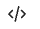
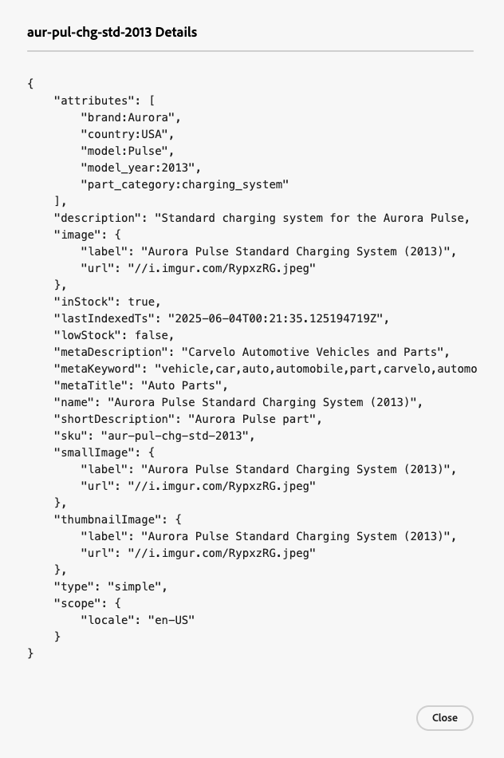

# Gegevenssynchronisatie

De **synchronisatie van Gegevens** pagina toont een overzicht van de synchronisatiestatus voor productgegevens die van uw gegevensbron (uw bestaande catalogus van Commerce, het systeem van het Beheer van de Informatie van het Product (PIM), het systeem van de Planning van het Middel van de Onderneming (ERP), etc.) worden overgebracht in [!DNL Adobe Commerce Optimizer].

De **pagina van de Synchronisatie van Gegevens** verstrekt waardevolle inzichten in de beschikbaarheid van productgegevens voor uw opslag, die ervoor zorgen dat het aan uw kopers kan onmiddellijk worden getoond.

De **pagina van de Synchronisatie van 0&rbrace; Gegevens &lbrace;wordt gevestigd bij** Opstelling *>* synchronisatie van Gegevens **.**

De **pagina van de Synchronisatie van Gegevens** bevat de volgende gebieden:

| Veld | Beschrijving |
|--- |--- |
| Catalogusbron | Specifieke landinstelling voor de gesynchroniseerde gegevens. |
| [!DNL Catalog Service] | Geeft de meest recente synchronisatie-update weer, het totale aantal ontvangen producten, een zoekveld en een tabel met de gesynchroniseerde producten voor [!DNL Catalog Service] . |
| Productdetectie | Hiermee geeft u de meest recente synchronisatie-update weer, het totale aantal ontvangen producten, een zoekveld en een tabel met de gesynchroniseerde producten voor Zoeken. |
| Aanbevelingen | Toont de recentste synchronisatieupdate, de totale ontvangen producten, een onderzoeksgebied, en een lijst van de gesynchroniseerde producten voor Aanbevelingen. |
| Producten ontvangen in de afgelopen 3 uur | Hier wordt het aantal producten weergegeven dat de afgelopen drie uur van de catalogusbron naar Adobe Commerce Optimizer is overgebracht. Als u uw catalogus niet vaak bijwerkt, is deze waarde vaak nul. |
| Totaal aantal producten in catalogus | Geeft het totale aantal catalogusproducten weer dat beschikbaar is voor Adobe Commerce Optimizer. |
| Gesynchroniseerde producten | Geeft informatie over de producten die zijn gesynchroniseerd met Adobe Commerce Optimizer. Deze tabel wordt standaard gesorteerd op Laatst bijgewerkt. Gebruik het veld **[!UICONTROL Search by Name or SKU]** om een specifiek product te zoeken. |

## Lijst van gesynchroniseerde producten

Om de details van een gesynchroniseerd product in formaat te zien JSON, klik op het codepictogram  op de rij van het product van de gesynchroniseerde productlijst.

## Catalogusgegevens opnieuw synchroniseren

Als u geen specifieke producten op de **pagina ziet van de Synchronisatie van Gegevens**, moet u een resync van uw stroomopwaartse systeem in werking stellen. Houd er echter rekening mee dat een resync de belasting van hardwarebronnen kan verhogen. In de volgende scenario&#39;s kan het echter nodig zijn de catalogus opnieuw te synchroniseren:

- Wanneer er belangrijke wijzigingen in uw productcatalogus worden aangebracht, zoals het toevoegen van nieuwe producten, het bijwerken van productdetails of het wijzigen van categorieën

- Als er discrepanties of prestatieproblemen optreden bij de weergave van productgegevens op uw winkels

>[!IMPORTANT]
>
>De tijd die nodig is om de synchronisatie te voltooien, is afhankelijk van de grootte van de catalogus en het volume van de bijgewerkte gegevens.
