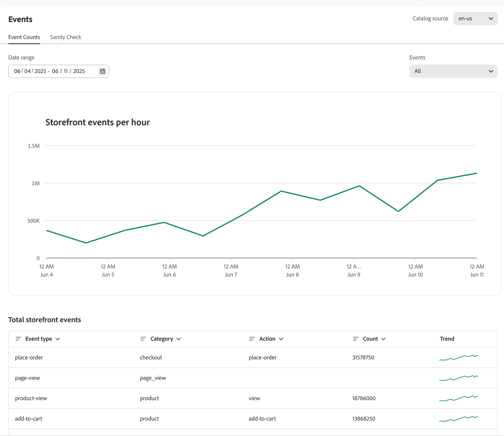

# Gebeurtenissen

Gebeurtenissen zijn een essentieel hulpmiddel om de winkelervaring te verbeteren en conversies te stimuleren door real-time gegevensinzichten te benutten.

[!DNL Adobe Commerce Optimizer] implementeert automatisch storefront-gebeurtenissen op uw site. Deze gebeurtenissen leggen gegevens vast uit de interacties van kopers op uw site. Deze geanonimiseerde gegevensmachten [ aanbevelingen ](../../manage-results/recommendation-performance.md), [ productontdekking ](../../manage-results/search-performance.md), en [ succesmetriek ](../../manage-results/success-metrics.md).

>[!NOTE]
>
>Gegevensverzameling omvat geen persoonlijk identificeerbare informatie (PII). Alle gebruikers-id&#39;s, zoals cookie-id&#39;s en IP-adressen, worden strikt geanonimiseerd. [ leer meer ](https://www.adobe.com/privacy/experience-cloud.html).

De **pagina van Gebeurtenissen** laat u de gegevens waarnemen van de storefront gebeurtenis die worden verzameld. Met een weergave in de verzameling van gebeurtenisgegevens kunnen handelaren controleren of ze storefront-gebeurtenissen correct hebben geïmplementeerd en of gebeurtenissen correct worden vastgelegd. Op deze pagina kunnen verkopers mogelijke problemen identificeren en stappen ondernemen om gebeurtenisproblemen op te lossen.

## Aantal gebeurtenissen

De **tellen van de Gebeurtenis** lusjesporen winkelinteracties, zoals onderzoeken, klikken, en aankopen, om u te helpen tendensen analyseren en de het winkelen ervaring verbeteren.

{zoomable="yes"}

| Veld | Beschrijving |
|---|---|
| **waaier van de Datum** | Hier geeft u het datumbereik op voor een specifieke subset van gegevens. |
| **gebeurtenissen Storefront per uur** | Toont een grafiek van het tonen van het aantal gebeurtenissen die op uw storefront worden teweeggebracht. |
| **Totale storefront gebeurtenissen** | Een filterbare tabel die gegevens bevat voor alle gebeurtenissen die op uw winkelcentrum worden geactiveerd. |

## Saniteitscontrole

Het **lusje van de Controle van de Gezondheid van 0&rbrace; &lbrace;biedt inzichten in de gezondheid van elke gedragsgebeurtenis, die nauwkeurige gegevensinzameling en functionaliteit verzekeren. &#x200B;**

{zoomable="yes"}

| Veld | Beschrijving |
|---|---|
| **waaier van de Datum** | Hier geeft u het datumbereik op voor een specifieke subset van gegevens. |
| **Ontdekking van het Product** | Geeft de vereiste gebeurtenissen weer om de zoekresultaten van het product aan te passen. De **kolom van de Status** wijst erop als de gebeurtenissen werden ontvangen. |
| **Aanbevelingen** | Toont de vereiste gebeurtenissen om productaanbevelingen aan te passen. De **kolom van de Status** wijst erop als de gebeurtenissen werden ontvangen. |

De volgende secties beschrijven gebeurtenisdetails voor [ productontdekking ](#product-discovery) en [ aanbevelingen ](#recommendations).

### Productdetectie

Bij productdetectie worden gebeurtenissen gebruikt om zoekalgoritmen zoals &quot;Meest bekeken&quot; en &quot;Dit bekeken, bekeken&quot; aan te sturen.

Deze lijst beschrijft de gebeurtenissen die door productontdekking [ worden gebruikt rangschikkend strategieën ](../../merchandising/rules/add.md#intelligent-ranking).

| Rangschikkingsstrategie | Gebeurtenissen | Pagina |
| --- | --- | --- |
| Meest bekeken | `page-view` `product-view` | Productdetailpagina |
| Meest aangekocht | `page-view` `place-order` | Winkelwagentje/Afhandeling |
| Meest toegevoegd aan winkelwagentje | `page-view` `add-to-cart` | De detailpagina van het product   product die pagina   van de Lijst van de Kar   van de Wenslijst van het Product |
| Bekeken dit, gezien dat | `page-view` `product-view` | Productdetailpagina |

#### Vereiste dashboardgebeurtenissen

Sommige gebeurtenissen worden vereist om het [ dashboard van de onderzoeksprestaties ](../../manage-results/search-performance.md) te bevolken

| Dashboardgebied | Gebeurtenissen | Veld samenvoegen |
| ------------------- | ------------- | ---------- |
| Unieke zoekopdrachten | `page-view`, `search-request-sent`, `search-response-received` | `searchRequestId` |
| Zoekopdrachten met nulresultaten | `page-view`, `search-request-sent`, `search-response-received` | `searchRequestId` |

### Aanbevelingen

Er zijn twee soorten gegevens die in aanbevelingen worden gebruikt:

- **Gedrag** - Gegevens van de overeenkomst van een verkoopster op uw plaats, zoals productmeningen, punten die aan een kar worden toegevoegd, en aankopen.
- **Catalogus** - de meta-gegevens van het Product, zoals naam, prijs, beschikbaarheid, etc.

Adobe Sensei voegt de gedrags- en catalogusgegevens samen en maakt aanbevelingen voor elk type aanbeveling. De dienst van Aanbevelingen stelt dan die aanbevelingen aan uw opslag in de vorm van een widget op die het geadviseerde product _punten_ bevat.

Sommige soorten aanbevelingen gebruiken gedragsgegevens van uw klanten om machine het leren modellen op te leiden om gepersonaliseerde aanbevelingen te bouwen. Andere soorten aanbevelingen gebruiken alleen catalogusgegevens en gebruiken geen gedragsgegevens. Als u snel wilt beginnen met het gebruik van Aanbevelingen op uw site, kunt u het aanbevolen type `More like this` gebruiken.

#### Koude start

Wanneer kunt u beginnen met het gebruiken van aanbevelingen die gedragsgegevens gebruiken? Het hangt ervan af. Dit wordt bedoeld als _Koud Begin_ probleem.

Het _Koude 1&rbrace; probleem van het Begin van het Begin &lbrace;verwijst naar de tijd het voor een model neemt om te trainen en effectief te worden._ Voor aanbevelingen betekent dit dat Adobe Sensei moet wachten om voldoende gegevens te verzamelen voor het trainen van zijn modellen voor machinaal leren voordat het aanbevelingen op uw plaats opstelt. Hoe meer gegevens de modellen hebben, des te nauwkeuriger en nuttiger de aanbevelingen zijn. Aangezien de gegevensinzameling op een levende plaats gebeurt, is het best om dit proces vroegtijdig te beginnen.

De volgende tabel bevat een aantal algemene richtlijnen voor de hoeveelheid tijd die nodig is om voldoende gegevens voor elk type aanbeveling te verzamelen:

| Type aanbeveling | Trainingstijd | Notities |
|---|---|---|
| Gebaseerd op populariteit (`Most viewed`, `Most purchased`, `Most added to cart`) | Varieert | Afhankelijk van het volume van gebeurtenissen - weergaven worden het meest gebruikt en leren dus sneller; voegt dan toe aan winkelwagentje en koopt |
| `Viewed this, viewed that` | Meer training is vereist | De productweergaven zijn aanzienlijk hoog in volume |
| `Viewed this, bought that`, `Bought this, bought that` | De meeste training is vereist | Aankoopgebeurtenissen zijn de meest voorkomende gebeurtenissen op een commercesite, met name in vergelijking met productweergaven |
| `Trending` | Vereist drie dagen gegevens om een basislijn voor populariteit te bepalen | Trending is een maat voor de recente dynamiek in de populariteit van een product in vergelijking met zijn eigen populariteit. De trending score van een product wordt berekend met behulp van een voorgrondset (recente populariteit in 24 uur) en een achtergrondset (basislijn voor populariteit in 72 uur). Als de populariteit van een item binnen een periode van 24 uur aanzienlijk toeneemt ten opzichte van de basislijnpopulariteit, krijgt het item een hoge trendscore. Elk product heeft deze score, en de punten met de hoogste score op elk ogenblik bestaan uit de reeks hoogste trending producten. |

Andere variabelen die van invloed kunnen zijn op de tijd die nodig is om te trainen:

- Hoger verkeersvolume draagt bij aan sneller leren
- Sommige aanbevelingen typen sneller dan andere
- [!DNL Adobe Commerce Optimizer] verwerkt de gedragsgegevens om de vier uur opnieuw. Aanbevelingen worden nauwkeuriger naarmate ze langer op uw site worden gebruikt.

Om u te helpen de opleidingsvooruitgang van elk aanbevelingstype visualiseren, [ creeer aanbeveling ](../../merchandising/recommendations/create.md#readiness-indicators) de indicatoren van de paginabereidheid.

Terwijl gegevens worden verzameld op uw livesite en de modellen voor het leren van machines een training zijn, kunt u andere test- en configuratietaken voltooien die nodig zijn om aanbevelingen op te stellen. Tegen de tijd dat u met dit werk wordt gedaan, zullen de modellen genoeg gegevens hebben om nuttige aanbevelingen tot stand te brengen, die u toestaan om hen aan uw winkel op te stellen.

Als uw plaats niet genoeg verkeer (meningen, aankopen, tendensen) voor de meeste product SKUs krijgt, zouden er niet genoeg gegevens kunnen zijn om het het leren proces te voltooien. Hierdoor kan de gereedheidsindicator in de werkruimte Aanbevelingen vastzitten. De gereedheidsindicatoren zijn bedoeld om handelaren een ander gegevenspunt te bieden bij het kiezen van het aanbevolen type voor hun winkel. De getallen zijn een leidraad en mogen nooit 100% bedragen. [ Leer meer ](../../merchandising/recommendations/create.md#readiness-indicators) over bereidheid indicatoren.

#### Aanbevelingen voor back-up

Als de invoergegevens onvoldoende zijn voor het verschaffen van alle aangevraagde aanbevolen items in een eenheid, geeft [!DNL Adobe Commerce Optimizer] back-upaanbevelingen om aanbevolen eenheden te vullen. Als u bijvoorbeeld het aanbevolen type `Recommended for you` op uw homepage plaatst, heeft een eerste winkelprogramma op uw site niet genoeg gedragsgegevens gegenereerd om op de juiste manier gepersonaliseerde producten te kunnen aanbevelen. In dit geval worden in [!DNL Adobe Commerce Optimizer] op het `Most viewed` -aanbevelingen gebaseerde type oppervlakken aan deze winkelier toegewezen.

In het geval van onvoldoende gegevensverzameling worden de volgende aanbevelingen getypt als fallback naar het aanbevolen type `Most viewed` :

- `Recommended for you`
- `Viewed this, viewed that`
- `Viewed this, bought that`
- `Bought this, bought that`
- `Trending`
- `Conversion (view to purchase)`
- `Conversion (view to cart)`

#### Aanbevelingsspecifieke gebeurtenissen

De volgende lijst maakt een lijst van de gebeurtenissen die worden teweeggebracht wanneer de kopers met aanbeveling op de storefront in wisselwerking staan. De gebeurtenisgegevens verzamelde bevoegdheden de [ metriek ](../../manage-results/recommendation-performance.md) om te analyseren hoe goed uw aanbevelingen presteren.

| Gebeurtenis | Beschrijving |
| --- | --- |
| `impression-render` | Verzonden wanneer de aanbeveling-eenheid op de pagina wordt weergegeven. Als een pagina twee aanbevelingen-eenheden heeft (gekocht, weergave-weergave), worden twee `impression-render` -gebeurtenissen verzonden. Deze gebeurtenis wordt gebruikt om metrisch voor beelden te volgen. |
| `rec-add-to-cart-click` | De verkoopster klikt **toevoegt aan wortel** knoop voor een punt in de aanbeveling eenheid. |
| `rec-click` | De verkoopster klikt op een product in de aanbevolen eenheid. |
| `view` | Verzonden wanneer de aanbevelingen-eenheid voor ten minste 50 procent zichtbaar wordt, bijvoorbeeld door naar beneden te schuiven. Als een aanbevolen eenheid bijvoorbeeld twee regels heeft, wordt een `view` -gebeurtenis verzonden wanneer één regel plus één pixel van de tweede regel zichtbaar wordt voor de gebruiker. Als de gebruiker de pagina meerdere keren omhoog en omlaag schuift, wordt de gebeurtenis `view` net zo vaak verzonden als de gebruiker de hele aanbevolen eenheid weer op de pagina ziet. |

#### Vereiste dashboardgebeurtenissen

De volgende gebeurtenissen worden vereist om het [ dashboard van de Prestaties van Aanbevelingen te bevolken ](../../manage-results/recommendation-performance.md)

| Dashboardkolom | Gebeurtenissen | Veld samenvoegen |
| ---------------- | --------- | ----------- |
| Impressies | `page-view`, `recs-request-sent`, `recs-response-received`, `recs-unit-render` | `unitId` |
| Weergaven | `page-view`, `recs-request-sent`, `recs-response-received`, `recs-unit-render`, `recs-unit-view` | `unitId` |
| Klikken | `page-view`, `recs-request-sent`, `recs-response-received`, `recs-item-click`, `recs-add-to-cart-click` | `unitId` |
| Ontvangsten | `page-view`, `recs-request-sent`, `recs-response-received`, `recs-item-click`, `recs-add-to-cart-click`, `place-order` | `unitId`, `sku`, `parentSku` |
| LT-ontvangsten | `page-view`, `recs-request-sent`, `recs-response-received`, `recs-item-click`, `recs-add-to-cart-click`, `place-order` | `unitId`, `sku`, `parentSku` |
| CTR | `page-view`, `recs-request-sent`, `recs-response-received`, `recs-unit-render`, `recs-item-click`, `recs-add-to-cart-click` | `unitId`, `sku`, `parentSku` |
| vCTR | `page-view`, `recs-request-sent`, `recs-response-received`, `recs-unit-render`, `recs-unit-view`, `recs-item-click`, `recs-add-to-cart-click` | `unitId`, `sku`, `parentSku` |

De volgende gebeurtenissen zijn niet specifiek voor Aanbevelingen, maar zijn vereist voor Adobe Sensei om winkelgegevens correct te interpreteren:

- `view`
- `add-to-cart`
- `place-order`

#### Type aanbeveling

In deze tabel worden de gebeurtenissen beschreven die door elk type aanbeveling worden gebruikt.

| Type aanbeveling | Gebeurtenissen | Pagina |
| --- | --- | --- |
| Meest bekeken | `page-view` `product-view` | Productdetailpagina |
| Meest aangekocht | `page-view` `place-order` | Winkelwagentje/Afhandeling |
| Meest toegevoegd aan winkelwagentje | `page-view` `add-to-cart` | De detailpagina van het product   product die pagina   van de Lijst van de Kar   van de Wenslijst van het Product |
| Bekeken dit, gezien dat | `page-view` `product-view` | Productdetailpagina |
| Bekijk dit, kocht dat | `page-view` `product-view` | De detailpagina van het product   Kar/Controle |
| Dit gekocht | `page-view` `product-view` | Productdetailpagina |
| Trend | `page-view` `product-view` | Productdetailpagina |
| Conversie: Weergeven voor aankoop | `page-view` `product-view` | Productdetailpagina |
| Conversie: Weergeven voor aankoop | `page-view` `place-order` | Winkelwagentje/Afhandeling |
| Omzetten: Weergeven naar winkelwagentje | `page-view` `product-view` | Productdetailpagina |
| Omzetten: Weergeven naar winkelwagentje | `page-view` `add-to-cart` | De detailpagina van het product   van de lijst van het Product pagina   Kaart   Wislijst |

## Ondersteuning

Als u om het even welke gegevensdiscrepanties opmerkt of als de aanbevelingen en de onderzoeksresultaten niet zoals verwacht werken, [ voorlegt een steunkaartje ](https://experienceleague.adobe.com/en/docs/commerce-knowledge-base/kb/help-center-guide/magento-help-center-user-guide).
