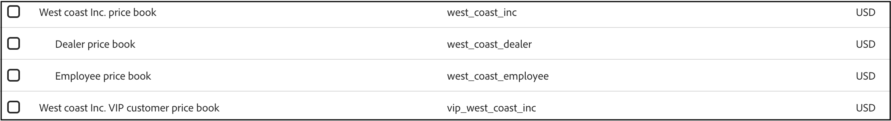

# Prijsboeken

Met prijzenboeken kunt u productprijzen voor een catalogusbron definiëren voor verschillende klantniveaus en markten. De boeken van de prijs steunen een hiërarchisch model, dat tot drie niveaus van genestelde kindprijsboeken onder elk basisprijzenboek toestaat. Elk prijzenboek kan naar een ouderprijzenboek verwijzen, dat een boomstructuur voor het bepalen van catalogusbronnen vormt.

Het basisprijzenboek definieert de valuta voor zichzelf en al zijn kinderprijzenboeken. De boeken van de kindprijs erven deze munt en kunnen niet het met voeten treden.

## Prijsboeken toevoegen aan [!DNL Adobe Commerce Optimizer]

Met de API Prijsboek voegt u prijzenboeken toe aan [!DNL Adobe Commerce Optimizer] . Zie de [&#x200B; ontwikkelaarsdocumentatie &#x200B;](https://developer.adobe.com/commerce/services/reference/rest/) leren hoe te, prijzenboeken voor [!DNL Adobe Commerce Optimizer] tot stand brengen bij te werken en te schrappen.

## Prijsboeken weergeven in [!DNL Adobe Commerce Optimizer]

Nadat u prijsboeken in [!DNL Adobe Commerce Optimizer] opneemt, kunt u de lijst van prijsboeken en hun overeenkomstige IDs op de **de meningspagina van de Catalogus** zien.

1. Ga naar _opstelling van de Opslag_, en klik **[!UICONTROL Catalog views]**.

1. Klik op **[!UICONTROL Create catalog view]** . &#x200B;

   Selecteer een van de beschikbare prijzenboeken in het dialoogvenster voor het configureren van de details van de catalogusweergave.

   

## Belangrijkste concepten

| Term | Beschrijving |
|------|-------------|
| **Boek van de Prijs** | Logische groepering die prijzen voor een catalogusbron bepaalt; bijvoorbeeld, specifiek gebied, of klantenrij en wordt gebruikt om productprijzen te beheren. |
| **Boek van de Prijs van de Fallback** | Het bovenste prijzenboek in een hiërarchie. Het heeft geen ouder en is het *slechts* prijsboek dat de munt voor zich en al zijn afstammende prijsboeken bepaalt.   als geen ouder tijdens de verwezenlijking van het prijsboek (door API) wordt bepaald, wordt een nieuw fallback prijzenboek gecreeerd. |
| **Boek van de Prijs van de Ouder** | Een prijzenboek op een hoger niveau waaruit een onderliggend prijzenboek prijzen kan overerven als deze niet expliciet in het kind zijn ingesteld. |
| **de Diepte van de Hiërarchie** | Maximum van drie niveaus (Fallback -> Kind -> Grootkind)    niet afgedwongen bij innametijd. |
| **Valuta** | Uitsluitend gedefinieerd voor de fallback-prijs. Overgenomen door alle kinderprijzenboeken.   als de munt niet tijdens de verwezenlijking van het fallback prijzenboek (door API) wordt gespecificeerd blijft de munt aan USD in gebreke. |
| **Prijs van het Product** | De specifieke prijs die is toegewezen aan een product (SKU) binnen een bepaald prijzenboek. |
| **Kortingen** | Kortingen worden gedefinieerd in de productprijs. Niet overgenomen. |
