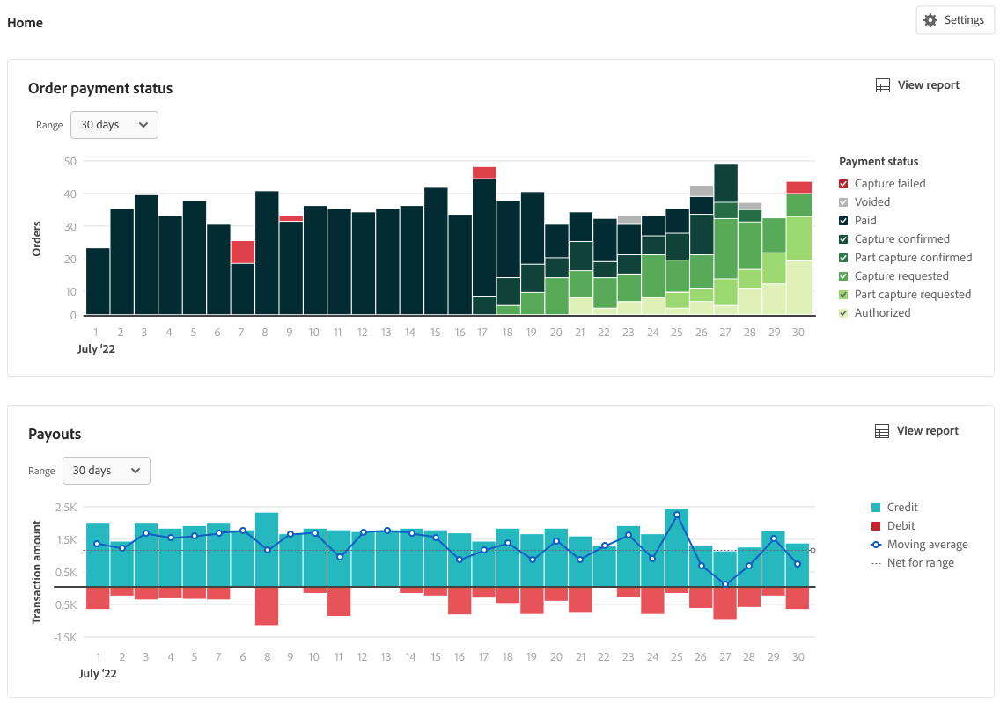

# Financiële verslaggeving

[!DNL Payment Services] for [!DNL Adobe Commerce] en [!DNL Magento Open Source] biedt uitgebreide rapportering zodat u een duidelijk beeld krijgt van de bestellingen en betalingen van uw winkel.

{width="600" zoomable="yes"}

De kasstroombeheerrapporten—Uitbetalingen, Transacties en Betalingsstatus van bestellingen—synchroniseren betalingsgegevens met bestelgegevens om u volledige transparantie te geven van verwerkt volume, betalingssaldo en gedetailleerde rapportage op transactieniveau voor financiële afstemming.
