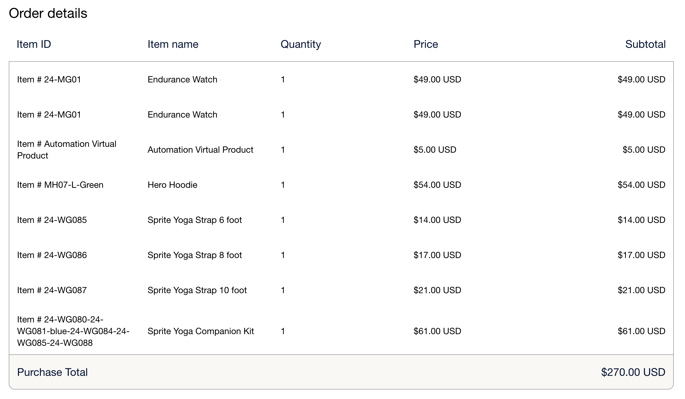

# Regelitems voor [!DNL Payment Services]

De punten van de lijn voor [!DNL Payment Services] zijn de punten inbegrepen in een orde. Deze lijnpunten verstrekken informatie zoals:

* Productgegevens
* Aantal
* Prijs (inclusief belastingen, kortingen en andere relevante informatie)

Deze informatie is nuttig voor de klantendienst, orderbeheer, en juiste het factureren.

## Lijnitems configureren

Regelitems zijn standaard ingeschakeld voor [!DNL Payment Services] . Om te vormen:

1. Voor _Admin_ sidebar, navigeer aan **[!UICONTROL Stores]** > _[!UICONTROL Settings]_>**[!UICONTROL Configuration]**.

1. Ga naar **[!UICONTROL Sales]** en selecteer **[!UICONTROL Payment Methods]** .

1. Vouw de sectie _[!UICONTROL FEATURED ADOBE PAYMENT SOLUTION]_uit.

1. Vouw in de sectie _[!UICONTROL Payment Services]_de sectie_[!UICONTROL Line Items]_ uit.

1. Selecteer voor **[!UICONTROL Line Items Enabled]** `Yes` om in te schakelen (standaard) of `No` om regelitems uit te schakelen.

1. Klik op **[!UICONTROL Save Config]** om de wijzigingen op te slaan.

>[!IMPORTANT]
>
> Als u extensies van derden hebt die aangepaste kosten (zoals verwerkingskosten) aan uw bestellingen toevoegen, moet u mogelijk lijnitems uitschakelen. [!DNL Payment Services] berekent lijnobjecten op basis van standaardbestelcomponenten van Commerce (objecten, belastingen, verzendkosten en kortingen). Kosten van derden die niet door [!DNL Payment Services] worden herkend, kunnen een verschil veroorzaken tussen het totaal van het regelitem en het totaal van de bestelling, waardoor afhandeling niet kan worden voltooid.

## Regelitems weergeven

Lijstitems weergeven:

1. Navigeer aan uw [ handelsPAL dashboard ](https://www.paypal.com/merchant/){target=_blank}.

1. Klik **Activiteit** > **Alle transacties**.

1. Selecteer de gewenste volgorde en bekijk de bijbehorende regelitems:

   > Voorbeeld van regelitems in de weergave van het winkeldashboard

   {width="500" zoomable="yes"}

## Kenmerken van lijnitems

Regelitems worden gegenereerd wanneer de bestelling via Adobe Commerce wordt geplaatst en er informatie naar PayPal wordt verzonden, met de volgende kenmerken:

| Kenmerk | Gegevenstype | Beschrijving |
| --- | --- | --- |
| `name` | Tekenreeks! | De naam van het item. Als een object meer dan één regel heeft vanwege meerdere hoeveelheden of vanwege een afsluitende belastingwaarde, blijft de naam van het item voor alle regels gelijk, maar de weergegeven prijs kan enigszins variëren als gevolg van afronding. |
| `unit_amount` | Object! | De objectprijs of -koers per eenheid. Bevat de volgende kenmerken: `currency_code` en `value` . |
| `tax` | Object | De objectbelasting voor elke eenheid. Bevat de volgende kenmerken: `currency_code` en `value` . |
| `quantity` | Tekenreeks! | Het aantal objecten. Wordt een geheel getal. |
| `description` | String | De gedetailleerde objectbeschrijving. |
| `sku` | String | De voorraadbewaareenheid (of SKU) voor het artikel. |
| `url` | String | De `URL` voor het item dat wordt aangeschaft. Zichtbaar voor de koper en gebruikt in ervaringen met kopers. |
| `upc` | Object | De Universal Product Code (of UPC) van het item. |
| `category` | String | Het type objectcategorie. |

### `unit_amount` kenmerken

Het `unit_amount` -object bevat de volgende kenmerken:

| Kenmerk | Gegevenstype | Beschrijving |
| --- | --- | --- |
| `currency_code` | Tekenreeks! | De [ driepunts ISO-4217 muntcode ](https://developer.paypal.com/api/rest/reference/currency-codes/) die de munt identificeert. |
| `value` | Tekenreeks! | Geeft de waarde van het item aan. `currency_code` bepaalt het vereiste aantal decimalen, als om het even welk. |

### `tax` kenmerken

Het `tax` -object bevat de volgende kenmerken:

| Kenmerk | Gegevenstype | Beschrijving |
| --- | --- | --- |
| `currency_code` | Tekenreeks! | De [ driepunts ISO-4217 muntcode ](https://developer.paypal.com/api/rest/reference/currency-codes/) die de munt identificeert. |
| `value` | Tekenreeks! | Geeft de waarde van het item aan. Afhankelijk van elke `currency_code` voor het vereiste aantal decimalen. |

### `upc` kenmerken

Het `upc` -object bevat de volgende kenmerken:

| Kenmerk | Gegevenstype | Beschrijving |
| --- | --- | --- |
| `type` | tekenreeks! | Het type UPC. |
| `code` | tekenreeks! | De UPC-productcode van het item. |

+++Voorbeeld van regelitems

```json
{
    "name": "Crown Summit Backpack - 1",
    "unit_amount": {
        "currency_code": "USD",
        "value": "38.50"
    },
    "tax": {
        "currency_code": "USD"
        "value": "3.13"
    },
    "quantity": "1",
    "description": "The Crown Summit Backpack is equally at home in a gym locker, study cube or a pup tent, so be sure yours is packed with books,",
    "sku": "24-MB03",
    "url": "https://magento.test/crown-summit-backpack.html",
    "upc": {
        "type": "UPC-A",
        "code": "000003"
    },
    "category": "PHYSICAL_GOODS"
},
{
    "name": "Crown Summit Backpack - 2",
    "unit_amount": {
        "currency_code": "USD",
        "value": "38.50"
    },
    "tax": {
        "currency_code": "USD",
        "value": "3.14"
    },
    "quantity": "1",
    "description": "The Crown Summit Backpack is equally at home in a gym locker, study cube or a pup tent, so be sure yours is packed with books,",
    "sku": "24-MB03",
    "url": "https://magento.test/crown-summit-backpack.html",
    "upc": {
        "type": "UPC-A",
        "code": "000003"
    },
    "category": "PHYSICAL_GOODS"
}
```

+++

Zie [ PayPal ontwikkelaarsdocumentatie over lijnpunten ](https://developer.paypal.com/docs/api/orders/v2/#definition-line_item){target=_blank} voor meer informatie over deze gebieden en hun beperkingen.

## Regelitems beheren

Adobe Commerce [ berekent belasting die op het totale bedrag voor elke rij ](https://experienceleague.adobe.com/en/docs/commerce-admin/stores-sales/site-store/taxes/taxes#warning-messages){target=_blank} wordt gebaseerd, die het afronden kwesties kan veroorzaken als de veelvoudige hoeveelheden van het zelfde punt worden bevolen of als de belasting-inclusieve prijzen in de catalogus worden getoond. In dergelijke gevallen mag de totale hoeveelheid in twee regels worden opgesplitst, maar de hoeveelheid is gelijk aan het totale aantal bestelde artikelen.

> Voorbeeld van regelitems met afrondingsproblemen in de dashboardweergave voor handelsdoeleinden

{width="600" zoomable="yes"}

+++Hoe Adobe Commerce een afrondingsprobleem berekent in line-items

Regelitems voor [!DNL Payment Services] plaatsen dit afrondingsprobleem op een zodanige manier dat de waarde `unit_amount` of `unit_tax` overeenkomt met het totale bedrag voor de volgorde. Een item kan in twee regels worden gesplitst om dit afrondingsprobleem op te lossen:

* Wanneer het afrondingsprobleem op de `unit_amount` wordt weergegeven, ziet de handelaar een verschil in de prijs op deze extra regel.
* Wanneer het afrondingsprobleem wordt weergegeven op de `unit_tax` , wordt er geen verschil weergegeven op de afzonderlijke regelitems omdat `tax` niet in het raster wordt weergegeven, maar alleen als een totaal onderaan.

+++
