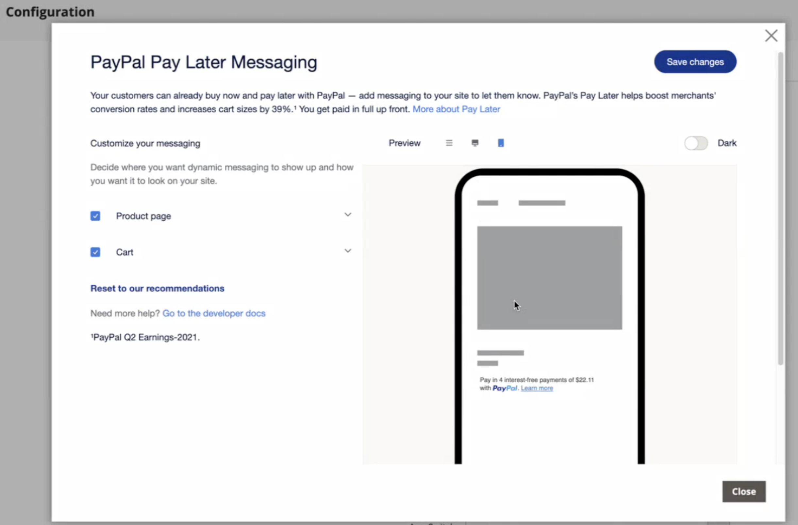

# Betalingsopties

Met [!DNL Adobe Commerce] en [!DNL Magento Open Source] [!DNL Payment Services] hebt u meerdere betalingsopties beschikbaar.

U kunt deze betalingsopties in [&#x200B; montages van het Huis &#x200B;](payments-home.md) vormen of [&#x200B; configuratie van de Opslag &#x200B;](configure-admin.md) (geadviseerd voor de opties van de erfenisbetaling of een multi-store opstelling).

Er zijn verschillende gedragingen voor elke betalingsmethode, afhankelijk van waar u zich bevindt in het uitbetalingsproces:

* Productpagina—De productpagina voor een item
* Mini kart - Beschikbaar bij klikken op het pictogram van het karretje wanneer een product aan de winkelwagentjes is toegevoegd
* Het winkelen kar-Beschikbaar op klik van _Mening en geeft kar_ van de mini-kar uit
* Controle mening-Beschikbaar op klik van _ga aan Controle_ van mini-kar of het winkelwagentje

>[!IMPORTANT]
>
>[!DNL Payment Services] aan boord moet zijn voltooid voordat betalingen kunnen worden verwerkt.

## Standaard versus geavanceerde betalingservaring

[!DNL Payment Services] verstrekt **Geavanceerd** (volledig gesteund) en **Standaard** (Uitdrukkelijke Controle) betalingsopties en onboarding stromen, afhankelijk van het land waarin u werkt.

* **Geavanceerd** - Alle beschikbare [&#x200B; betalingsopties &#x200B;](../payment-services/payments-options.md) zijn beschikbaar voor huidige [&#x200B; volledig gesteunde landen &#x200B;](../payment-services/introduction.md#availability). Tijdens onboarding om levende betalingen toe te laten, selecteer de [&#x200B; Geavanceerde onboarding optie &#x200B;](../payment-services/production.md#advanced-onboarding).

* **Standaard** - een ondergroep betalingsopties (Uitdrukkelijke Afhandeling) - PayPal krediet en debetkaarten-is beschikbaar voor andere beschikbare gesteunde landen. [&#x200B; de gebieden van de Kredietkaart &#x200B;](#credit-card-fields) en [&#x200B; Betalen Apple &#x200B;](#apple-pay-button) zijn niet beschikbaar voor deze onboarding optie. Tijdens het aan boord gaan om levende betalingen toe te laten, selecteer de [&#x200B; Standaard aan boord komende optie &#x200B;](../payment-services/production.md#standard-onboarding).

Zie [&#x200B;  [!DNL Payment Services]  toelaten voor productie &#x200B;](../payment-services/production.md#complete-merchant-onboarding) voor informatie over de voltooiing van Geavanceerde en Standaard op het instappen.

## [!UICONTROL Credit Card Fields]

[!UICONTROL Credit Card Fields] biedt een eenvoudige en veilige afhandeling voor betalingsmethoden met creditcard of bankpas. Wanneer een winkelier uitcheckt met gebruik van creditcardvelden, geeft hij zijn naam, factuuradres en creditcardgegevens op om zijn bestelling te plaatsen. De klantgegevens worden tijdens de aankoopsessie veilig gebruikt om ze naadloos door de afrekenstroom te begeleiden.

{width="500" zoomable="yes"}

## [!UICONTROL Digital Wallets]

### [!DNL Fastlane] knop

[!DNL Fastlane] biedt een snelle, veilige en probleemloze manier om online te betalen. Tijdens de controle van de Gast van de a **&#x200B;**, kunt u veilig uw kaart en verschepende details voor nog snellere aankopen in de toekomst opslaan.

* **Onmiddellijke toegang voor geverifieerde kopers**: Erken miljoenen van terugkerende klanten en laat naadloze betalingen in seconden toe.
* **opbrengst van de Verhoging**: Verbeter omzettings en toestemmingstarieven met meer voltooide aankopen.
* **versnelt controle**: Verminder wrijving met een veilige, wachtwoord-loze login ervaring.

Wanneer [!DNL Fastlane] is ingeschakeld, is de optie [!UICONTROL Credit Card Fields] standaard uitgeschakeld.

>[!NOTE]
>
> Fastlane wordt momenteel alleen ondersteund voor Amerikaanse handelaren. Daarom wordt [!UICONTROL 3D Secure authentication] momenteel niet ondersteund.

Zie [&#x200B; Fastlane door PayPal &#x200B;](https://www.paypal.com/us/fastlane){target=_blank} onderwerp voor meer informatie.

### [!DNL Apple Pay] knop

Met [!DNL Apple Pay] kunnen handelaren een veilige, gestroomlijnde afrekenervaring bieden in Safari (voor maximaal 99 domeinen per zakelijke account), waardoor conversies kunnen toenemen. De opgeslagen betalings-, contact- en verzendgegevens van iOS- of macOS-apparaten van klanten in [!DNL Apple Pay] worden automatisch ingevuld, waardoor een snelle, eenmalige afhandeling mogelijk wordt.

{width="500" zoomable="yes"}

Als deze optie is ingeschakeld, is de knop [!DNL Apple Pay] zichtbaar vanaf de productpagina, de miniwinkelwagentje, het winkelwagentje en de afrekenweergave. U kunt [!DNL Apple Pay] configureren in de winkelconfiguratie of de startconfiguratie van de extensie.

>[!NOTE]
>
>  Het certificaat voor domeinverificatie in Apple Pay is al opgenomen in de code voor betalingsservices. Controleer of het pad `/.well-known/apple-developer-merchantid-domain-association` een antwoordcode van 200 retourneert. Zie [&#x200B; PayPal ontwikkelaarsdocumentatie over het Integreren met Apple Pay &#x200B;](https://developer.paypal.com/docs/checkout/apm/apple-pay/#download-and-host-sandbox-domain-association-file) voor meer informatie over het **de verificatie van het Domein van Apple Pay** certificaat.

Zie [&#x200B; Montages &#x200B;](configure-admin.md#apple-pay) voor meer informatie.

### [!DNL Google Pay] knop

Door [!DNL Google Pay] in uw afrekenervaring te integreren, kunnen verkopers opgeslagen betalings-, contact- en verzendgegevens verzamelen van de Google-account van de klant. Zo kunt u een handige, gestroomlijnde afhandeling uitvoeren in ondersteunde browsers en apps.

[!DNL Google Pay] is alleen beschikbaar in bepaalde landen of regio&#39;s en op bepaalde apparaten. Zie [[!DNL Google Pay]  documentatie &#x200B;](https://developer.paypal.com/docs/checkout/apm/google-pay/#link-googlepayintegration) voor meer informatie.

{width="500" zoomable="yes"}

Als deze optie is ingeschakeld, is de knop [!DNL Google Pay] zichtbaar vanaf de productpagina, de miniwinkelwagentje, het winkelwagentje en de afrekenweergave. Zie [&#x200B; Montages &#x200B;](configure-admin.md) voor meer informatie.

>[!NOTE]
>
> De API van [!DNL Google Pay] kan alleen worden gebruikt op websites in een veilige context. Zie [&#x200B; het Oplossen van problemen &#x200B;](https://developers.google.com/pay/api/web/support/troubleshooting) documentatie voor meer informatie.

### [!DNL PayPal Payment Buttons]

[!DNL PayPal payment buttons] , dat PayPal gebruikt om een aankoop te voltooien, slaat het verzendadres, het factuuradres en de betalingsgegevens van uw winkels op voor later gebruik. Kopers kunnen elke betalingsmethode gebruiken die eerder door PayPal is opgeslagen of aangeboden.

{width="350" zoomable="yes"}

U kunt [!UICONTROL PayPal payment buttons] configureren in de winkelconfiguratie of in [!DNL Payment Services] Home.

Leer over beschikbaarheid van betalingsmethodes door land in de documentatie van de Methodes van de Betaling van PayPal [&#128279;](https://developer.paypal.com/docs/checkout/payment-methods/).

#### [!DNL PayPal] knop

Klanten kunnen met gemak en vertrouwen uitchecken met de PayPal-knop.

De knop [!DNL PayPal] is zichtbaar vanaf de productpagina, de miniwinkelwagentje, het winkelwagentje en de afrekenweergave.

#### [!DNL Venmo] knop

De klanten kunnen uit het gebruiken van de [&#x200B; knoop van Venmo &#x200B;](https://venmo.com/) controleren.

De knop [!DNL Venmo] is zichtbaar vanaf de productpagina, de miniwinkelwagentje, het winkelwagentje en de afrekenweergave.

#### PayPal-incasso of creditcard

Klanten kunnen uitchecken via de button PayPal-incasso of creditcard.

De button PayPal Debit of Creditcard is zichtbaar vanaf de betalingspagina.

Met deze optie kun je een betalingsoptie voor een debet of creditcard aan kopers aanbieden met een PayPal-gehoste knop als alternatief voor de integratie met een creditcard.

#### [!DNL Pay Later] knop

Bied uw klanten kortetermijnbetalingen, rentevrije betalingen en andere financieringsopties aan, zodat ze nu kunnen kopen en later kunnen betalen met de knop [!DNL Pay Later] .

De knop [!DNL Pay Later] is zichtbaar vanaf de productpagina, de miniwinkelwagentje, het winkelwagentje en de afrekenweergave.

Zie informatie over het [&#x200B; Betaal later aanbiedingen &#x200B;](https://developer.paypal.com/docs/checkout/pay-later/us/) in de documentatie van de Ontwikkelaar van PayPal. Gebruik **Land of gebied** dropdown om een gebied van belang te selecteren.

Leer om het [!DNL Pay Later] overseinen onbruikbaar te maken of toe te laten door de [&#x200B; configuratie van Montages &#x200B;](configure-admin.md#pay-later-button) bij te werken.

##### Optioneel. Later betalingsbericht configureren

**vorm overseinen** voor [&#x200B; later betalen &#x200B;](configure-admin.md#pay-later-button) staat verkopers toe om de standaardstijlen voor deze betalingsoptie te wijzigen. Als u **[!UICONTROL Display Pay Later Message]** aan `Yes` in uw [&#x200B; configuratie van Montages &#x200B;](configure-admin.md#pay-later-button) plaatst, wordt een **[!UICONTROL Configure Messaging]** modale knoop getoond zodat kunt u de stijlen voor **[!UICONTROL PayPal Pay Later messaging]** plaatsen.

{width="500" zoomable="yes"}

### Alleen PayPal-betalingsknoppen gebruiken

Om uw opslag in productiemodus snel te krijgen, kunt u _slechts_ PayPal betalingsknopen (Venmo, PayPal, etc.) vormen.—in plaats van ook de optie PayPal-creditcardbetaling te gebruiken.

Zo kunt u:

* Geef uw klanten verschillende betalingsopties, waaronder de betaalknoppen Venmo en PayPal, met de optie om door PayPal gehoste kaartvelden uit te schakelen en een bestaande creditcardprovider te gebruiken.
* Gebruik de bestaande creditcardprovider voor creditcardbetalingen en gebruik ook de andere betalingsopties van PayPal.
* Gebruik de betalingsknoppen van PayPal in regio&#39;s waar PayPal geen creditcards als betalingsoptie ondersteunt.

**vangt betalingen met _slechts_ PayPal betaalknopen (_niet_ de optie van de creditcardbetaling van PayPal)**:

1. Zorg ervoor dat uw opslag [&#x200B; op productiemodus &#x200B;](configure-admin.md#enable-payment-services) is.
1. [&#x200B; vorm de gewenste PayPal betalingsknopen &#x200B;](configure-admin.md#payment-buttons) in Montages.
1. Draai _weg_ de **[[!UICONTROL Show PayPal Credit and Debit card button]](configure-admin.md#payment-buttons)** optie in de _[!UICONTROL Payment buttons]_&#x200B;sectie.

Om **betalingen met uw bestaande creditcardleverancier _en_ PayPal betaalknopen** te vangen:

1. Zorg ervoor dat uw opslag [&#x200B; op productiemodus &#x200B;](configure-admin.md#enable-payment-services) is.
1. [&#x200B; vorm de gewenste PayPal betalingsknopen &#x200B;](configure-admin.md#payment-buttons).
1. Draai _weg_ de **[[!UICONTROL PayPal Show Credit and Debit card button]](configure-admin.md#payment-buttons)** optie in de _[!UICONTROL Payment buttons]_&#x200B;sectie.
1. Draai _van_ de **[[!UICONTROL Show on checkout page]](configure-admin.md#credit-card-fields)** optie in de _[!UICONTROL Credit card fields]_&#x200B;sectie en gebruik uw [&#x200B; bestaande rekening van de creditcardleverancier &#x200B;](https://experienceleague.adobe.com/docs/commerce-admin/stores-sales/payments/payments.html?lang=nl-NL#payments).

## Afhandelingsopties

Met [!DNL Payment Services] kunt u de kassa voor Adobe Commerce zo configureren dat deze het beste aansluit bij de voorkeuren en het gedrag van uw klanten. De eigenschappen zoals creditcard [&#x200B; het vaulteren &#x200B;](vaulting.md) en de orde auto-ongeldig verklaren verzekeren een naadloze, vlotte transactie voor uw klanten.

Met Adobe Commerce en Magento Open Source [!DNL Payment Services] beschikt u over meerdere uitcheckervaringen. Er zijn verschillende gedragingen voor elke betalingsmethode, afhankelijk van waar u zich bevindt in het uitbetalingsproces:

* Productpagina——De productpagina voor een item

* Mini kart——Beschikbaar na klikken op het pictogram van het winkelwagentje wanneer een product aan de winkelwagentjes is toegevoegd

* Winkelwagentje——Beschikbaar als je klikt op Weergave en winkelwagentje bewerkt in de miniwagentje

* Afhandelingsweergave——Beschikbaar na klikken op Doorgaan naar Afhandeling van mini-kar of winkelwagentje

### Orderrecalculatie

Wanneer een klant de afhandelingsstroom invoert van de mini-cart, winkelwagentje of productpagina, wordt deze doorgestuurd naar een pagina voor het controleren van bestellingen waar hij het geselecteerde verzendadres kan zien in een pop-upvenster van PayPal. Nadat de klant de verzendmethode heeft geselecteerd, wordt het orderbedrag op de juiste wijze herberekend en kan de klant de verzendkosten en -belastingen zien.

Wanneer een klant de afrekenstroom vanaf de afhandelingspagina invoert, is het systeem zich al bewust van het verzendadres en het uiteindelijke berekende bedrag en worden de totalen op de juiste wijze weergegeven.

Belastingvrije dagen, verzendkosten en BTW kunnen per locatie sterk verschillen. Nadat [!DNL Payment Services] het verzendadres en de verzendkosten heeft ontvangen, worden alle toepasselijke kosten snel opnieuw berekend en op de juiste wijze weergegeven tijdens de laatste stappen van de afhandeling.

Leer over beschikbaarheid van betalingsmethodes door land in [&#x200B; de methodes van de Betalingen van PayPal &#x200B;](https://developer.paypal.com/docs/checkout/payment-methods/){target=_blank} documentatie.
