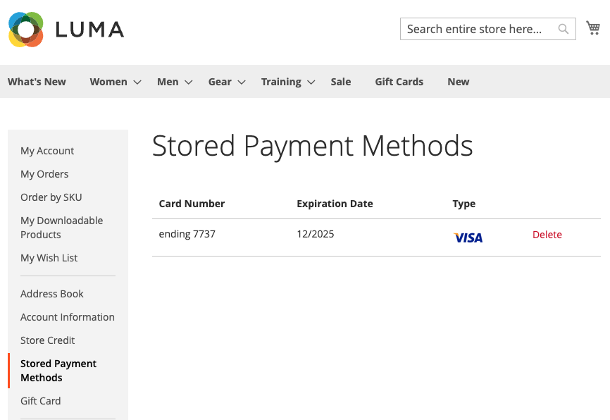
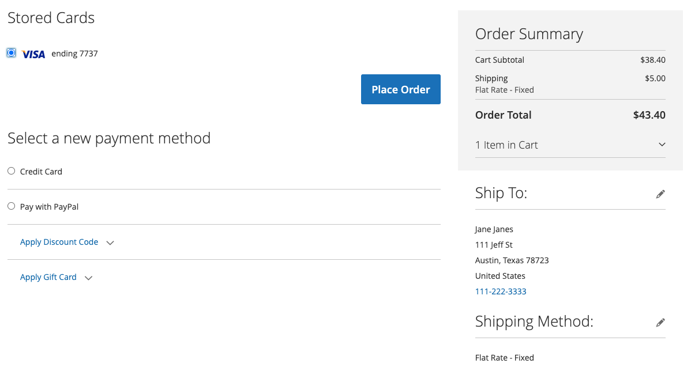

# Creditcard vauleren

Eenmalige klanten converteren naar loyale klanten met een creditcardkluis. Ingeschreven klanten kunnen hun creditcardgegevens opslaan (of &#39;vault&#39;) en deze later gebruiken voor dezelfde of een andere aankoop binnen dezelfde zakelijke account.

## Vulling inschakelen

De handelaren kunnen creditcardkluizen voor hun opslag in de [!DNL Payment Services] [ Montages ](configure-admin.md#card-vaulting) toelaten.

1. Voor _Admin_ sidebar, ga **[!UICONTROL Sales]** > **[!UICONTROL Payment Services]**.

1. Klik op **[!UICONTROL Settings]**.

1. Schakel de kiezer van **[!UICONTROL Vault enabled]** in of uit. Zie [ toelaten  [!DNL Payment Services]](configure-admin.md#enable-payment-services) voor meer informatie.

## Wisselen zonder aankoop

Logged-binnen klanten kunnen een betalingsmethode in het **Mijn dashboard van de Rekening** door vault:

1. Het registreren in hun **Mijn Rekening** op de storefront.

1. Navigeer naar **[!UICONTROL Stored Payment Methods]** in de linkernavigatie om alle opgeslagen betalingsmethoden te bekijken.

   Zie [ Opgeslagen Methoden van de Betaling ](https://experienceleague.adobe.com/en/docs/commerce-admin/stores-sales/payments/stored-payment-methods) voor meer informatie.

1. De klant klikt op **[!UICONTROL Add New Card]** om een nieuwe kaart op te slaan.

   {width="400" zoomable="yes"} toe

   De klant moet alle vereiste gegevens, zoals kaart- en factureringsgegevens, verstrekken om de betalingsmethode te kunnen berekenen.
Alle gefactureerde betalingsmethoden gebruiken het factuuradres dat is ingesteld terwijl de kaart in de PayPal-rekening van de koper wordt gefactureerd. De klant ziet mogelijk een ander factuuradres dan het adres dat in Commerce wordt weergegeven.

1. Klikken **[!UICONTROL Save New Card]**

   {width="400" zoomable="yes"}

Opgeslagen kaarten kunnen worden gebruikt bij het plaatsen van een bestelling:

{width="400" zoomable="yes"}

### Een opgeslagen betalingsmethode verwijderen

De klanten kunnen gefactureerde creditcards van de **Opgeslagen Methoden van de Betaling** in **Mijn Rekening** gemakkelijk schrappen door **Schrapping** voor een specifieke kaart te klikken.

## Een betalingsmethode valideren tijdens het afrekenen

Klanten met aanmelding kunnen tijdens het afrekenen een creditcard bewaren voor latere aankopen in de huidige winkel of in andere winkels binnen dezelfde zakelijke account:

{width="400" zoomable="yes"}

Commerce slaat een token op dat klanten helpt bij het voltooien van toekomstige afrekeningen door hun opgeslagen creditcardgegevens op te halen. Als u een kaart vanaf de klantenrekening of tijdens het afrekenen bewaart, worden verschillende betaaltokens weergegeven.

>[!WARNING]
>
> PayPal kan momenteel maximaal vijf in kluizen opslaan.

## Vullingen gebruiken in de Admin

Als een klant een eerder gearchiveerde creditcard heeft, kan een handelaar een volgende bestelling voor die klant in Admin tot stand brengen gebruikend om het even welk van deze gefactureerde betalingsmethodes.

U kunt alleen in Admin gearchiveerde kaarten gebruiken als de klant zowel een bestaande account als een geldige token in het systeem heeft opgeslagen vanaf een eerder uitgevoerde betaling.

U kunt als volgt een bestelling voor een klant maken in de Admin met de gefactureerde creditcard:

1. [ creeer een orde en voeg producten ](https://experienceleague.adobe.com/docs/commerce-admin/stores-sales/point-of-purchase/assist/customer-account-create-order.html) toe.
1. Selecteer _[!UICONTROL Payment & Shipping Information]_als betalingsmethode in **[!UICONTROL Stored Cards]**.
1. Selecteer de gewenste betalingsmethode voor creditcard.
1. Na de voltooiing van andere noodzakelijke stappen voor de orde, [ voorlegt het ](https://experienceleague.adobe.com/docs/commerce-admin/stores-sales/point-of-purchase/assist/customer-account-create-order.html?lang=en#step-3%3A-submit-the-order).

   {width="600" zoomable="yes"}

## Beveiliging

Minimale creditcardgegevens worden met de klant gedeeld; deze ziet alleen de laatste vier cijfers, de vervaldatum en het merk van de gefactureerde creditcard. De informatie van de creditcard wordt opgeslagen met de betalingsleverancier om [ te voldoen PCI ](security.md#PCI-compliance) nalevingsnormen.
