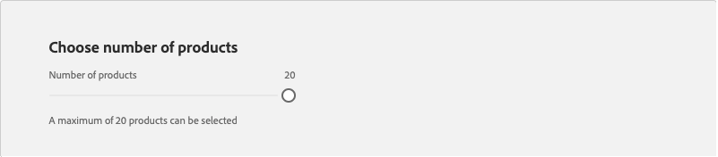
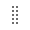
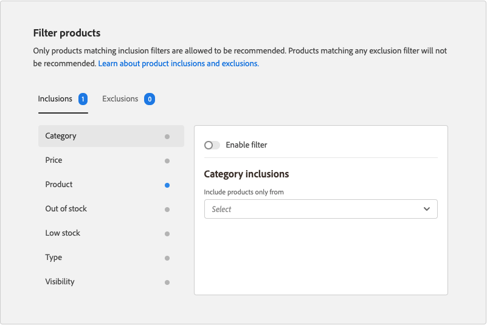

# Aanbeveling bewerken

Op de pagina Aanbeveling bewerken kunt u de afzonderlijke instellingen van de aanbeveling aanpassen. Alle instellingen kunnen worden bewerkt, behalve het paginatype en het type aanbeveling. U kunt de volgende instellingen bewerken:

- [Naam van aanbeveling](#name)
- [Label voor Storefront](#label)
- [Aantal producten](#number)
- [Plaatsing en positie](#placement)
- [Filterproducten](#filters)

In de voorvertoning aan de rechterkant van de pagina ziet u hoe de aanbeveling met de huidige instellingen in de winkel kan worden weergegeven. De _geadviseerde productvoorproef_ blijft zichtbaar voor verwijzing aangezien u neer de pagina scrolt. In de voorvertoning worden voor elk geretourneerd product een miniatuurafbeelding, de productnaam, SKU, de prijs en het resultaattype weergegeven. Het resultaattype geeft aan of er voldoende primaire gedragsgegevens zijn om de aanbeveling te genereren, of dat er back-upgedragsgegevens worden gebruikt.

 uit

## Een aanbeveling bewerken

1. Op _Admin_ sidebar, ga **Marketing** > _Bevorderingen_ > **Aanbevelingen van het Product**.

1. Selecteer de aanbeveling die u wilt bewerken.

1. Klik **uitgeven**. Volg vervolgens de onderstaande instructies om de gewenste wijzigingen aan te brengen.

1. Wanneer volledig, klik **sparen Veranderingen**.

### Naam van aanbeveling {#name}

Kies een beschrijvende naam die het doel van de aanbeveling aangeeft. De naam is bedoeld voor interne referentie en wordt niet weergegeven in de winkelruimte.

 uit

### Label voor Storefront {#label}

Voer in de winkel de tekst in die u als label voor de aanbevolen eenheid wilt gebruiken.

 uit

### Aantal producten {#number}

Pas de schuifregelaar aan om maximaal 20 producten weer te geven in de aanbevolen eenheid.

 uit

### Plaatsing en positie {#placement}

1. Kies de paginalocatie waar de aanbevelingen-eenheid in de winkel moet worden weergegeven.

   - Onderaan de hoofdinhoud
   - Bovenaan de hoofdinhoud

    uit

1. Om de orde van de aanbevelingen te veranderen die in de eenheid inbegrepen zijn, gebruik de **Beweging**  controle om de aanbevelingen in positie te slepen.

    uit

### Filterproducten {#filters}

Om het even welke veranderingen die aan product [&#x200B; filters &#x200B;](filters.md) worden aangebracht worden weerspiegeld in de _geadviseerde productvoorproef_. Alleen producten die overeenkomen met inclusiefilters mogen worden aanbevolen. Producten die overeenkomen met uitsluitingsfilters worden niet aanbevolen.

De _3&rbrace; lusjes van de Uitbreidingen_ en _van de Uitsluitingen &lbrace;maken een lijst van de beschikbare filters van elk type._ In de lijst wordt elk actief filter gemarkeerd met een blauwe stip.

- Klik op de filternaam om de details van elk filter weer te geven.
- Om de filterstatus te veranderen, plaats **filter** knevel aan de `on` of `off` positie toelaten.

 uit

De filterinstellingen beschrijven de producten die in de aanbevolen eenheid moeten worden opgenomen of uitgesloten. Bijvoorbeeld, vertellen de _montages van de de filteropneming van de Categorie_ het systeem om producten slechts van de geselecteerde categorieën te omvatten.

 uit
