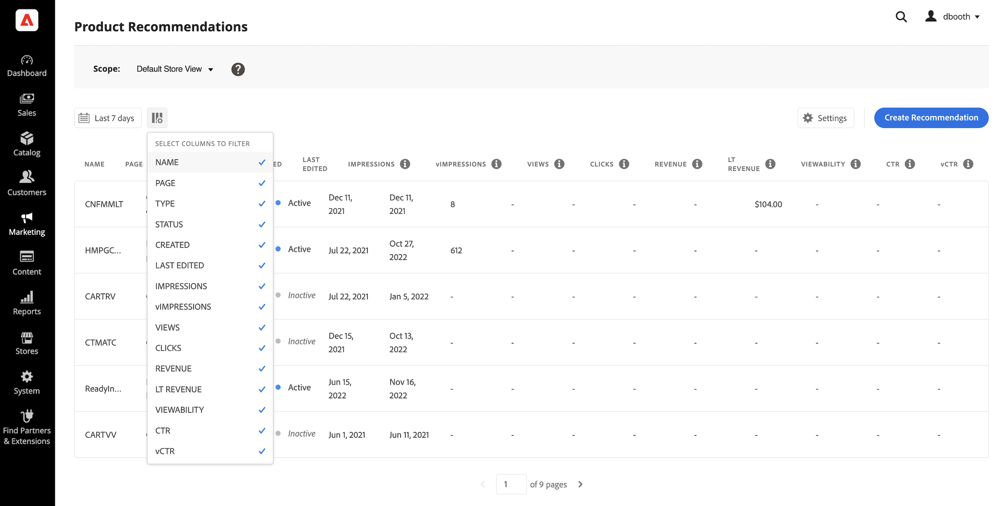

# [!DNL Product Recommendations] Workspace

De werkruimte van [!DNL Product Recommendations] toont een lijst van eerder gevormde aanbevelingen met metriek die u helpen het succes van elke aanbeveling volgen. De lijst kan worden gevormd om metriek voor de laatste dag, de week, of de maand te berekenen. U kunt de metriek gebruiken om actionable inzichten tot stand te brengen die op hoe vaak een aanbeveling wordt bekeken of geklikt, of te analyseren hoe goed uw aanbevelingen presteren.

>[!INFO]
>
>Een aanbevelingseenheid is een widget die de geadviseerde product _punten_ bevat.

_Aanbevelingen Workspace_

## Gegevensverzameling

Om ervoor te zorgen dat elk functioneel gebied op de werkruimte de correcte gegevens bevat, moet u gegevensinzameling vormen die op de geselecteerde storefront implementatie wordt gebaseerd:

1. Luma - Gegevensverzameling is offline beschikbaar.
1. Headless - De inzameling van Gegevens moet manueel, afhankelijk van storefront implementatie worden gevormd.

Als u een koploze winkel gebruikt, raadpleegt u de volgende documentatie voor meer informatie over de vereiste gebeurtenissen die u moet toevoegen:

- [&#x200B; Vereiste gebeurtenissen &#x200B;](events.md) voor het dashboard van de Aanbevelingen van het Product.
- [&#x200B; de gebeurtenisinzamelaar van de Storefront &#x200B;](https://developer.adobe.com/commerce/services/shared-services/storefront-events/collector/) die als voorwaarde moet worden toegevoegd.
- [&#x200B; Voorbeelden &#x200B;](https://github.com/adobe/commerce-events/tree/main/examples) van de gebeurtenisstructuur.

## Bereik instellen

Aanvankelijk wordt het [&#x200B; werkingsgebied &#x200B;](https://experienceleague.adobe.com/docs/commerce-admin/start/setup/websites-stores-views.html?lang=nl-NL) van alle aanbevelingen montages geplaatst aan `Default Store View`. Als uw installatie van Commerce veelvoudige opslagmeningen omvat, plaats **Reikwijdte** aan de [&#x200B; opslagmening &#x200B;](https://experienceleague.adobe.com/docs/commerce-admin/start/setup/websites-stores-views.html?lang=nl-NL#scope-settings) waar uw aanbevelingen van toepassing zijn.

## Datumbereik van metrische gegevens instellen

1. Klik de **&#x200B;**&#x200B;controle van de selecteur van de Kalender 

1. Kies een van de volgende opties:

   - Afgelopen 24 uur
   - Laatste 7 dagen
   - Laatste 30 dagen

   De berekende waarden in de kolommen van metriek veranderen om op de huidige datumwaaier te wijzen.

   >[!NOTE]
   >
   >Metrische gegevens voor productaanbevelingen zijn geoptimaliseerd voor Luma-winkels. Als uw storefront niet-Luma gebaseerd is, hoe de gegevens van het metriekspoor van hoe afhangen u [&#x200B; de gebeurtenisinzameling &#x200B;](events.md) uitvoert.

## Kolommen tonen/verbergen

1. In de upper-left hoek, klik **tonen/verbergen**  kolommen.

   De zichtbare kolommen hebben een blauw vinkje.

1. Voer in het menu een van de volgende handelingen uit:

   - Als u een verborgen kolom wilt weergeven, klikt u op een kolomnaam zonder vinkje.
   - Als u een zichtbare kolom wilt verbergen, klikt u op een kolomnaam met een vinkje.

   De tabel wordt vernieuwd en bevat alleen de geselecteerde kolommen.

   
   _tonen/verbergen kolommen_

## Instellingen

De instellingen bepalen de SaaS-gegevensruimte die de aanbevelingen en gedraggegevens bevat.

- Om te veranderen waar aanbeveling-gedrag gegevens voortkomt, kies een verschillende gegevensruimte SaaS.

- Om een nieuwe SaaS gegevensruimte te vormen, klik **uitgeven Configuratie**. Meer leren, zie [&#x200B; Montages &#x200B;](settings.md).

_de Montages van Aanbevelingen_

## Details weergeven

1. Klik in de tabel op de aanbeveling die u wilt onderzoeken.

   
   _het Detail van het Tarief van de Omzetting van de Homepage_

1. Om het statuut van de aanbeveling te veranderen, activeer **&#x200B;**&#x200B;of **&#x200B;**&#x200B;deactivate.

## Aanbeveling bewerken

Van de pagina van de aanbevelingsdetails, geeft de klik **&#x200B;**&#x200B;uit. Meer leren, ga [&#x200B; Aanbevelingen &#x200B;](edit.md) uitgeven.

## Aanbeveling maken

Van de pagina van de aanbevelingsdetails, klik **creëren**. Meer leren, ga [&#x200B; tot Aanbevelingen &#x200B;](create.md) leiden.

## Workspace-besturingselementen

| Besturing | Beschrijving |
|---|---|
|  | Hiermee bepaalt u het tijdsbereik dat wordt gebruikt voor metrische berekeningen. Opties: 24 uur / 7 dagen / 30 dagen |
|  | Bepaalt de kolommen die in de [!DNL Product Recommendations] lijst verschijnen. |
| Instellingen | Bepaalt de SaaS gegevensruimte waar aanbeveling-gedrag gegevens wordt gehaald, en laat ook visuele gelijkenis aanbevelingen type toe. |
| Aanbeveling maken | Opent [&#x200B; creëren Nieuwe pagina van de Aanbeveling &#x200B;](create.md). |

## Kolombeschrijvingen

| Kolom | Beschrijving |
|---|---|
| Naam | De naam van de aanbeveling. |
| Pagina | De pagina waar de aanbeveling wordt weergegeven. |
| Type | Het type aanbeveling. |
| Status | De adviesstatus. Opties: Inactief/actief/concept |
| Gemaakt | De datum waarop de aanbeveling is opgesteld. |
| Laatst bewerkt | De datum waarop de aanbeveling voor het laatst is bewerkt. |
| Impressies | Het aantal keren dat een aanbevolen eenheid op een pagina wordt geladen en weergegeven. Een aanbeveling-eenheid die zich onder de voud van de viewport van de browser bevindt, wordt weergegeven op de pagina, zelfs als de gebruiker deze niet bekijkt. In dit geval wordt de weergegeven eenheid geteld als een indruk, maar een weergave wordt alleen geteld als de gebruiker de eenheid in beeld schuift. |
| vImpressions | (Zichtbare indrukkingen) Het aantal aanbevelingen-eenheden dat ten minste één weergave registreert. Als de aanbevolen eenheid bijvoorbeeld twee regels heeft, elk met twee producten, en de laatste twee producten niet door de verkoopster worden gezien, maar de eerste twee, dan zal de activiteit nog steeds als een indruk worden beschouwd. |
| Weergaven | Het aantal aanbevelingen dat wordt weergegeven in de viewport van de browser van de klant. Als de gebruiker de pagina meerdere keren omhoog of omlaag schuift, wordt de gebeurtenis meerdere keren geactiveerd, telkens wanneer de eenheid zichtbaar is. |
| Klikken | De som van het aantal tijden een verkoopster klikt een punt in de aanbeveling eenheid en het aantal tijden de verkoopster **toevoegt aan wortel** knoop in de aanbeveling eenheid |
| Ontvangsten | De inkomsten die voortvloeien uit de aanbeveling voor de huidige periode. |
| LT-inkomsten | (Levensopbrengsten) De levenslange inkomsten die worden voortgebracht door een aanbeveling. |
| Zichtbaarheid | Het percentage aanbevolen eenheden dat zich registreert voor de weergave. |
| CTR | (Doorkliksnelheid) Het percentage eenheidsindrukkingen voor de aanbeveling die een klik registreert. CTR telt alle indrukken zelfs als de eenheid niet de mening van de verkoopster ingaat. Als de eenheid van de aanbeveling niet wordt bekeken, is het onwaarschijnlijk om te worden geklikt. Deze onzichtbare indrukken tellen echter mee voor de CTR-score en verlagen het totale CTR-percentage. |
| vCTR | (Zichtbare Doorkliksnelheid) maateenheden die alleen op zichtbare indrukken (aanbevelingen die daadwerkelijk in het zichtbare gedeelte van het scherm van de klant zijn weergegeven) zijn gebaseerd, zodat u een nauwkeurigere schatting van de betrokkenheid van de klant krijgt. |
