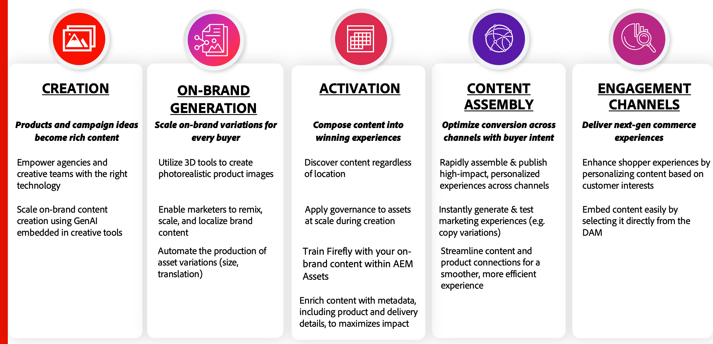

# Nauwkeurige en relevante inhoud behouden

Een ware inhoudslevering impliceert een combinatie zeer belangrijke pijlers over **Creatie en Productie**, **Werkschema en Planning**, en **Levering en Activering**. Elk van deze pijlers is op zich waardevol en draagt bij tot significante waarde voor organisaties:

{width="600" zoomable="yes"}

Een eCommerce-platform is een van de meest cruciale communicatiekanalen. Zorgen voor naadloze updates in het assetmanagementsysteem garandeert dat winkelwinkels altijd de meest actuele productinformatie weergeven. Dit is essentieel aan het bereiken van de drie belangrijkste doelstellingen van om het even welk **DAM (het Systeem van het Beheer van Digitale Activa)** &lt;> **de integratie van Commerce**:

* Verbeter **Tijd-aan-Markt (TTM)** voor nieuwe productlanceringen.

* Elimineer operationele inefficiënties en verminder handmatige interacties.

* Zorg voor consistentie tussen merken door altijd goedgekeurde inhoud te bedienen die is afgestemd op de richtlijnen voor merken.

Om deze doelstellingen te bereiken, wordt de [!DNL Product Visuals] integratie ingetekend aan zowel **Adobe Commerce** als **AEM Assets** gebeurtenissen, die dynamische synchronisatie tussen inhoud en handel verzekeren.

## Wijzigingen in Adobe Commerce-catalogus

De [!DNL Product Visuals] integratie luistert naar de gebeurtenissen van de productcreatie teweeggebracht wanneer de producten in **Admin** of door **API** te gebruiken worden gecreeerd. Als deze activering plaatsvindt, worden goedgekeurde activa van de DAM gesynchroniseerd die zijn gekoppeld aan de SKU van het nieuwe product.

Door het creëren van inhoud van catalogusbeheer te ontkoppelen, bereiken de ondernemingen verscheidene voordelen:

* Inhoudsteams kunnen onafhankelijk werken en zorgen dat hoogwaardige middelen klaar zijn voor het starten van producten.

* De productupdates blijven snel omdat de creatie van activa catalogusveranderingen niet vertraagt, toelatend grotere behendigheid in het beheren van nieuwe producten.

* Automatisering verbetert de efficiëntie en nauwkeurigheid, waardoor de verschillen tussen productgegevens en de bijbehorende inhoud worden verkleind.

## Wijzigingen in AEM Assets-levenscyclus

De integratie luistert ook naar wijzigingen in de status van elementen in AEM Assets. Omdat Adobe Commerce als een betrokkenheidskanaal fungeert, worden alleen goedgekeurde middelen weergegeven in de winkel.

De integratie automatiseert het beheer van de levenscyclus van bedrijfsmiddelen om ervoor te zorgen dat de inhoud van de winkel accuraat blijft en voldoet aan het merk.

* Alleen goedgekeurde bedrijfsmiddelen worden gepubliceerd, met behoud van de integriteit van het merk en de naleving van de regelgeving.

* Verouderde of irrelevante elementen worden automatisch verwijderd, zodat er geen inhoud van een schaal wordt weergegeven.

* Naadloze synchronisatie tussen goedkeuring van bedrijfsmiddelen en productweergave vermindert handmatige inspanningen en vertragingen.

Door gebruik te maken van de integratie met de AEM Asset Selector kunnen bedrijven een gestroomlijnde, nauwkeurige en efficiënte wijziging in de contentlevering handhaven, waardoor zowel de ervaring van de klant als de operationele efficiëntie worden verbeterd.
